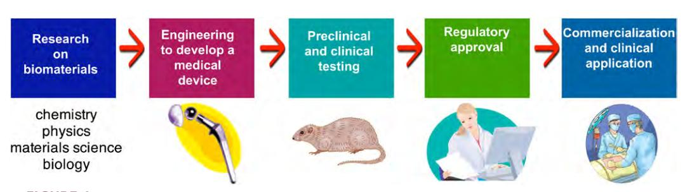
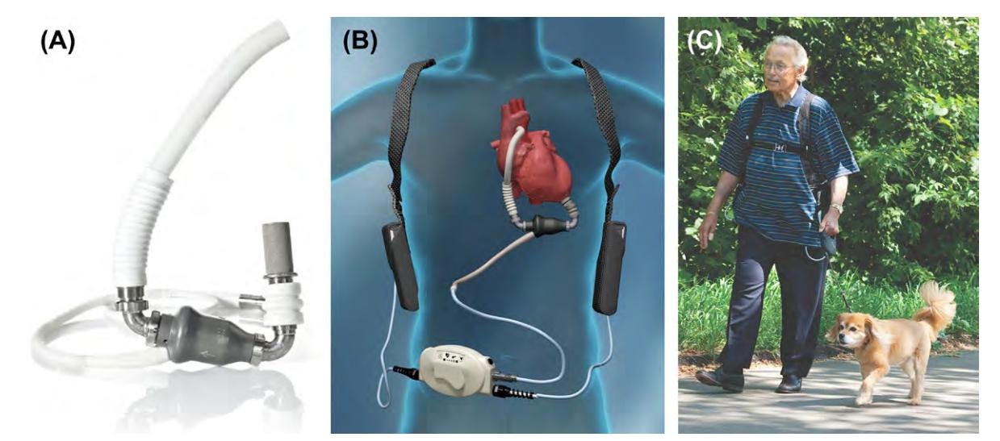

# Biomaterials Science: An Evolving, Multidisciplinary Endeavor

*Buddy D. Ratner, Allan S. Hoffman, Frederick J. Schoen, and Jack E. Lemons*

## BIOMATERIALS AND BIOMATERIALS SCIENCE

*Biomaterials Science*: *An Introduction to Materials in Medicine*, third edition addresses the design, fabrication, testing, applications, and performance of synthetic and natural materials that are used in a wide variety of implants, devices, and process equipment that contact biological systems. These materials are referred to as biomaterials.

The compelling, human side to biomaterials is that millions of lives are saved, and the quality of life is improved for millions more.

The field of biomaterials is some 60–70 years old (or young) at the time of publication of this third edition. It significantly impacts human health, the economy, and many scientific fields. Biomaterials and the medical devices comprised of them are now commonly used as *prostheses* in cardiovascular, orthopedic, dental, ophthalmological, and reconstructive surgery, and in other interventions such as surgical sutures, bioadhesives, and controlled drug release devices. The compelling, human side to biomaterials is that millions of lives have been saved, and the quality of life improved for millions more, based on devices fabricated from biomaterials. The biomaterials field has seen accelerating growth since the first medical devices that were based on accepted medical and scientific principles made their way into human usage in the late 1940s and early 1950s. And the growth of the field is ensured, with the aging population, the increasing standard of living in developing countries, and the growing ability to address previously untreatable medical conditions.

Biomaterials science addresses both therapeutics and diagnostics. It encompasses basic sciences (biology, chemistry, physics), and engineering and medicine. The translation of biomaterials science to clinically important medical devices is dependent on: (1) sound engineering design; (2) testing *in vitro*, in animals and in humans; (3) clinical realities; and (4) the involvement of industry permitting product development and commercialization. [Figure 1](#page--1-0) schematically illustrates the path from scientific development to the clinic.

Biomaterials science, in its modern incarnation, is an example of an important new research model – called *convergence* – an emerging paradigm that pushes multidisciplinary collaboration among experts and multidisciplinary integration of concepts and practice (Sharp and Langer, 2011). Not only biomaterials, but also bioinfomatics, synthetic biology, computational biology, nanobiology, systems biology, and other forefront fields, depend on convergence for their continued progress. This textbook aims to introduce these diverse multidisciplinary elements, particularly focusing on interrelationships rather than disciplinary boundaries, to systematize the biomaterials subject into a cohesive curriculum – a true convergence.

The title of this textbook, *Biomaterials Science*: *An Introduction to Materials in Medicine*, is accurate and descriptive. The intent of this work is: (1) to focus on the scientific and engineering fundamentals behind biomaterials and their applications; (2) to provide sufficient background material to guide the reader to a clear understanding and appreciation of the applications of biomaterials; and (3) to highlight the opportunities and challenges in the field. Every chapter in this textbook can serve as a portal to an extensive contemporary literature that expands on the basic ideas presented here. The magnitude of the biomaterials endeavor, its broadly integrated multidisciplinary scope, and examples of biomaterials applications will be revealed in this introductory chapter and throughout the book.

The common thread in biomaterials is the physical and chemical interactions between complex biological systems and synthetic or modified natural materials.

**FIGURE 1** The path from the basic science of biomaterials, to a medical device, to clinical application.

Although biomaterials are primarily used for medical applications (the focus of this text), they are also used to grow cells in culture, to assay for blood proteins in the clinical laboratory, in processing equipment for biotechnological applications, for implants to regulate fertility in cattle, in diagnostic gene arrays, in the aquaculture of oysters, and for investigational cell–silicon "neuronal computers." How do we reconcile these diverse uses of materials into one field? The common thread is the physical and chemical interactions between complex biological systems and synthetic materials or modified natural materials.

In medical applications, biomaterials are rarely used as isolated materials, but are more commonly integrated into devices or implants. Chemically pure titanium can be called a biomaterial, but shaped (machined) titanium in conjunction with ultrahigh molecular weight polyethylene becomes the device, a hip prosthesis. Although this is a text on biomaterials, it will quickly become apparent that the subject cannot be explored without also considering biomedical devices and the biological response to them. Indeed, both the material and the device impact the recipient (patient) and, as we will see, the patient's host tissue impacts the device. These interactions can lead to device success or, where there is inappropriate choice of biomaterials or poor device design, device failure.

Furthermore, a biomaterial must always be considered in the context of its final fabricated, sterilized form. For example, when a polyurethane elastomer is cast from a solvent onto a mold to form the pump bladder of a heart assist device, it can elicit different blood reactions than when injection molding is used to form the same device. A hemodialysis system serving as an artificial kidney requires materials that must function in contact with a patient's blood, and also exhibit appropriate membrane permeability and mass transport characteristics. Much fabrication technology is applied to convert the biomaterials of the hemodialysis system (polysulfone, silicone rubber, polyethylene) into the complex apparatus that is used for blood purification.

Due to space limitations and the materials focus of this work, many aspects of medical device design are not addressed in this book. Consider the example of the hemodialysis system. This textbook will overview membrane materials and their biocompatibility; there will be little coverage of mass transport through membranes, the burst strength of membranes, dialysate water purification, pumps, flow systems, and monitoring electronics. Other books and articles cover these topics in detail, and chapter authors provide references useful to learn more about topics not explicitly covered.

#### KEY DEFINITIONS

The words "biomaterial" and "biocompatibility" have already been used in this introduction without formal definition. A few definitions and descriptions are in order, and will be expanded upon in this and subsequent chapters.

A definition of "biomaterial" endorsed by a consensus of experts in the field is:

*A biomaterial is a nonviable material used in a medical device, intended to interact with biological systems.*

#### *Williams, 1987*

A biomaterial is a nonviable material used in a medical device, intended to interact with biological systems.

Although biomaterials are most often applied to meet a therapeutic or diagnostic medical need, if the word "medical" is removed, this definition becomes broader and can encompass the wide range of applications suggested above. If the word "nonviable" is removed, the definition becomes even more general, and can address many new tissue engineering and hybrid artificial organ applications where living cells are used.

"Biomaterials science" is the study (from the physical and/or biological perspective) of materials with special reference to their interaction with the biological environment. Traditionally, emphasis in the biomaterials field has been on synthesis, characterization, and the host– material interactions biology. Yet, most biomaterials (that meet the special criteria of biocompatibility – see Chapters II.3.2 and II.3.4) induce a non-specific biological reaction that we refer to as the foreign-body reaction (Chapter II.2.2). This leads us to consider a widely-used definition of biocompatibility.

*"Biocompatibility" is the ability of a material to perform with an appropriate host response in a specific application.*

*Williams, 1987*

"Biocompatibility" is the ability of a material to perform with an appropriate host response in a specific application.

Examples of "appropriate host responses" include resistance to blood clotting, resistance to bacterial colonization, and normal, uncomplicated healing. Examples of "specific applications" include a hemodialysis membrane, a urinary catheter or a hip joint replacement prosthesis. Note that the hemodialysis membrane might be in contact with the patient's blood for five hours, the catheter may be inserted for a week, and the hip joint may be in place for the life of the patient. This general concept of biocompatibility has been extended to tissue engineering, in which *in vitro* and *in vivo* processes are harnessed by careful selection of cells, materials, and metabolic and biomechanical conditions to regenerate functional tissues. Ideas central to biocompatibility are elaborated upon in Ratner (2011), and Chapter II.3.2.

In the discussion of these definitions, we are introduced to considerations that set biomaterials apart from most materials explored in materials science. [Table 1](#page--1-1) lists a few applications for synthetic materials in the body. It includes many classes of materials used as biomaterials. Note that metals, ceramics, polymers, glasses, carbons, and composite materials (combinations of different classes of materials) are listed. Such materials are used as molded or machined parts, coatings, fibers, films, membranes, foams, fabrics, and nanoparticles. [Table 1](#page--1-1) also gives estimates of the numbers of medical devices containing biomaterials that are implanted in humans each year. The human impact, and the size of the commercial market for biomaterials and medical devices, is impressive [\(Table 1;](#page--1-1) [Table 2](#page--1-2)).

| TABLE 1 Key Applications of Synthetic Materials and Modified Natural Materials in Medicine* |                                                    |                                                  |  |
|------------------------------------------------------------------------------------------------|----------------------------------------------------|--------------------------------------------------|--|
| Application                                                                                    | Biomaterials Used                                  | Number/Year – World (or World Market in US\$) |  |
| Skeletal system                                                                                |                                                    |                                                  |  |
| Joint replacements (hip, knee, shoulder)                                                       | Titanium, stainless steel, polyethylene            | 2,500,000                                        |  |
| Bone fixation plates and screws                                                                | Metals, poly(lactic acid) (PLA)                    | 1,500,000                                        |  |
| Spine disks and fusion hardware                                                                |                                                    | 800,000                                          |  |
| Bone cement                                                                                    | Poly(methyl methacrylate)                          | (\$600M)                                         |  |
| Bone defect repair                                                                             | Calcium phosphates                                 | –                                                |  |
| Artificial tendon or ligament                                                                  | Polyester fibers                                   | –                                                |  |
| Dental implant-tooth fixation                                                                  | Titanium                                           | (\$4B)                                           |  |
| Cardiovascular system                                                                          |                                                    |                                                  |  |
| Blood vessel prosthesis                                                                        | Dacron, expanded Teflon                            | 200,000                                          |  |
| Heart valve                                                                                    | Dacron, carbon, metal, treated natural tissue      | 400,000                                          |  |
| Pacemaker                                                                                      | Titanium, polyurethane                             | 600,000                                          |  |
| Implantable defibrillator                                                                      | Titanium, polyurethane                             | 300,000                                          |  |
| Stent                                                                                          | Stainless steel, other metals, PLA                 | 1,500,000                                        |  |
| Catheter                                                                                       | Teflon, silicone, polyurethane                     | 1B (\$20B)                                       |  |
| Organs                                                                                         |                                                    |                                                  |  |
| Heart assist device                                                                            | Polyurethane, titanium, stainless steel            | 4000                                             |  |
| Hemodialysis                                                                                   | Polysulfone, silicone                              | 1,800,000 patients (\$70B)                       |  |
| Blood oxygenator                                                                               | silicone                                           | 1,000,000                                        |  |
| Skin substitute                                                                                | Collagen, cadaver skin, nylon, silicone            | (\$1B)                                           |  |
| Ophthalmologic                                                                                 |                                                    |                                                  |  |
| Contact lens                                                                                   | Acrylate/methacrylate/silicone polymers            | 150,000,000                                      |  |
| Intraocular lens                                                                               | Acrylate/methacrylate polymers                     | 7,000,000                                        |  |
| Corneal bandage lens                                                                           | hydrogel                                           | –                                                |  |
| Glaucoma drain                                                                                 | Silicone, polypropylene                            | (\$200M)                                         |  |
| Other                                                                                          |                                                    |                                                  |  |
| Cochlear prosthesis                                                                            | Platinum, platinum-iridium, silicone               | 250,000 total users                              |  |
| Breast implant                                                                                 | Silicone                                           | 700,000                                          |  |
| Hernia mesh                                                                                    | Silicone, polypropylene, Teflon                    | 200,000 (\$4B)                                   |  |
| Sutures                                                                                        | PLA, polydioxanone, polypropylene, stainless steel | (\$2B)                                           |  |
| Blood bags                                                                                     | Poly(vinyl chloride)                               | –                                                |  |
| Ear tubes (Tympanostomy)                                                                       | Silicone, Teflon                                   | 1,500,000                                        |  |
| Intrauterine device (IUD)                                                                      | Silicone, copper                                   | 1,000,000                                        |  |

\*Data compiled from many sources – these numbers should be considered rough estimates that are changing with growing markets and new technologies. Where only US numbers are available, world usage is estimated at approximately 2.5× of US usage. NOTE: M=millions, B=billions.

| TABLE 2                                                                         | The Biomaterials and Healthcare Market: Facts and Figures (Per Year) |                |
|---------------------------------------------------------------------------------|-------------------------------------------------------------------------|----------------|
| Total US healthcare expenditures (1990)                                         |                                                                         | \$714 billion  |
| Total US healthcare expenditures (2009)                                         |                                                                         | \$2.5 trillion |
| Total US health research and development \$139 billion expenditure (2009) |                                                                         |                |
| Number of medical device companies in the US                                    |                                                                         | 12,000         |
| Jobs in the US medical device industry (2008)                                   |                                                                         | 425,000        |
| Sales by US medical device industry (2008)                                      |                                                                         | \$136 billion  |
| World medical device market forecast for 2013*                                  |                                                                         | \$286 billion  |

\*Source: Medical Market Fact Book 2008.

#### THE EVOLUTION OF THE BIOMATERIALS FIELD

Biomaterials research and development have been stimulated and guided by advances in cell and molecular biology, chemistry, materials science, and engineering. The biomaterials community has been the major contributor to the understanding of the interactions of materials with the physiological environment (often referred to as the biointerface). The development of biomaterials for medical and dental applications has evolved through three generations, each somewhat temporally overlapping, yet each with a distinct objective [\(Figure 2\)](#page--1-3).

The goal of early biomaterials (first generation) was to achieve a suitable combination of functional properties to adequately match those of the replaced tissue without deleterious response by the host. First generation biomaterials (beginning in the 1950s and 1960s) were comprised largely of off-the-shelf, widely available industrial materials that were not developed specifically for medical use. They were selected because of the desirable combination of physical properties specific to the intended clinical use, and because they were *bioinert* (i.e., they elicited minimal response from the host tissues), and therefore they were considered *biocompatible* (see Chapter II.3.2**)**. The widely used elastomeric polymer, silicone rubber, is prototypical. Pyrolytic carbon, originally developed in the 1960s as a coating material for nuclear fuel particles, and now widely used in modified compositions to coat components of mechanical heart valves, exemplifies one of the early biomaterials whose formulation and properties were studied, controlled according to engineering principles, and tuned specifically for medical application (Chapter I.2.8).

Second generation biomaterials evolved from those early biomaterials, and were intended to elicit a controlled reaction with the tissues into which they were implanted in order to induce a desired therapeutic effect. In the 1980s, these *bioactive* materials were in clinical use in orthopedic and dental surgeries as various compositions of bioactive glasses and ceramics (Hench and Pollak, 2002; Chapter I.2.4.A), in controlled localized drug release applications such as the Norplant

**FIGURE 2** Evolution of biomaterials science and technology. (Based upon Rabkin, E. & Schoen, F. J. (2002). Cardiovascular tissue engineering. Cardiovasc Pathol, 11: 305.)

hormone-loaded contraceptive formulation (Meckstroth and Darney, 2001), and in devices such as the Heart-Mate® left ventricular assist device for patients with congestive heart failure (Chapter II.5.3.D). This cardiac assist device has an integrally-textured polyurethane surface that fosters a controlled surface thrombotic (clotting) reaction to minimize the risk of de-adhering fragments of clotted blood into the bloodstream (Rose et al., 2001). Still another example of second generation biomaterials used in medical devices are the drug-eluting endovascular stents that have been shown to markedly limit restenosis (blood vessel closure) following balloon angioplasty (Daemen et al., 2007a and 2007b; Chapter II.5.3.B).

The second generation of biomaterials also included the development of resorbable biomaterials, with rates of degradation that could be tailored to the requirements of a desired application (Chapters I.2.6 and II.4.3). Thus, the discrete interface between the implant site and the host tissue could be eliminated in the long-term, because the foreign material would ultimately be degraded to soluble, non-toxic products by the host. A biodegradable suture composed of polyglycolic (PGA) acid has been in clinical use since the 1960s (see "History of Biomaterials"). Many groups continue to search for biodegradable polymers with needed properties such as strength, flexibility, a chemical composition conducive to tissue development, and a degradation rate consistent with the specific application. Polymeric materials with other novel properties such as shape-memory and programmable and interactive surfaces that control the cellular microenvironment are also under investigation (Langer and Tirrell, 2004; Khademhosseini et al., 2006; Lutolf et al., 2009; Chapter I.2.11).

The need for maximally effective pharmacologic dosing regimens and minimization of systemic toxicities has stimulated development of new implantable polymers and innovative systems for controlled drug delivery and gene therapy (Chapter II.5.16 and subchapters under

**FIGURE 3** The tissue engineering paradigm – various cell types are seeded on porous scaffolds, possibly proliferated in a bioreactor, and finally implanted in various tissue sites to restore or regenerate damaged or missing tissue. (nature.com.)

this section). Also, new protein and nucleic acid-based drugs (which cannot be taken in classical pill form) created the need for new technologies to deliver these valuable pharmacologic agents. Biomaterials systems can permit delivery of drugs, active proteins, and other macromolecules localized to the site where the drug is needed. The biomaterials-intensive field of controlled drug delivery is now capable of targeting a wide range of drugs to tumors, to diseased blood vessels, to the pulmonary alveoli, etc., on a one-time or sustained basis with highly-regulated dosage (Lawson et al., 2007). Biomaterial-based slow release mechanisms have been developed for delivery of growth factors to induce vascularization and other biological responses (Kong and Mooney, 2007). Moreover, nanoparticle delivery systems (Chapters II.5.16.A and I.2.19) and the development of microelectromechanical systems (MEMS) have opened new possibilities for fine control of dosage, perhaps regulated endogenously (Sengupta et al., 2005; Goldberg et al., 2007). Other formulations can regulate cell and tissue responses through delivery of growth factors, genes or small interfering RNAs (siRNA) (Whitehead et al., 2009).

The third generation of biomaterials, the logical extension of the rapidly progressing state-of-the-art, has the goal of supporting and stimulating the regeneration of functional tissue. Through all of human history, the ability of the physician or healer to actually regenerate tissues and organs lost due to disease or trauma was essentially nonexistent; the physician's role was palliative – ease the symptoms without curing. Now, with advances in tissue engineering and regenerative medicine, it seems that true replacement with living tissue will be possible. Biomaterials play a key role in the rapidly developing field of tissue engineering and regenerative therapeutics (Section II.6). Tissue engineering is a broad term describing a set of tools at the interface of the biomedical and engineering sciences that use living cells (or attract endogenous cells) to aid tissue formation or regeneration, and thereby produce therapeutic or diagnostic benefit (Freed, 2006; Hunziker et al., 2006; Ingber, 2010; Mikos et al., 2006). In the most frequently applied paradigm, cells are seeded on a scaffold composed of synthetic polymer or natural material (collagen or chemically-treated tissue), a tissue is matured *in vitro*, and the construct is implanted in the appropriate anatomical location as a prosthesis [\(Figure 3](#page--1-4)). A typical scaffold is a bioresorbable polymer in a porous configuration in the desired geometry for the engineered tissue, often modified to be adhesive for cells, in some cases selective for a specific cell population; either application-specific and differentiated or undifferentiated (stem) cells are used (Stocum, 2005; Chapter II.1.7). Tissue engineering has led to the replacement in humans of damaged bladders, trachea, skin, corneal epithelium, and cartilage. Future directions in biomaterials, tissue engineering, and regenerative therapeutics are indeed exciting and priorities are under active discussion (Hacker et al., 2006; Goldberg et al., 2007; Hellman et al., 2007; Johnson, 2007; Daley et al., 2008; Kohane et al., 2008).

#### EXAMPLES OF TODAY'S BIOMATERIALS APPLICATIONS

Five examples of biomaterials applications now follow to illustrate important ideas. The specific devices discussed were chosen because they are widely used in humans with good success. However, key limitations with these

**FIGURE 4** Prosthetic heart valves. Left: A bileaflet tilting disk mechanical heart valve. (St. Jude Medical Inc., St. Paul, MN.) Right: A bioprosthetic (xenograft) tissue heart valve (Hancock® valve, Medtronic Inc., MN.)

biomaterial devices are also highlighted. Each of these examples is also discussed in detail in later chapters in this textbook.

#### **Heart Valve Prostheses**

Diseases and degeneration of the heart valves often make surgical repair or replacement necessary. The natural heart valve opens and closes over 40 million times per year, and can require replacement due to disease or wear. Approximately 250,000 replacement valves are implanted each year worldwide, because of acquired damage to the natural valve and congenital heart anomalies. There are many types of heart valve prostheses, and they are fabricated from carbons, metals, elastomers, plastics, fabrics, and animal or human tissues chemically pretreated to reduce their immunologic reactivity, and to enhance durability. [Figure 4](#page--1-5) shows a bileaflet tilting disk mechanical heart valve and a bioprosthetic (xenograft) tissue heart valve, two of the most widely used designs. Generally, as soon as the valve is implanted, cardiac function is restored to near normal levels, and the patient shows rapid improvement. In spite of the overall success seen with replacement heart valves, there are problems, many of them specific to a specific type of valve; they include induction of blood clots (sometimes shed into the bloodstream as emboli), degeneration of valve tissue leaflets, mechanical failure (e.g., at weld joints), and infection. Heart valve substitutes are discussed in Chapter II.5.3.A.

#### **Total Hip Replacement Prostheses**

The human hip joint is subjected to high levels of mechanical stress, and receives considerable abuse in the course of normal and extraordinary activity. It is not surprising that after 50 or more years of cyclic mechanical stress or because of degenerative or rheumatoid disease,

**FIGURE 5** A hip prosthesis. Microplasty® titanium alloy femoral stem, Biolox® alumina-zirconia ceramic femoral head, ultra-high molecular weight polyethylene acetabular cup infused with vitamin E antioxidant. (Image courtesy of Biomet, Inc.)

the natural joint wears out, leading to loss of mobility and sometimes confinement to a wheelchair. Hip joint prostheses are fabricated from a variety of materials, including titanium, stainless steel, special high-strength alloys, ceramics, composites, and ultrahigh molecular weight polyethylene (UHMWPE). Replacement hip joints [\(Figure 5](#page--1-6)) are implanted in more than 200,000 humans each year in the United States alone. With some types of replacement hip joints and surgical procedures which use a polymeric cement, ambulatory function is restored within days after surgery. For other types, a healing-in period is required for integration between bone and the implant before the joint can bear the full weight of the body. In most cases, good function is restored. Even athletic activities are possible, although those activities that subject the repaired joint to high stress are generally not advisable. After 10–15 years, many of these implants fail by loosening, which usually necessitates another operation (a revision procedure). Metal-on-metal implants also experience problems of corrosion and adverse responses to released metal ions. Artificial hip joint prostheses are discussed in Chapter II.5.6.

**FIGURE 6** Schematic images of early dental root form implants and a photograph of several designs used in clinical practice.

#### **Dental Implants**

The development of root form designs of titanium implants ([Figure 6](#page--1-7)) by Per-Ingvar Brånemark revolutionized dental implantology (Carlsson et al., 1986). These devices form an implanted artificial tooth anchor upon which a crown is affixed, and are implanted in 2,000,000 people each year in the US alone, according to the American Dental Association. A special requirement of a material in this application is the ability to form a tight seal against bacterial invasion where the implant traverses the gingiva (gum). Other issues are associated with the rapidly growing junctional epithelium inhibiting regrowth of the slower growing bone. Also, in normal physiology, the tooth is connected to the jaw by the periodontal ligament, and is not directly attached to the jawbone. One of the primary advantages originally cited for the titanium implant was its osseous integration with the bone of the jaw. In recent years, however, this attachment has been more accurately described as a tight apposition or mechanical fit, and not true bonding. Loss of tissue support leading to loosening remains an occasional problem, along with infection and issues associated with the mechanical properties of unalloyed titanium that is subjected to long-term cyclic loading. Dental implants are discussed in Chapter II.5.7.

## **Intraocular Lenses**

Implants to replace lenses in the eye that have clouded due to cataracts are called intraocular lenses (IOLs). They have been fabricated from a variety of transparent materials including poly(methyl methacrylate), silicone elastomer, soft acrylic polymers, and hydrogels [\(Figure 7](#page--1-8)). By the age of 75, more than 50% of the population suffers from cataracts severe enough to warrant IOL implantation. This translates to more than three million implantations in the US alone each year, and more than double that number worldwide. Good vision is generally restored

**FIGURE 7** Two styles of multipiece intraocular lenses.

almost immediately after the lens is inserted, and the success rate with this device is high. IOL surgical procedures are well-developed, and implantation is most often performed on an outpatient basis. Observations of implanted lenses through the cornea using a microscope to directly study the implants show that inflammatory cells such as macrophages migrate to the surface of the lenses after implantation. Thus, the conventional healing pathway is seen with these devices, similar to that observed with materials implanted in other sites in the body. Outgrowth of cells onto the IOL from the posterior lens capsule, stimulated by the presence of the IOL, can cloud vision, and this is a significant complication. IOLs are discussed in Chapter II.5.9.B.

#### **Left Ventricular Assist Devices**

Nearly 5,000,0000 Americans are living with seriously failing hearts (congestive heart failure), and 300,000 individuals will die each year from this disease. According to the American Heart Association, 50,000–100,000 of these individuals might benefit from cardiac transplantation or mechanical assist. Since the available pool

**FIGURE 8** Left ventricular assist device (LVAD). (A) Continuous flow pump with associated inflow/outflow grafts and electrical drive line (Heartmate II® device). (B) Schematic of LVAD implanted as a left ventricular assist device with associated external power source. (C) Patient (human) implanted with this LVAD device illustrating freedom of activity. (Reprinted with the permission of Thoratec Corporation, Pleasantville, CA.)

of donor hearts for transplantation is only 2000–3000 per year, effective and safe mechanical cardiac assist or replacement seems like a desirable option. Left ventricular assist devices (LVADs) have evolved from a daring experimental concept, the mechanical total heart, to a life-prolonging tool. A number of devices have received FDA approval. They are now used to maintain a patient with a failing heart while the patient awaits the availability of a transplant heart, and some patients receive these LVADs as a permanent ("destination") therapy. An LVAD is illustrated in [Figure 8.](#page--1-9) LVAD recipients can have considerable mobility and freedom while cardiac support is provided by the device. Patients have lived on LVAD support for more than four years. However, a patient with an LVAD is always at risk for infection and blood clots initiated within the device. These could break off (embolize) and possibly obstruct blood flow to a vital organ. Furthermore, LVADs are well over \$100,000 in price, not including associated surgical, drug, and hospital expenses. Can so expensive an innovation be made available to the wide patient base that could benefit from them? LVADs are discussed in detail in Chapter II.5.3.D.

These five cases, only a small fraction of the important medical devices that could have been used as examples, spotlight central ideas and themes relevant to most medical devices interfacing with the human biology. A few generalizations are:

- Implantation in hundreds of thousands of patients with good success is noted.
- A broad range of synthetic materials of varying properties are used.
- Most anatomical sites can be interfaced with a device.
- The normal response by which the body responds to foreign bodies is observed.

- Problems, concerns, unexplained observations or unintended consequences may be noted for each device.
- Most device complications are related to biomaterials– tissue interactions.
- Companies are manufacturing devices and bringing value to shareholders (and patients).
- Regulatory agencies are carefully assessing device performance, and making policy decisions to monitor the device industry, ensure quality, and protect the patient.
- Ethical and societal issues are associated with each device.

These ideas are relevant to nearly all medical devices. As you work through this textbook, consider how these ideas impact the specific topic you are studying.

#### CHARACTERISTICS OF BIOMATERIALS SCIENCE

Now that we've defined key terms and reviewed specific examples highlighting successes and also complications, we can examine core characteristics of the field of biomaterials.

# **Multidisciplinary**

More than any other field of contemporary technology, biomaterials science brings together teams of researchers from diverse academic and industrial backgrounds, who must clearly communicate and integrate complex concepts and data. [Figure 9](#page--1-10) lists some of the disciplines and key steps that are encountered in the progression from identifying the need for a biomaterial or device to its testing, regulation, manufacture, sale, and implantation.

**FIGURE 9** The path from an identified need to a clinical product, and some of the disciplines that facilitate this development process.

## **Diverse Materials are Used**

The biomaterials scientist must have an appreciation of materials science including polymers, metals, ceramics, glasses, composites, and biological materials. This may range from an impressive command of the theory and practice of the field demonstrated by the professional materials scientist to a general understanding of the properties of materials that should be possessed by the physician or biologist investigator involved in biomaterials-related research.

A wide range of materials is routinely used in medical devices ([Table 1](#page--1-1)), and no one researcher will be comfortable synthesizing, characterizing, designing, and fabricating with all these materials. Thus, specialization is common and appropriate. However, a broad appreciation of the properties and applications of these materials, the palette from which the biomaterials scientist "creates" medical devices, is a hallmark of professionals in the field.

There is a tendency to group biomaterials and researchers into the "hard tissue replacement" camp, typically represented by those involved in orthopedic and dental materials, and the "soft tissue replacement" camp, frequently associated with cardiovascular implants and general plastic surgery materials. Hard tissue biomaterials researchers are thought to focus on metals and ceramics, while soft tissue biomaterials researchers are considered polymer experts. In practice, this division is artificial: a heart valve may be fabricated from polymers, metals, and carbons. A hip joint will also be composed of metals and polymers (and sometimes ceramics), and will be interfaced to the body via a polymeric bone cement. There is a need for a general understanding of all classes of materials and the common conceptual theme of their interaction with the biological milieu. This book provides a background to the important classes of materials, hard and soft, and their interactions with the biological environment.

#### **Biomaterials to Devices to Materials to Markets and Medicine**

Thomas Edison once said that he would only invent things that people would buy. In an interesting way, this idea is central to biomaterials device development. The process of biomaterial/medical device innovation is driven by clinical need: a patient or a physician defines a need and then initiates an invention. However, someone must test and manufacture the device, and shepherd it though the complex, expensive regulatory process. This "someone" is a company, and a company exists (by law) to return value to its shareholders. [Figure 9](#page--1-10) illustrates multidisciplinary interactions in biomaterials, and shows the progression in the development of a biomaterial or device. It provides a perspective on how different disciplines work together, starting from the identification of a need for a biomaterial through development, manufacture, implantation, and (possibly) removal from the patient. Note that the development process for medical devices is very different from that for drugs. There are insightful reference works available to help understand this specialized device commercialization process (Zenios et al., 2010).

#### **Magnitude of the Field**

The magnitude of the medical device field expresses both the magnitude of the need and a sizeable commercial market ([Table 2](#page--1-2)). Consider four commonly used biomaterial devices: a contact lens; a hip joint; a hydrocephalous drainage shunt; and a heart valve. Let's examine these devices in the contexts of human needs and commercial markets. The contact lens offers improved vision and, some will argue, a cosmetic enhancement. The hip joint offers mobility to the patient who would otherwise need a cane or crutch or be confined to a bed or wheelchair. The hydrocephalus shunt will allow an infant to survive without brain damage. The heart valve offers a longer life with improved quality of life. The contact lens may sell for \$100, and the hip joint, hydrocephalus shunt, and heart valve may sell for \$1000–\$4000 each. Each year there will be millions of contact lenses purchased worldwide, 400,000 heart valves, 160,000 hydrocephalus shunts, and 500,000 total artificial hip prostheses. Here are the issues for consideration: (1) the large number of devices (an expression of both human needs and commercial markets); (2) medical significance (cosmetic to life saving); and (3) commercial potential (who will manufacture it and why – for example, what is the market for the hydrocephalus shunt?). Always, human needs and economic issues color this field we call "biomaterials science." Medical practice, market forces, and bioethics come into play almost every day.

Lysaght and O'Laughlin (2000) have estimated that the magnitude and economic scope of the contemporary organ replacement enterprise are much larger than is generally recognized. In the year 2000, the lives of over 20 million patients were sustained, supported, or significantly improved by functional organ replacement. The impacted population grows at over 10% per year. Worldwide, first year and follow-up costs of organ replacement and prostheses exceed \$300 billion US dollars per year, and represents between 7% and 8% of total worldwide healthcare spending. In the United States, the costs of therapies enabled by organ replacement technology exceed 1% of the gross national product. The costs are also impressive when reduced to the needs of the individual patient. For example, the cost of an implanted heart valve is roughly \$5000–\$7000. The surgery to implant the device entails a hospital bill and first year follow-up costs upwards of \$40,000. Reoperation for replacing a failed valve will have these same costs. Reoperations for failed valves now exceed 10% of all valve replacements. Overall costs of healthcare and medical devices are summarized in [Table 2](#page--1-2).

**Success and Failure.** Most biomaterials and medical devices perform satisfactorily, improving the quality of life for the recipient or saving lives. However, no manmade construct is perfect. All manufactured devices have a failure rate. Also, all humans are different, with differing ethnicities, ages, genetics, gender, body chemistries, living environments, and degrees of physical activity. Furthermore, physicians implant or use these devices with varying degrees of skill. The other side to the medical device success story is that there are problems, compromises, complications, and unintended consequences that often occur with medical devices. Central issues for the biomaterials scientist, manufacturer, patient, physician, and attorney are: (1) is the design competent and optimal; (2) who should be responsible when devices perform "with an inappropriate host response"; and (3) what are the cost:risk or cost:benefit ratios for the implant or therapy?

Some examples may clarify these issues. Clearly, heart valve disease is a serious medical problem. Patients with diseased aortic heart valves have a 50% chance of dying within three years. Surgical replacement of the diseased valve leads to an expected survival of 10 years in 70% of the cases. However, of these patients whose longevity and quality of life have clearly been enhanced, approximately 60% will suffer a serious valve-related complication within 10 years after the operation. Another example involves LVADs. A clinical trial called Randomized Evaluation of Mechanical Assistance for the Treatment of Congestive Heart Failure (REMATCH) led to the following important statistics (Rose et al., 2001). Patients with an implanted Heartmate® LVAD (Thoratec Laboratories) had a 52% chance of surviving for one year, compared with a 25% survival rate for patients who took medication. Survival for two years in patients with the Heartmate® was 23% versus 8% in the medication group. Also, the LVAD enhanced the quality of life for the patients – they felt better, were less depressed, and were mobile. Importantly, patients participating in the REMATCH trial were not eligible for a heart transplant. In the cases of the heart valve and the LVAD, clinical complications possibly associated with less than stellar biomaterials performance do not preclude widespread clinical acceptance.

Biomaterials science:

- multidisciplinary;
- multi-biomaterial;
- clinical need-driven;
- substantial world market;
- risk–benefit issues.

Thus, these five characteristics of biomaterials science:

- multidisciplinary;
- multi-material;
- clinical need-driven;
- substantial market; and
- risk–benefit issues.

color all aspects of the field.

In addition, there are certain unique subjects that are particularly prominent in our field and help delineate the biomaterials endeavor as a unique field of science and engineering. Let us review a few of these.

## SUBJECTS INTEGRAL TO BIOMATERIALS SCIENCE

**Toxicology.** A biomaterial should not be toxic, unless it is specifically engineered for such requirements (e.g., a "smart" drug delivery system that targets cancer cells with a toxic drug and destroys them). Since the nontoxic requirement is the norm, toxicology for biomaterials has evolved into a sophisticated science. It deals with the substances that migrate out of biomaterials. For example, for polymers, many low molecular weight "leachables" exhibit some level of physiologic activity and cell toxicity. It is reasonable to say that a biomaterial should not give off anything from its mass unless it is specifically designed to do so. Toxicology also deals with methods to evaluate how well this design criterion is met when a new biomaterial is under development. Chapter II.3.3 provides an overview of methods in biomaterials toxicology. Implications of toxicity are addressed in Chapters II.2.5, II.3.2, and II.3.4.

**Biocompatibility.** The understanding and measurement of biocompatibility is unique to biomaterials science. Unfortunately, we do not have precise definitions or accurate measurements of biocompatibility. More often than not, biocompatibility is defined in terms of performance or success at a specific task. Thus, for a patient who is doing well with an implanted large diameter Dacron fabric vascular prosthesis, few would argue that this prosthesis is not "biocompatible." However, the prosthesis probably did not recellularize (although it was designed to do so), and is also embolic, although the emboli in this case usually have little clinical consequence. This operational definition of biocompatible ("the patient is alive so it must be biocompatible") offers us little insight in designing new or improved vascular prostheses. It is probable that biocompatibility may have to be specifically defined for applications in soft tissue, hard tissue, and the cardiovascular system (blood compatibility, Chapters II.2.6 and II.3.5). In fact, biocompatibility may have to be uniquely defined for each application. The problems and meanings of biocompatibility will be explored and expanded upon throughout this textbook; in particular see Chapters II.2.2, II.3.2 and II.3.4.

**Inflammation and Healing.** Specialized biological mechanisms are triggered when a material or device interfaces with the body. Injury to tissue will stimulate the welldefined inflammatory reaction sequence that ultimately leads to healing. Healing can be normal (physiological) or abnormal (pathological). Where a foreign body (e.g., an implant) is present in the wound site (the surgical incision), the reaction sequence is referred to as the "foreignbody reaction" (Chapters II.2.2 and II.3.4). The normal response of the body will be modulated because of the solid implant. Furthermore, this reaction will differ in intensity and duration, depending upon the anatomical site involved. An understanding of how a foreign object shifts the normal inflammatory reaction sequence is an important concern for the biomaterials scientist.

**Functional Tissue Structure and Pathobiology.** Biomaterials-based medical devices are implanted into almost all tissues and organs. Tissues and organs vary widely in cell composition, morphological organization, vascularization, and innervation. Implantation of a biomaterial into bone, liver, or heart will have special physiological consequences. Therefore, key principles governing the structure of normal (and abnormal) cells, tissues, and organs are important to biomaterials researchers. Also, techniques by which the structure and function of normal and abnormal tissue are studied must be mastered. In addition, fundamental mechanisms

leading to abnormal cell, tissue, and organ structures (i.e., diseases and other pathologies) are critical considerations to biomaterials researchers (see Chapter II.1.5). **Dependence on Specific Anatomical Sites of Implantation.** Consideration of the anatomical site of an implant is essential. An intraocular lens may be implanted into the lens capsule or the anterior chamber of the eye. A hip joint will be implanted in bone across an articulating joint space. A prosthetic heart valve will be sutured into cardiac muscle, and will contact both soft tissue and blood. A catheter may be placed in an artery, a vein or the urinary tract. Each of these sites challenges the biomedical device designer with special requirements for anatomy, physiology, geometry, size, mechanical properties, and bioresponses.

**Mechanical Requirements and Physical Performance Requirements.** Each biomaterial and device has mechanical and performance requirements originating from the need to perform a physiological function. These requirements can be divided into three categories: mechanical performance, mechanical durability, and physical properties.

First, consider mechanical performance. A hip prosthesis must be strong and rigid. A tendon material must be strong and flexible. A tissue heart valve leaflet must be flexible and tough. A dialysis membrane must be strong and flexible, but not elastomeric. An articular cartilage substitute must be soft and elastomeric. One significant example of a controlled micro-mechanical interface is the contact zone between a synthetic biomaterial (titanium, tantalum, alumina, zirconia, and hydroxyapatites) and oral bones. Microstrain magnitudes have been controlled through macro/micro/nano surface/topographies and construct designs to be within the microstrain limits of bone. The result has been decades of chemical stability, now called osseous integration.

Then, we must address mechanical durability. A catheter may only have to perform for three days. A bone plate may fulfill its function in six months or longer. A leaflet in a heart valve must flex 60 times per minute without tearing for the lifetime of the patient (realistically, at least for 10 or more years). A hip joint must not fail under heavy loads for 20 years or more.

Finally, the bulk physical properties impact other aspects of performance. The dialysis membrane has a specified permeability, the acetabular cup of the hip joint must have high lubricity, and the intraocular lens has transparency and refraction requirements. To meet these requirements, design principles are borrowed from physics, chemistry, mechanical engineering, chemical engineering, and materials science.

**Industrial Involvement.** A significant basic research effort is now under way, primarily at universities, to understand how biomaterials function and how to optimize them. At the same time, companies are producing implants for use in humans and, appropriate to the mission of a company, earning profits on the sale of medical devices. Thus, although we are now only learning about the fundamentals of biointeraction, we manufacture millions of devices for implantation in humans. How is this dichotomy explained? Basically, as a result of 50 or more years of experience we now have a set of materials that perform satisfactorily in the body. The medical practitioner can use them with reasonable confidence, and the performance in the patient is largely acceptable (generally considerably better than other alternatives). Though the devices and materials are far from perfect, the complications associated with the devices are fewer than the complications of the original diseases.

**Risk–Benefit and Corporate Realities.** A risk–benefit analysis must be considered in developing new devices and improving existing devices. Central to biomaterials science is the desire to alleviate suffering and death, and also the desire to improve the quality of life for patients. These considerations are convoluted with the excitement of new scientific ideas, the corporate imperative to turn a profit, and the mandate of the regulatory agencies to protect the public. For example, the acceptable risk varies with different types of medical devices. The acceptable risk of devices that sustain life (e.g., heart valve, defibrillator, cardiac assist device, hemodialysis device/access graft, hydrocephalus shunt) is greater than that of devices that alleviate pain/disability or enhance function (e.g., hip joint, artificial skin, drug delivery device, intraocular lens, intrauterine contraceptive device). Then consider the acceptable risk for devices that have only cosmetic application (e.g., collagen injections, breast implants). Obviously, ethical concerns enter into the risk–benefit picture. Remember that companies have large investments in the development, manufacture, quality control, clinical testing, regulatory clearance, and distribution of medical devices. How much of an advantage (for the company and the patient) will be realized in introducing an improved device? The improved device may indeed work better for the patient. However, the company will incur a large expense (development and regulatory costs) that will be perceived by the stockholders as reduced profits. The development of a new or improved device, as well as offering benefits, entails risks that months or years after introduction some unforeseen complication will compromise the device. Product liability issues are a major concern to manufacturers. Consider questions about the ethics of withholding improved devices from people who could benefit from them because of development costs and regulatory hurdles, the market share advantages of having a better product, and the gargantuan costs (possibly nonrecoverable) of introducing a new product into the medical marketplace. If companies did not have the profit incentive, would there be any medical devices, let alone improved ones, available for clinical application?

From the biomaterials industry, we see specialized, essential contributions to our field. Industry deals well with technologies such as packaging, sterilization, storage, distribution, quality control, and analysis. These subjects are grounded in specialized technologies, often ignored in academic communities, but having the potential to generate stimulating research questions. Also, many companies support in-house basic research laboratories, and contribute in important ways to the fundamental study of biomaterials science.

**Ethics.** A wide range of ethical considerations impact biomaterials science. Some key ethical questions in biomaterials science are summarized in [Table 3.](#page--1-11) Typical of ethical questions, an absolute answer may be difficult to come by. Some articles have addressed ethical questions in biomaterials and debated the important points (Saha and Saha, 1987; Schiedermayer and Shapiro, 1989; Merryman, 2008). Chapter III.2.7 introduces ethics and ethical issues related to biomaterials and medical devices. **Regulation.** The consumer (the patient) and the physician demand safe medical devices. To prevent inadequately tested devices and materials from coming on the market, and to screen out those clearly unqualified to produce biomaterials, the United States government has evolved a complex regulatory system administered by the US Food and Drug Administration (FDA). Most nations of the world have similar medical device regulatory bodies. The International Standards Organization (ISO) has

#### **TABLE 3** Ethical Concerns Relevant to Biomaterials Science

#### **Animals**

Is the animal model relevant to human physiology? Specifically, is the experiment well-designed and outcome sufficiently important so that the data obtained will justify the suffering and sacrifice of the life of a living creature?

#### **Human Subjects**

How should human subject research be conducted to minimize negative outcomes to the patient and offer a reasonable risk-tobenefit ratio? How can we best ensure informed consent?

#### **Industrial Involvement**

Companies fund much biomaterials research and also own proprietary biomaterials. How can the needs of the patient be best balanced with the financial goals of a company? Consider that someone must manufacture devices – these would not be available if a company did not choose to manufacture them.

#### **Researchers**

Since researchers often stand to benefit financially from a successful biomedical device, and sometimes even have devices named after them, how can investigator bias be minimized in biomaterials research?

#### **Patients**

For life-sustaining devices, what is the trade-off between sustaining life and the quality of life with the device for the patient? Should the patient be permitted to "pull the plug" if the quality of life is not satisfactory?

#### **Regulatory Agencies**

With so many unanswered questions about the basic science of biomaterials, do government regulatory agencies have sufficient information to define adequate tests for materials and devices and to properly regulate biomaterials?

introduced international standards for the world community. Obviously, a substantial base of biomaterials knowledge went into establishing these standards. The costs to comply with the standards and to implement materials, biological, and clinical testing are enormous. Introducing a new biomedical device to the market requires a regulatory investment of tens of millions of dollars. Are the regulations and standards truly addressing the safety issues? Is the cost of regulation inflating the cost of healthcare and preventing improved devices from reaching those who need them? Under this regulation topic, we see the intersection of all the players in the biomaterials community: government, industry, scientists, physicians, and patients. The answers are not simple, but the problems must be addressed every day. Chapters III.2.2 and III.2.3 expand on standards and regulatory concerns.

# BIOMATERIALS LITERATURE

Over the past 50 years, the field of biomaterials has evolved from individual physicians innovating to save the lives of their patients to the science-grounded multidisciplinary endeavor we see today. In 1950, there were no biomaterials or medical device journals, and few books. Concurrent with the evolution of the discipline, a literature has also developed addressing basic science, applied science, engineering, medicine, and commercial issues. A bibliography is provided in Appendix D to highlight key reference works and technical journals in the biomaterials field. As might be expected, these journals stem from many disciplines and technical societies.

# BIOMATERIALS SOCIETIES

The biomaterials field evolved from individual researchers and clinicians who intellectually associated their efforts with established disciplines such as medicine, chemistry, chemical engineering, or mechanical engineering, to a modern field called "biomaterials." This evolution is paralleled by the growing sense of professionalism and the formation of biomaterials societies as homes for the profession to develop in. Probably the first biomaterials-related society was the American Society for Artificial Internal Organs (ASAIO). Founded in 1954, this group of visionaries established a platform to consider the development of devices such as the artificial kidney and the artificial heart. A Division of Interdisciplinary Studies, the administrative home of a nascent biomaterials effort, was established at Clemson University, Clemson, South Carolina in 1969. Clemson began organizing annual International Biomaterials Symposia in 1969. The first of these symposia was titled "Use of Ceramics in Surgical Implants." About 100 scientists and physicians attended, and 17 papers were presented. The cover of the 1975 International Biomaterials Symposium program is shown in [Figure 10.](#page--1-12)

In 1974–1975, these symposia evolved into the Society for Biomaterials, the world's first biomaterials

**FIGURE 10** The cover of the program book for the 1975 International Biomaterials Symposium, Clemson, South Carolina.

society. Founding members, about 40, plus those who joined in 1975 and 1976, numbered less than 100, and included clinicians, engineers, chemists, and biologists. Their common interest, biomaterials, was the engaging focus for the multidisciplinary participants. The European Society for Biomaterials was founded in 1975. Shortly after that, the Canadian Biomaterials Society and the Japanese Society for Biomaterials were formed. The Controlled Release Society, a group strongly rooted in biomaterials for drug delivery, was founded in 1978. At this time there are many national biomaterials societies and specialty societies. For example, the Tissue Engineering and Regenerative Medicine International Society (TERMIS) now has about 3000 members. The development of biomaterials professionalism and a sense of identity for the field called biomaterials can be attributed to these societies and the researchers who organized and led them.

#### SUMMARY

This chapter provides a broad overview of the biomaterials field. It offers a vantage point from which the reader can gain a perspective to see how the sub-themes fit into the larger whole.

Biomaterials science may be the most multidisciplinary of all the sciences. Consequently, biomaterials scientists must master certain key material from many fields of science, technology, engineering, and medicine in order to be competent and conversant in this profession. The reward for mastering this volume of material is immersion in an intellectually stimulating endeavor that advances a new basic science of biointeraction and contributes to reducing human suffering.

## BIBLIOGRAPHY

- Carlsson, L., Rostlund, T., Albrektsson, B., Albrektsson, T., & Branemark, P. I. (1986). Osseointegration of titanium implants. *Acta. Orthopaed. Scand*., **57**, 285–289.
- Daemen, J., & Serruys, P. W. (2007a). Drug-eluting stent update 2007: Part I. A survey of current and future generation drugeluting stents: Meaningful advances or more of the same? *Circulation*, **116**(3), 316–328.
- Daemen, J., & Serruys, P. W. (2007b). Drug-eluting stent update 2007: Part II. Unsettled issues. *Circulation*, **116**(8), 961–968.
- Daley, G. Q., & Scadden, D. T. (2008). Prospects for stem cell therapy. *Cell*, **132**(4), 544–548.
- Freed, L. E., Guilak, F., Guo, X. E., Gray, M. L., Tranquillo, R., Holmes, J. W., Radisic, M., Sefton, M. V., Kaplan, D., & Vunjak-Novakovic, G. (2006). Advanced tools for tissue engineering: Scaffolds, bioreactors, and signaling. *Tissue Eng.*, **12**, 3285–3305.
- Goldberg, M., Langer, R., & Jia, X. (2007). Nanostructured materials for applications in drug delivery and tissue engineering. *J. Biomater. Sci. Polym. Ed.*, **18**, 241–268.
- Hacker, M. C., & Mikos, A. G. (2006). Trends in tissue engineering research. *Tissue Eng.*, **12**, 2049–2057.
- Hellman, K. B., & Nerem, R. M. (2007). Advancing tissue engineering and regenerative medicine. *Tissue Eng.*, **13**, 2823–2824.
- Hench, L. L., & Pollak, J. M. (2002). Third-generation biomedical materials. *Science*, **295**, 1014–1017.
- Huebsch, N., & Mooney, D. J. (2009). Inspiration and application in the evolution of biomaterials. *Nature*, **462**, 426–432.
- Hunziker, E., Spector, M., Libera, J., Gertzman, A., Woo, S. L.-Y., Ratcliffe, A., Lysaght, M., Coury, A., Kaplan, D., & Vunjak-Novakovic, G. (2006). Translation from research to applications. *Tissue Eng.*, **12**, 3341–3364.
- Ingber, D. E. (2010). From cellular mechanotransduction to biologically inspired engineering. *Annals of Biomedical Engineering*, **38**(3), 1148–1161.
- Johnson, P. C., Mikos, A. G., Fisher, J. P., & Jansen, J. A. (2007). Strategic directions in tissue engineering. *Tissue Eng.*, **13**, 2827–2837.
- Kohane, D. S., & Langer, R. (2008). Polymeric materials in tissue engineering. *Pediatr. Res.*, **63**(5), 487–491.