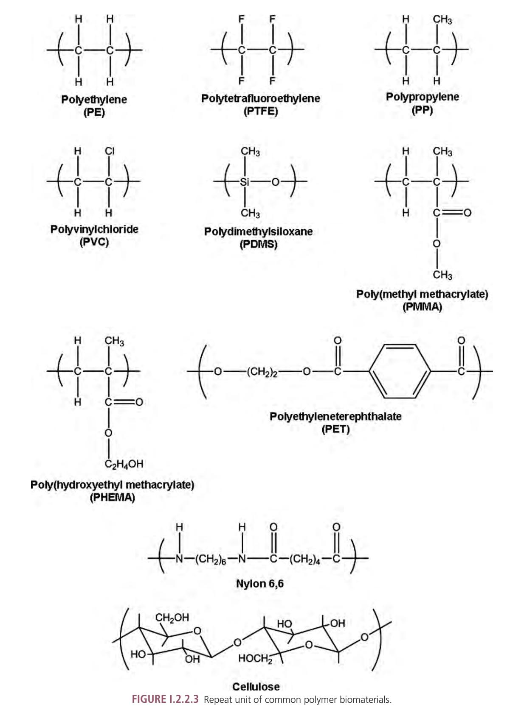

as silica-reinforced silicone rubber or hydroxyapatite particle-reinforced poly(lactic acid). Such composites can be considered as a sixth class of biomaterials, and they are discussed in Composites (Chapter I.2.9). This chapter emphasizes the mechanical properties of polymers that have been reinforced with specially surface-treated particles, fibers, and fabrics.

It should be noted that some implants and devices, such as artificial heart valves, are comprised of more than one class of biomaterial. For example, the Starr-Edwards ball-in-cage heart valve includes the silicone rubber ball, the polyester fabric for fixation to the tissues, and the stainless steel struts; however, these implants should not be considered as "composites," even though one or more component may be a composite material (such as the silica-reinforced silicone rubber ball composite material in the Starr-Edwards ball-in-cage heart valve). These implants are considered in other sections and chapters in this text.

Another chapter on special forms and properties of synthetic polymers is Hydrogels (Chapter I.2.5). This chapter includes a wide variety of compositions and structures, but it does not include "smart hydrogels" or drug delivery from hydrogels, which are found in other chapters, e.g., Chapter I.2.11 in the section on "smart," environmentally-responsive polymers, and Chapter II.5.16, which is a very detailed chapter on drug delivery systems. Section I.2 also includes a chapter on bioresorbable

### CHAPTER I.2.2 POLYMERS: BASIC PRINCIPLES

*Daniel E. Heath and Stuart L. Cooper* William G. Lowrie Department of Chemical and Biomolecular Engineering, The Ohio State University, Columbus, OH, USA

# INTRODUCTION

Polymer materials possess an array of unique properties which make them useful in a wide variety of biomaterial applications such as orthopedics, dental, hard and soft tissue replacements, and cardiovascular devices. In fact, polymers represent the largest class of materials used in medicine. This chapter introduces the basic principles in polymer science, illustrates how polymer materials can be specifically designed to fill needs in the biomaterials field, and provides examples of how this class of materials is currently used in medical applications.

The central idea of this chapter is structure–property relationships, which means molecular characteristics such as molecular architecture, molecular weight, and chemical composition are directly related to the physical and chemical properties of the macroscopic material. For instance, polymer scientists in other fields have been and bioerodible materials (Chapter I.2.6) that are a very important subclass of polymeric biomaterials.

Following these chapters, there are several chapters that focus on surfaces of biomaterials, including the principles of surface modification (Chapter I.2.12), surfaceimmobilized biomolecules (Chapter I.2.17), and surface patterning (Chapter I.2.13). These chapters are fundamental to the bioresponses of biomaterials.

Special fabrication processes and forms of materials are also considered in chapters on electrospinning of fibers (Chapter I.2.16), medical fibers and textiles (Chapter I.2.14), textured and porous materials (Chapter I.2.15), and micro- and nanoparticles (Chapter I.2.19). A chapter on biomimetic materials (Chapter I.2.18) is included, with special focus on bio-inspired designs and compositions of biomaterials.

More recently, biomaterials scientists and engineers have developed a growing interest in natural tissues and polymers in combination with living cells. This is particularly evident in the field of tissue-engineering, which focuses on the repair or regeneration of natural tissues and organs. This interest has stimulated the isolation, purification, and application of many different natural materials, including decellularized natural tissues and spider silk. The principles and applications of these biomaterials and modified biomaterials are critically described, discussed, and reviewed in Section II.6 of this text.

able to exploit structure–property relationships to create non-stick coatings, pressure-sensitive adhesives, and the penetration-resistant materials used in bullet-proof vests. A biomaterials scientist aware of structure–property relationships can rationally engineer a polymer system for a specific need.

# THE POLYMER MOLECULE

# **Molecular Structure of Single Polymer Molecules**

The hallmark of polymer molecules is high molecular weight. A single polymer molecule could have a molecular weight of 200,000 Da compared to a water molecule, which has a molecular weight of 18 Da. Furthermore, polymer molecules are organized into very interesting architectures. Common shapes of polymer molecules are shown in Figure I.2.2.1. The simplest is the linear chain where there is a single molecular backbone. When linear chains of two different composition polymers (e.g., A and B) are linked together, the resultant polymer is called an A–B block copolymer. If another chain is added to the second chain, it may be called an A–B–C triblock copolymer, or more simply, an A–B–C block copolymer. Branched structures are also possible where a central polymer backbone has smaller side chains extending from it. Branches can occur due to undesired side reactions during synthesis, or can be purposefully incorporated into the molecular structure. So far we have discussed polymer systems in which there are discrete polymer molecules. However, what would happen if you took a linear polymer molecule and covalently bonded it to the backbone of another linear

**FIGURE I.2.2.1** Some of the molecular structures available for polymer molecules. In the schematic of the network, polymer open circles indicate cross-link sites.

chain? You would produce a branched structure. If you repeated this act many times over you would eventually link all of the polymer chains together into one very large *network* polymer. This is also possible by using small di- or tri-functional "cross-linker" molecules to react with pendant or terminal reactive groups on linear polymer chains, eventually yielding a network polymer.

# **Chemical Structure of Single Polymer Molecules**

If you were able to see the individual atoms making up a polymer molecule, you would notice the same basic structure repeats over and over again. Figure I.2.2.2 shows a schematic of a linear polypropylene molecule. The polymer backbone is a series of carbon–carbon single bonds, while the hydrogen atoms and methyl group are *pendant groups*. The polymer chain is composed of many –(–CH2–CHCH3–)– groups covalently linked end-to-end. This structure is called the *repeat unit* of a polymer molecule. Etymologically, polymer comes from the Greek "poly," meaning many, and "meros," meaning part – many parts. In polymer molecules the "mer" is

Atactic PP

**FIGURE I.2.2.2** Polypropylene repeat unit and different tactic isomers. In the schematic Me indicates a methyl group.

the repeat unit. The repeat unit can be controlled through polymer synthesis and plays a large role in the macroscopic behavior of the polymer. Figure I.2.2.3 shows the repeat units of several synthetic and natural polymers commonly used in the biomaterials field.

# **Copolymers**

Sometimes it is advantageous to synthesize copolymers – polymers containing more than one chemically distinct repeat unit. For instance, a researcher may synthesize a

**FIGURE I.2.2.4** Some of the molecular structures available for copolymers.

**FIGURE I.2.2.5** Repeat unit of two common copolymer biomaterials.

polymer which contains repeat units "A" and "B." As shown in Figure I.2.2.4, there are many different ways the repeat units could be organized. Random copolymers occur when the "A" and "B" repeat units have no order in the backbone; however, alternating, block, and graft copolymers are also possible and the arrangement of repeat units affects the physical behavior of the biomaterial. The repeat units of two random copolymers commonly used in the biomaterials field are shown in Figure I.2.2.5.

# **Determination of Chemical Composition**

A researcher will often need to verify the chemical structure of polymers or determine the composition of copolymer systems. Two common techniques a scientist would use are nuclear magnetic resonance spectroscopy (NMR) and infrared spectroscopy (IR). NMR is an analytical technique which exploits the magnetic moments associated with nuclei containing an odd number of protons (most commonly the 1H and 13C isotopes). These protons are excited to a higher energy state through a burst of radiofrequency radiation. The nuclei relax to a lower energy state which is measured as an electric signal. Fourier transform analysis is used to convert this time domain electrical signal into the frequency domain. Due to shielding, protons attached to different structural units will display chemical shifts, meaning their peaks in the NMR spectrum will be at different frequencies. Through analysis of the peak placement and intensity, the chemical structure of molecules can be determined.

Infrared spectroscopy (IR) is also used to determine the chemical composition of polymers. The sample of interest is irradiated with infrared radiation and the sample adsorbs certain wavelengths, resulting in specific molecular motion (such as C–H stretching). The IR spectrum is created by plotting absorbance versus wavelength. Like NMR, analysis of the spectra can lead to the verification of a polymer's composition.

Often the chemical composition of the polymer surface is different from the bulk. For a medical implant the surface composition is highly important, since it will interface with the biological environment. To probe the surface composition X-ray photoelectron spectroscopy (XPS) – also known as electron spectroscopy for chemical analysis (ESCA) – is a common technique. A sample is bombarded with X-rays which results in the ejection of inner shell electrons from the atoms displayed on the material surface. The kinetic energies of the ejected electrons are measured and interpreted into information about the chemical composition of the surface (for more information on surface characterization techniques see Chapter I.1.5).

# **Tacticity**

Tacticity describes the stereochemistry of the repeat units in polymer chains. To illustrate the discussion on tacticity let us consider a molecule of polypropylene (PP). When stretched into its *planar zigzag* form, as seen in Figure I.2.2.2, you can see that sometimes the methyl groups are all on one side of the backbone, sometimes they alternate from side to side, and sometimes they are randomly distributed. During routine synthesis, a polymer chemist would normally produce an *atactic* version of PP, one where the methyl group is randomly located in front of and behind the polymer backbone. However, when a special catalyst is used during synthesis a chemist can produce *isotactic* PP, where all the methyl groups are located on one side of the "stretched out" polymer backbone, or *syndiotactic* PP where the methyl groups regularly alternate from side to side. As will be discussed later, tacticity can drastically affect the physical behavior of the polymer system, largely by affecting the ability of the polymer molecules to crystallize. Tactic isomers occur whenever an atom in the polymer backbone has the capacity to form tetrahedral bonding and is bonded to four different ligands. Such atoms (generally carbon) are referred to as *asymmetric*.

# MOLECULAR WEIGHT

# **The Molecular Weight Distribution and its Averages**

During polymerization, polymer chains are built up from low molecular weight monomers. The number of monomer repeat units in each polymer chain is called the *degree of polymerization*. However, in a traditional free radical

or condensation polymerization synthesis, each polymer chain will not have the same degree of polymerization. For instance, in the free radical polymerization of polyethylene, one polymer chain may add 3000 monomers, a second may add 4500 monomers, and a third may only add 1500. Therefore, most polymer systems have a *distribution of molecular weights*. Since polymer materials are made from molecules with a variety of molecular weights, it is incorrect to talk about *the* molecular weight of a polymer system. Instead, a polymer system is described by different averaged values of molecular weight. The two most commonly used averages are the number average molecular weight (Mn) and the weight average molecular weight (Mw). The mathematical definitions of these averages are supplied in Equations 1 and 2, where Ni is the number of molecules with "i" repeat units and Mi is the molecular weight of a polymer chain with "i" repeat units. Since Mw is calculated using the square of the molecular weight it is always greater than or equal to Mn.

$$
M_n = \frac{\sum_i N_i M_i}{\sum_i N_i}
$$
 (1)

$$
M_{w} = \frac{\sum_{i} N_{i} M_{i}^{2}}{\sum_{i} N_{i} M_{i}}
$$
 (2)

The ratio of Mw to Mn is the polydispersity index (PDI) (Equation 3) which is a measurement of the breadth of the molecular weight distribution. If the PDI of a polymer system is unity the number average and weight average molecular weights are identical, meaning the polymer sample is monodisperse (all chains have the same degree of polymerization). For most condensation polymers, the PDI is approximately 2.

$$
PDI = \frac{M_w}{M_n} \tag{3}
$$

The higher the average molecular weight, the stronger a polymer material will be. However, the melt/solution viscosity also increases with increasing average molecular weight, making the material more difficult to process. Often a molecular weight range exists within which most desired physical behaviors are achieved, yet the material is still easily processed. Generally, a number average molecular weight range from 25,000 to 50,000 Da is suitable for condensation polymers, while values from about 50,000 Da up to hundreds of thousands are preferred for addition polymers.

### **Characterizing the Molecular Weight Distribution**

Through understanding the importance of molecular weight and its distribution, polymer scientists have developed many methods for measuring average molecular weight values. For instance, Mn can be determined through techniques such as end-group analysis, vapor pressure lowering, and freezing point depression. In the following paragraphs we will first discuss common methods historically used to measure Mn (osmotic pressure) and Mw (light scattering). Although osmotic pressure and light scattering are powerful and useful techniques in the field of polymer science, they have been replaced in recent years by gel permeation chromatography (GPC), which gives much more detail about the molecular weight distribution, and does so much quicker. From the molecular weight distribution obtained by GPC, the first and second moments of the distribution, Mn and Mw, are readily determined.

In osmotic pressure experiments, a dilute polymer solution is separated from pure solvent by a semi-permeable membrane through which solvent can freely pass but which excludes polymer. The activity of the pure solvent differs from that of the solvent molecules in the solution phase resulting in a thermodynamic driving force – the osmotic pressure (π or *p*) causes molecules of pure solvent to diffuse across a membrane (which is permeable only to solvent) and into a compartment containing a solute (e.g., polymer) in solution. This causes the fluid level in the solution compartment to rise, resulting in a hydrostatic pressure head. Equilibrium is reached when the pressure head exactly offsets the osmotic pressure. By measuring the rise in fluid level, the osmotic pressure can be calculated and related to the number average molecular weight. A number of polymer solutions are prepared, each with a distinct concentration. The osmotic pressure is measured for each solution and plotted against concentration, the concentration is then extrapolated to zero, and the number average molecular weight can be determined from the intercept of the regression line.

Light scattering is a common technique to determine the Mw of a polymer system. In dilute solutions, the scattering of light is directly proportional to the number of molecules. The scattered intensity is observed at a distance *r* and angle *Q* from the incident beam, and is related to the size or weight average molecular weight of the molecule. The light scattering behavior of a series of polymer solutions with varying concentrations are measured and the data are extrapolated to zero concentration to determine Mw. Once the Mn and Mw values are determined, the PDI of the polymer system can be calculated.

Gel permeation chromatography (GPC) is the most commonly used molecular weight characterization technique in modern polymer science laboratories. Unlike osmotic pressure and light scattering, which provide *average* values of molecular weight, GPC provides the entire molecular weight distribution from which all the desired average values can be calculated. In GPC experiments, a dilute polymer solution flows through a column packed with solid separation media which contains pores on the same size scale as the polymer molecules. As the polymer molecules flow though the column, smaller chains diffuse into the pores and are detained, while larger polymer chains move through the column faster since they are excluded from the pore structure, resulting in higher molecular weight material eluting from the column first, followed by lower molecular weight species. The concentration of the effluent stream is monitored and a plot of detector signal (which is proportional to polymer concentration) versus elution time can be generated. Elution time is converted to molecular weight though calibration with mono-disperse polymers of known molecular weights.

## CONNECTING PHYSICAL BEHAVIOR WITH CHEMICAL CHARACTERISTICS

We have discussed the key characteristics of polymer molecules (molecular architecture, chemical composition, tacticity, and molecular weight). Now we will relate these molecular characteristics to macroscopic properties, and illustrate how these characteristics can be manipulated to create a polymer system with the desired behavior. We will focus on the tensile properties, hydrophilicity, and biodegradability of polymer systems.

**Physical States of Linear Polymers.** When designing a biomaterial, physical behavior is a key feature. For instance, if you were creating a cement for use in loadbearing bones (tibia or femur) you would have to ensure the material is both strong enough to act as a cement, but not so brittle that it would fail due to low fracture toughness. The physical properties of a polymer system stem from the intermolecular interactions occurring between individual polymer molecules; thus, the molecular characteristics we have discussed up to this point are of extreme importance. As you will see in the following text, the four most fundamental molecular characteristics of polymer chains which determine the physical behavior of a polymer are chain stiffness, chain composition or polarity, chain architecture or regularity, and molecular weight.

The three fundamental molecular properties of polymer molecules are chain stiffness, chain polarity, and chain architecture. They determine two important temperatures that characterize polymer molecules: Tg, the glass transition temperature, and Tm, the crystalline melting temperature. Tm is only present when there are crystalline regions in a polymer.

In Figure I.2.2.2, we see polypropylene molecules extended into planar zigzags. Although this is a convenient way to draw polymer molecules, this type of extended structure is rarely seen in nature. More often, polymer molecules are found as unorganized and three-dimensional structures called the *random coil*. In an *amorphous* structure, each random coil is highly interpenetrated with its neighbors. Polymers in the rubbery state or the glassy state have this amorphous molecular arrangement. Under certain conditions, some polymers will arrange themselves into highly organized crystalline domains resulting in a semi-crystalline material. Each of these states will now be explored in more depth.

**The Rubbery State.** Rubbery polymers are amorphous. However, the random coils have enough thermal energy for rotation to occur around single bonds. If you were able look at polymer molecules in the melt state, you would see that each random coil is continuously changing shape (conformation). This molecular motion becomes more intense as the thermal energy in the system increases. Macroscopically these materials are soft, flexible, and extensible, due to the molecular motion available to the molecules.

**The Glassy State.** As the polymer system is cooled, rotation around single bonds becomes hindered due to energy barriers created by a segment of a chain having to move (rotate) past a neighboring segment. As the temperature drops, the rate of rotation around main chain bonds in a polymer chain becomes slower and slower, and the chain gets stiffer and stiffer. Eventually, at a low enough temperature, single bond rotation ceases and the interpenetrated random coils become frozen in space. This is called the glassy state, and the temperature where single bond rotation ceases is called the glass transition temperature (Tg). A material below its Tg is called a glass because it is hard, stiff, and brittle. Molecules in the glassy state can no longer rearrange themselves under applied stress, so deformation results in straining the secondary interactions between molecules. The opposite occurs when an amorphous polymer is heated: the amorphous region goes from hard and glassy, to "leathery," to rubbery, and if the material is not cross-linked, it will eventually flow as a viscous fluid and can be processed into shapes.

#### **Ramen Noodles: Glassy Versus Rubbery Polymer Chains**

If you're reading this you are probably a college student, which means you are very familiar with Ramen Noodles. A package of noodles can be cooked in about 10minutes. When you first remove the noodles from the package, you will notice that the individual noodles are rather random in shape and intertwined with their neighbors. Furthermore, before boiling, these noodles are very rigid and fixed in relation to one another. This food product is a pretty good example of a polymer in the glassy state, where each noodle represents one polymer molecule. As the noodles are boiled they become flexible, and can easily change their shape and slip around; however, they retain their intertwined character. These noodles are a good example of a polymer material in the rubbery state.

**The Semi-Crystalline State.** All polymer systems form glasses at sufficiently low temperatures. However, as a melt is cooled, certain polymers have the ability to pack into a regular lattice, leading to the formation of stable crystalline domains. In polyethylene (PE), these stable crystalline domains are formed by chains in the planar zigzag conformation, while the crystalline chains in syndiotactic poly(vinyl chloride) (PVC) have a helical conformation. Since only a portion of the long polymer chains can crystallize (some segments will not be able to pack into the crystallites) this state is called semicrystalline. The temperature above which such crystalline regions will melt is called the crystalline melting point (Tm). Crystallites act to stiffen and reinforce the bulk material, and extend the stiffness and strength properties of a material well above the glass transition temperature until the crystallite melting point (Tm) is reached.

### **The Physical Behavior of Linear and Amorphous Polymers**

Unlike metals which are held together by metallic bonds and atomic crystals which are held together by covalent bonds, polymer materials are held together by secondary interactions such as London forces, dipole–dipole interactions, and hydrogen bonding. For this reason, polymers are often mechanically weaker than other classes of materials; however, they can display physical behavior more similar to native tissue.

The simplest polymer system is an amorphous rubbery or glassy polymer composed of linear polymer chains. When rubbery materials are strained, the polymer molecules are able to deform and extend resulting in a material which is macroscopically soft and weak, yet highly extensible. However, as the Tg of the material approaches and exceeds the environmental conditions, the material becomes a glass and is much stronger yet stiffer. The mechanical behavior of polymer systems is often probed through stress–strain analysis. From this analysis several key material properties can be determined: modulus (a measurement of material stiffness); tensile strength (the stress at failure); and percent elongation (the amount of deformation at failure). The room temperature mechanical properties of several polymeric biomaterials are presented in Table I.2.2.1.

# **The Physical Behavior of Other Physical States**

Cross-linking, crystallinity, and copolymerization greatly affect the physical behavior of polymer systems, and controlling these parameters gives a polymer scientist ways of specifying the physical behavior of a polymer system. Figure I.2.2.6 illustrates how each of these affects polymer modulus as a function of temperature. In Figure I.2.2.6A we see the standard modulus–temperature behavior of a linear and amorphous polymer system (solid line). Below the Tg the material is a glass and has a high modulus. However, at the glass transition temperature we see a dramatic drop in modulus due to the increased mobility within the polymer structure. At temperatures just higher than the Tg, we see a plateau on the curve where modulus declines more slowly with temperature. This is called the rubbery plateau, and in this region the polymer is still solid-like but soft, flexible, and extensible. Eventually, as the temperature is increased more, we see the modulus curve take another drop corresponding to the material beginning to flow. Notice that amorphous materials do not have a melting temperature. Melting refers to the loss of crystallinity, and since these materials are noncrystalline they never truly melt. As we will discover later, the architecture of the polymer chains, especially where there is a specific tacticity, determines if segments of a polymer chain can pack together and form crystallites.

In Figure I.2.2.6A we can also see the modulus– temperature behavior of a semi-crystalline material. In this curve we see a small drop in the modulus at the glass transition temperature, due to the onset of backbone rotation in the amorphous regions of the polymer. Since crystallites are unaffected by the Tg, the magnitude of this drop is greatly affected by the amount of crystallinity in the system. After the Tg we see that the modulus holds steady until the melting point, illustrating that crystallinity

| TABLE I.2.2.1                               | Physical Properties and Equilibrium Water Absorption of Common Polymeric Biomaterials |                          |                           |                            |                         |
|---------------------------------------------|---------------------------------------------------------------------------------------|--------------------------|---------------------------|----------------------------|-------------------------|
| Material                                    |                                                                                       | Tensile Modulus (GPa) | Tensile Strength (MPa) | Elongation at Break (%) | Water Absorption (%) |
| Polyethylene (PE)                        |                                                                                       | 0.8–2.2                  | 30–40                     | 130–500                    | 0.001–0.02              |
| Poly(methyl methacrylate) (PMMA)         |                                                                                       | 3–4.8                    | 38–80                     | 2.5–6                      | 0.1–0.4                 |
| Polytetrafluoroethylene (PTFE)           |                                                                                       | 1–2                      | 15–40                     | 250–550                    | 0.1–0.5                 |
| Polylactide (PLA)                        |                                                                                       | 3.4                      | 53                        | 4.1                        | <0.5                    |
| Poly(hydroxyethyl methacrylate)† (PHEMA) |                                                                                       | 0.29                     | 0.15                      | 71                         | 40                      |
| Polypropylene (PP)                       |                                                                                       | 1.6–2.5                  | 21–40                     | 100–300                    | 0.01–0.035              |
| Poly(ethylene terephthalate) (PET)       |                                                                                       | 3–4.9                    | 42–80                     | 50–500                     | 0.06–0.3                |

†Tensile properties were measured after the polymer was equilibrated with water.

**FIGURE I.2.2.6** Modulus versus temperature behavior for: (A) linear amorphous, semi-crystalline, and cross-linked polymer; (B) random copolymer; and (C) block or graft copolymer.

is a way to increase the window of temperatures in which a polymer can be employed. At Tm the crystallites melt and the polymer begins to flow. The ability of chains to crystallize is a special feature of chain architecture that is sometimes called "symmetry" or "regularity," i.e., a streamline profile in cross-section with small side groups that allows the chain segments to pack into crystallites. In special cases, a stereospecific property of some chains with asymmetric atoms is called tacticity; it can also control the ability of a polymer to crystallize. Polymers without asymmetric atoms in the backbone (and therefore having no tactic isomers) can crystallize along with isotactic and syndiotactic polymers. However, atactic materials cannot organize themselves into a lattice due to the irregularity in their chemical structure, and so are therefore permanently amorphous. Branched polymers have difficulty crystallizing, since the branch sites interfere with the ability of the polymer to organize into a lattice. In cases where branch sites are purposefully incorporated into the material they will lower the extent of crystallization (such as in the case of low density polyethylene).

Also in Figure I.2.2.6A you can see the modulus– temperature behavior of a cross-linked polymer. Again, at the glass transition temperature you will see a decrease in modulus due to the onset of single bond rotation; however, above the Tg the modulus is relatively independent of temperature because the cross-links act to tether the polymer chains in place. In fact, the cross-linked polymer will not experience a large decrease in modulus until the temperature is high enough to begin thermally degrading the bonds holding the structure together.

Copolymerization of more than one monomer unit could also be used to control the physical behavior of a material. Figure I.2.2.6B shows modulus–temperature curves for a random copolymer system where the shape of the curve is maintained, but shifted laterally. If block or graft copolymers are produced, one would see the distinct transition of both materials used to generate the copolymer, as seen in Figure I.2.2.6C.

Table I.2.2.2 provides the repeat unit, Tg, and Tm of common polymers. Chemical characteristics that facilitate backbone rotation result in lower Tg materials, while structural characteristics that hinder backbone rotation result in higher Tg materials. For instance, the –Si–O– bond in polydimethylsiloxane is unhindered, and is a freely rotating bond down to very low temperatures, resulting in a

†Isotactic.

\*Decomposition temperature.

very low Tg. As pendant group bulkiness increases, the polymer chains along the backbone have more difficulty rotating due to steric hindrances, illustrated by the much higher Tg of polystyrene in comparison with polyethylene. However, pendant groups of four or more carbon atoms tend to create "free volume" around the polymer backbone, making main chain rotation easier, and the Tg may be lowered, as seen in the alkyl methacrylate family as the alkyl group increases in length. Increased polarity, especially where hydrogen bonds may act between side groups, increases the polar interactions between chains, slowing the rate of main chain rotations and resulting in a higher Tg. In general, the structural factors that affect the glass transition temperature (backbone flexibility, pendant group structure and polarity, main chain symmetry and polarity) similarly affect Tm, as illustrated by the data in Table I.2.2.2.

#### **A Tragedy Caused by a Change in Temperature and its Effect on Tg and Polymer Properties**

In 1986 the space shuttle Challenger broke apart during lift-off, killing the seven crew members aboard and halting all US space flights for the next two and a half years. This tragedy was caused by the failure of an O-ring - a polymer gasket – connecting the shuttle's external fuel tank to one of its solid rocket boosters. The O-ring failed, in part, due to the abnormally cold weather on the morning of the launch, causing stiffening of the gasket as the polymer approached its Tg, and that undermined its ability to form a tight seal. The gasket failure allowed a tongue of flame to reach both the solid rocket booster and the external fuel tank, and resulted in the structural failure of both. The shuttle then broke apart due to extreme aerodynamic loads. See NASA, 1986.

## **Characterizing a Polymer's Physical State and Behavior**

Crystallinity plays a large role in determining polymer behavior. The *degree of crystallinity* – a measurement of how much of the polymer is incorporated into crystalline regions – can be studied with techniques such as measurement of density, X-ray diffraction (XRD), and infrared spectroscopy. In XRD experiments a polymer sample is bombarded with X-ray radiation and the intensity of the scattered X-rays is measured as a function of scattering angle. A fully amorphous material would produce a very broad peak, covering all scattering angles. However, crystalline materials will produce sharp peaks at specific angles. Furthermore, the placement of these peaks corresponds to a particular crystalline structure. By integrating the areas under the amorphous peak and the crystalline peaks, and then calculating the fractional area of the crystalline peaks relative to the total area, a researcher can determine the degree of crystallinity.

Stress–strain analysis provides information about the mechanical behavior of a polymeric biomaterial. In this test a polymer sample of known dimensions is deformed at a given rate, and the force needed to cause the deformation is recorded.

# **Measuring the Transition Temperatures Between States**

Measuring transition temperatures (Tg and Tm) is important to understanding how a material will behave in a certain application. Two common methods for determining the transition temperatures in polymer systems are differential scanning calorimetry (DSC) and dynamic mechanical analysis (DMA). In DSC experiments a polymer sample is heated at a constant temperature rate (generally 10–20°C/min) and the amount of heat supplied to the sample to obtain the temperature increase is recorded. The output from this experiment is a plot of supplied heat versus temperature. The curves exhibit a step change at Tg due to a change in heat capacity at the onset of backbone rotation. An endothermic peak occurs in the DSC spectra at the melting point of the polymer due to the increased energy needed to melt the crystalline regions.

When performing a DMA experiment, one measures the modulus (stiffness) of the material over a temperature range, yielding the types of curves shown in Figure I.2.2.6. The glass transition temperature of the material is physically observed as the softening point of the material. In a DMA study the modulus drops by approximately three orders of magnitude at the Tg. At the Tm another drop is observed, associated with the softening due to melting of the polymer crystalline units and the onset of flow behavior.

# **Interactions with Water**

Biomaterials are often employed in highly hydrated environments, so their interaction with water is an important design characteristic. Relatively non-polar and electrically neutral polymers such as polyethylene or poly(methylmethacrylate) are very hydrophobic and absorb <1 wt% water. However, as polarity and, in some cases, ionic character is incorporated into the polymer, it will imbibe more water due to polar (and coulombic) interactions. For instance, poly(hydroxyethyl methacrylate) (PHEMA) (the first soft contact lens) absorbs approximately 40 wt% water due to the polar hydroxyl moieties of the pendant groups. Eventually, if enough polarity or ionic character is incorporated into the material, it becomes water soluble, e.g., poly(ethylene glycol) and poly(methacrylic acid). The equilibrium water absorption of common biomaterials is presented in Table I.2.2.1.

One can tailor the interaction of a polymer with water in several ways, such as by controlling the ratio of hydrophobic and hydrophilic monomers in a copolymer. Also, crystalline regions in polymers usually resist infiltration of water molecules. If a polymer is processed in a way to control the degree of crystallization, the swelling character of the polymer can thereby be controlled. Crosslinked hydrophilic polymers generate hydrogels that can imbibe upwards of 200 wt% water. However, increasing the cross-link density can reduce the swelling of such a material, providing another method of tailoring the interactions of a polymer with water.

In addition to swelling behavior, the surface hydrophilicity of a polymer is also an important design feature. Though it is beyond the scope of this chapter, you will learn elsewhere in this text that a biomaterial surface can be physically or chemically coated with peptides or proteins to enhance cellular attachment and growth. Surfaces may also be treated to be "non-fouling," i.e., to resist protein adsorption and cell attachment.

# **Measuring the Hydrophilicity of Polymer Materials**

Equilibrium swelling experiments are performed to study the interactions between bulk polymer and water. A dry sample of polymer of known mass is submerged in water, and the change in mass is recorded over time. Eventually the sample weight will become constant, and from this value the equilibrium water absorption can be calculated.

The surface hydrophilicity is probed through either static or dynamic contact angle experiments. In static experiments, a droplet of water is placed on a flat polymer surface and the angle the droplet makes with the material (as measured through the water phase) is measured. The degree to which water spreads on the surface is a measurement of the polarity of the interface. For instance, a material with a water contact angle of 20° has a *more polar* surface than a material with a water contact angle of 95°.

The surface composition of some materials can change depending on the external environment. For instance, a polymer may expose its hydrophobic portions to an air environment, yet it will reorganize its surface to display its hydrophilic portions when exposed to water (unless the interface has been oxidized to increase hydrophilicity). Dynamic contact angle experiments allow a researcher to probe the ability of the surface molecules to rearrange depending on the phase to which they are exposed. In such an experiment a polymer film is dipped into a bath of water and then removed. The force between the polymer sample and water is measured during immersion and retraction, and converted into contact angles. Materials with surface molecules that have the mobility to rearrange in air versus water will exhibit contact angle hysteresis, and the advancing and receding contact angles will not be the same. The advancing angle is always greater than the receding angle.

# **Degradation Characteristics**

Depending on the application, one may desire a polymer material that is either biodegradable or biostable. For instance, a polymer that will be used for a tissue engineered scaffold needs to be biodegradable, and to "disappear" as functioning tissue is regenerated by cells. However, some biomaterials, such as dental implants, vascular grafts, and intraocular lenses need to be biostable so that they retain their function for the lifetime of the patient. The main type of polymer degradation reaction occurring in the body is *hydrolysis*, i.e., the reaction of the polymer backbone bonds with water, which results in the hydrolysis of those bonds and loss of the polymer's mechanical properties. Eventually the polymer breaks up into small fragments that are metabolized and/or dissolve, and the residual molecules are eliminated from the body. The ultimate stability of polymers in the body depends on two key factors: water absorption and the susceptibility of main chain bonds to hydrolysis.

The carbon–carbon single bond is very stable and those materials with main chain C–C bonds, such as polyethylene, polypropylene or PMMA, do not lose their properties due to degradation of the backbone. However, the presence of other bonds in the polymer backbone (*heterochain* polymers) can lead to hydrolytic breakdown, and the rate of this hydrolysis is greatly affected by the polymer's molecular structure. For instance, the hydrolysis of amide bonds in Nylon 6,6 is so slow that it is almost non-existent at physiological conditions, making polyamide biomaterials relatively biostable. On the other hand, water can hydrolyze ester bonds (–CO–O–C–) present in some polymers. For example, poly(lactideco-glycolide) copolymers (Figure I.2.2.5) degrade by such hydrolysis. An exception to this is poly(ethylene terephthalate) or PET, which is crystalline and hydrophobic, so that even though it has main chain ester bonds, water absorption is so low it is resistant to hydrolysis. The reader is referred to Chapter II.4.1 on degradation of biomaterial implants and to Chapter II.5.16 on drug delivery from degradable matrices for further discussion of this important topic.

### POLYMER SYNTHESIS

A polymer scientist who understands structure–property relationships can design polymer molecules to fit a particular application. In this section of we discuss synthesis of polymers.

### **Polymerization Mechanisms**

*Condensation* and *addition polymerization* are the two most common methods for polymer synthesis. In organic chemistry, reactions are described which occur between different functional groups. For instance, a carboxylic acid group can react with an amine group to form an amide bond and liberate a water molecule. Table I.2.2.3 illustrates some of these major organic reactions. The same reactions as those seen in Table I.2.2.3 are used to produce condensation polymers. The only difference

is that instead of using monofunctional molecules (which contain only one functional group) difunctional monomers (which contain two functional groups) are used. Figure I.2.2.7A illustrates the formation of a poly(ethylene terephthalate) (PET) repeat unit through the reaction of ethylene glycol and dimethyl terephthalate, while Figure I.2.2.7B shows the production of a Nylon 6,6 repeat unit through the reaction of adipic acid and hexamethylenediamine. (In practice, PET is synthesized by an ester interchange reaction between dimethyl terephthalate and ethylene glycol, liberating methanol.) Notice that all of the monomers are difunctional molecules. Furthermore, the products from each reaction are also difunctional, allowing further, similar reactions to gradually produce higher molecular weight linear polymer chains.

The addition polymerization mechanism is quite different. A reactive center (most often a free radical, but sometimes an ion) is produced and reacts by adding across the C═C of vinyl monomers. The active center is not consumed during this reaction, and will continue reacting with carbon double bonds until it is terminated. High molecular weight chains are produced rapidly, and new chains are constantly being initiated. Figure I.2.2.8 is a schematic of a typical addition polymerization. First the reaction is initiated by the production of free radicals through a peroxide decomposition. The radical then propagates the polymer chain by consuming vinyl monomers. Finally the polymerization is terminated through a coupling reaction with a second radical (another method of termination called disproportionation is possible but is not discussed here) to produce a polymer molecule containing monomer repeat units.

There are newer polymerization techniques that are known as "controlled living free radical polymerizations" (or CRP) where the growth, chain transfer, and termination reactions are controlled to yield polymers with a desired molecular weight and narrow PDI. The two most popular of these techniques are known as ATRP, or Atom Transfer Radical Polymerization (Kato et al., 1995; Wang and Matyjaszewski, 1995) and RAFT,

**(A)**

**FIGURE I.2.2.7** Condensation reaction between: (A) ethylene glycol and dimethyl terephthalate to produce a repeat unit of poly(ethylene terephthalate); and (B) adipic acid and hexamethylenediamine first form a 1:1 Nylon salt to ensure stoichiometric balance between monomers allowing polymerization to high molecular weights. Monomers present in the Nylon salt are then polymerized to produce a repeat unit of Nylon 6,6.

R CH2 X X C H **+** R

**(C)**

**Termination - two free radicals react to form a single bond through coupling to form one polymer chain.**

**FIGURE I.2.2.8** Addition polymerization of a vinyl monomer to a polymer chain: (A) the initiation step where the free radical is produced; (B) the propagation step where the free radical adds across the vinyl monomer's double bond; and (C) the termination step where two radicals react to produce dead polymer chains. In the schematic X represents a generic side group.

or Reversible Addition-Fragmentation Chain Transfer Polymerization (Chiefari et al., 1998).

The reader is referred to recent polymer textbooks (see Bibliography) for further reading on polymerization techniques.

## **Using Synthesis Conditions to Build the Desired Polymer**

The first step towards producing a material with the desired behavior is selection of the appropriate monomer species. For instance, a researcher developing a bone cement could select a monomer with a bulky pendant group to produce a glassy polymer, while another biomaterials scientist creating a hydrogel could select a monomer with a polar pendant group to improve hydrogen bonding interactions with water.

Physical behavior can be further tailored through crystallinity and cross-linking. Addition polymers containing asymmetric carbon atoms are generally atactic, meaning the polymer will be predominantly amorphous. However, one can use special catalysts to produce isotactic or syndiotactic addition polymers that can crystallize.

In condensation polymerization, monomers containing two functional groups produce linear polymer chains. However, if one adds a small amount of a monomer with three or more functional groups, cross-linked materials are produced. Similarly, addition of vinyl type monomers containing two or more vinyl groups can produce networked materials. Linear polymers can also be cross-linked after synthesis through techniques such as vulcanization, or UV or gamma ray irradiation.

#### **So What is a Network Polymer?**

A common example of a network polymer is an automobile tire. The main polymer component of tire tread is a polystyrene/polybutadiene copolymer (SBR). The individual SBR polymer chains are covalently cross-linked into a network polymer through reaction with sulfur (a process known as vulcanization). There are other additives in car tires (carbon black, for instance, which gives the tire its black color); however, the polymer component of the tire is actually one very large, covalently cross-linked molecule.

If degradation characteristics are desired they can be achieved through control of the composition of the backbone groups. Addition polymerization produces homochain polymers that are generally biostable. Sometimes condensation polymerization mechanisms may produce a water molecule. The reverse reaction can occur between the polymer bonds being formed and the water molecule, resulting in simultaneous degradation of the polymer. In that case, water must be removed as it is formed.

### CASE STUDIES

We have discussed the basic molecular characteristics that govern polymer behavior, and how to exploit chemistry in order to build polymers with the desired characteristics. Table I.2.2.4 compiles the chemical characteristics of several polymeric biomaterials, and reports their clinical applications. We will also look in more depth at the development of three polymer biomaterials that have achieved clinical success.

## THE PRESENT AND THE FUTURE

In the early days of biomaterials science, materials were not designed for biomedical applications. Pre-existing materials were used and their biocompatibility was empirically assessed. As you will learn through this book, much of the current work in the biomaterials field focuses on creating materials that exhibit specific interactions with biology to achieve improved performance and better healing.

#### **Case Study** Resorbable Sutures

#### **What problems can occur?**

Sutures are often needed to hold tissue together after injury, incision, or surgery. If a non-biodegradable material is used to suture an internal wound, a secondary surgery would be necessary to remove the stitches after healing.

#### **What properties are required of the biomaterial?**

For a suture material, the most fundamental property required is appropriate tensile strength, so the wound does not reopen during healing. Also, the suture materials should degrade in the body during healing, making retrieval or removal unnecessary. Further, the degradation must occur at an appropriate rate, and the degradation products must be non-toxic.

#### **What polymeric biomaterial is used?**

Early resorbable sutures were made from sheep or beef gut. However, synthetics are more commonly used due to their ease of handling, low cost, consistent performance, and low chance of disease transfer. One commonly used material is a poly(lactide-co-glycolide) copolymer (PLGA). This is a random copolymer so the material is permanently amorphous; however, it still possesses the high tensile strength and flexibility required for this application. Also, the material biodegrades through hydrolysis of the ester bonds in the polymer backbone into lactic and glycolic acid. Both of these chemicals occur naturally in the body's metabolic pathway, and so are non-toxic in small amounts. Furthermore, the ester bonds in the lactide and glycolide repeat units hydrolyze at different rates, allowing the degradation rate to be tailored.

#### **TABLE I.2.2.4** Common Polymeric Biomaterials with Their Applications and the Properties That Make Them Useful in the Medical Field

| Material                              | Characteristics                                                                                                                                                                                      | Uses                                                                                   |
|---------------------------------------|------------------------------------------------------------------------------------------------------------------------------------------------------------------------------------------------------|----------------------------------------------------------------------------------------|
| Poly(methyl methacrylate) (PMMA)   | Hydrophobic polymer which is hard, rigid, and biostable. The amorphous material is clear allowing light transmittance                                                                             | Bone cement Intraocular lenses Hard contact lenses                               |
| Polyacrylamide (PA)                | Cross-linking produces a hydrogel with molecular-sized pores and allows the gel to be used as a separation medium                                                                                 | Separation gel used in electrophoresis                                              |
| Poly(acrylic acid) (PAA)           | The liquid monomer can be cured with a photo-initiator. If inorganic salts are added, ionic cross-linking can occur. The material is glassy and rigid, and has the potential to bond to enamel | Glass ionomer cement used in dental restoration                                     |
| Polyethylene (high density) (PE)   | Low density PE cannot withstand sterilization temperatures; however, high density PE has good toughness and wear resistance                                                                    | Tubing for drains and catheters Prosthetic joints                                   |
| Poly(vinyl chloride) (PVC)         | PVC is plasticized to make flexible materials. This material is used for short-term applications since plasticizers can be leached resulting in embrittlement of the material                  | Tubing Blood storage bags                                                           |
| Polypropylene (PP)                 | Isotactic PP is semi-crystalline, has high rigidity and tensile strength, and good biostability                                                                                                   | Non-degradable sutures Hernia repair                                                |
| Polydimethylsiloxane (PDMS)        | Due to its silicone backbone, this material has a very low Tg making it extremely flexible and providing it with good fatigue resistance at physiological conditions                           | Finger joints Heart valves Breast implants Ear, chin, and nose reconstruction |
| Poly(ethylene terephthalate) (PET) | The aromatic rings in the backbone generate a polymer with a high melting point (Tm = 267°C). It is semi-crystalline and possesses excellent tensile strength                                  | Vascular grafts Fixation of implants Hernia repair Ligament reconstruction    |
| Cellulose acetate (CA)             | Unique transport properties make it excellent for use in the separation of complex biological mixtures                                                                                            | Dialysis membranes Osmotic drug delivery devices                                    |

#### **Case Study** Soft Contact Lenses

#### **What problem was addressed?**

The first contact lens, developed in 1888, was made of glass, and could not be worn for long periods of time. A generation of PMMA lenses were developed (hard contact lenses) and experienced clinical success. However, these rigid lenses caused eye irritation, and did not allow enough oxygen to be transported to the cornea of the eye (an avascular tissue which must receive oxygen from the environment in order for normal metabolism to occur). The Czech scientists, Wichterle and Lim, wanted to make a lens which was more comfortable and would allow better transport of oxygen to the cornea. (Otto Wichterle and Drahoslav Lim, "Process for producing shaped articles from three-dimensional hydrophilic high polymers", US Patent 2,976,576, March 28, 1961.)

#### **What properties were required of the biomaterial?**

Strong mechanical properties were not a major factor in the design of soft contact lenses, since the device does not need to support large stresses. However, a successful lens needed to: (1) be transparent so that clear vision could be achieved; (2) be dimensionally stable to maintain the optical correction desired; (3) be soft and flexible to minimize eye irritation; (4) allow appropriate transport of oxygen and nutrients to the cornea; and (5) have sufficient surface wettability so as not to damage the corneal cells.

#### **What polymeric biomaterial is used?**

The major component of most modern soft contact lenses is loosely cross-linked poly(hydroxyethyl methacrylate) (PHEMA). Semi-crystalline polymers are often translucent due to light refracted by crystallites. Since PHEMA is atactic the polymer is transparent. When dry, PHEMA is glassy, allowing the lens to be fabricated through milling procedures (as is done with hard contact lenses). However, the hydroxyl-containing pendant group results in a hydrophilic polymer that imbibes 40 wt% water. The absorbed water plasticizes the polymer, producing a soft and supple material that is less irritating to the eye. Pure PHEMA lenses are not capable of providing the necessary oxygen to the cornea of the eye, so PHEMA is often copolymerized with other monomers, such as fluorinated or "siliconized" methacrylates, to improve oxygen transport either by increasing the oxygen solubility in the lens or by allowing the fabrication of a thinner lens.

Recently, much research in contact lens development has focused on the design of extended wear lenses (contacts that can be worn for up to 7–14 days without removal). A leading material for extended wear contacts is a silicone hydrogel that is composed of a silicone polymer network with an entrapped water-soluble polymer such as poly(vinyl pyrrolidone). This combination creates a material with excellent oxygen and ion permeability, and good lubricity of the lens against the cornea. (For example, see [http://en.wikipedia.org/wiki/Contact\\_lens](http://en.wikipedia.org/wiki/Contact_lens).)

## **Case Study** Artificial Hip Joints

#### **What problem was addressed?**

A surgeon may perform hip arthroplasty (implantation of an artificial hip) to alleviate the pain and stiffness of severe arthritis or to repair the joint after physical damage. An artificial hip implant has two pieces: the femoral ball and stem; and the acetabular cup. The femoral ball and stem implant is a metal shaft that inserts into the femoral bone core, and is capped by a ball that articulates with the acetabular cup.

#### **What properties were required of the biomaterial?**

Sir John Charnley – a British orthopedic surgeon – conceived the initial concept that led to the modern artificial hip. Focusing on the acetabular component, tribology (the study of friction, lubrication, and wear) is of utmost importance. The ideal polymer for use in an articulating joint would be low friction and resistant to wear.

#### **What polymeric biomaterial was used?**

Initially Charnley used poly(tetrafluoroethylene) (PTFE), a very non-polar and low-friction material, for the acetabular cup. He also used stainless steel for the femoral ball and stem. Two problems arose: first, PTFE did not have the necessary wear resistance, and small pieces of PTFE debris eroded from the surface of the cup, causing severe inflammation of the surrounding tissue. Second, Charnley had to force-fit the femoral stem into the femur, and it loosened during use. Although polyethylene (PE) is a higher-friction surface than PTFE, very high molecular weight PE is a superior biomaterial for this application, since the PE did not produce excessive wear debris. Also, the PE could be simultaneously gamma radiation-sterilized and cross-linked, increasing its wear resistance. It could also be machined to a fine smoothness to further minimize wear. Charnley was advised by Dennis Smith, a biomaterials chemist working on dental implants, to use PMMA dental cement to hold the femoral stem in place during wear, and that solved the second problem.

# BIBLIOGRAPHY

- Allcock, H. R., Lampe, F. W., & Mark, J. E. (2004). *Contemporary Polymer Chemistry* (3rd ed.). Englewood Cliffs, NJ: Prentice Hall, Inc.
- Brandrup, J., Immergut, E. H., & Grukle, E. A. (1999). *Polymer Handbook* (4th ed.). New York, NY: Wiley-Interscience.
- Charnley, J., & Halley, D. K. (1975). Rate of wear in total hip replacement. *Clinical Orthopedic Related Research*, **112**, 170–179.
- Chiefari, J., Chong, Y. K., Ercole, F., Krstina, J., Jeffery, J., et al. (1998). Living free-radical polymerization by reversible addition−fragmentation chain transfer: The RAFT process. *Macromolecules*, **31**, 5559–5562.
- Dumitriu, S. (2002). *Polymeric Biomaterials* (2nd ed.). New York, NY: Marcel Dekker Inc.
- Gilding, D. K., & Reed, A. M. (1979). Biodegradable polymers for use in surgery: Poly(glycolic)/poly(lactic acid) homo- and copolymers. *Polymer*, **20**, 1459–1464.
- Flory, P. J. (1953). *Principles of Polymer Chemistry*. Ithaca, NY: Cornell University Press.
- Kato, M., Kamigaito, M., Sawamoto, M., & Higashimura, T. (1995). Polymerization of methyl methacrylate with the carbon tetrachloride/dichlorotris-(triphenylphosphine)ruthenium(II)/ methylaluminum bis(2,6-di-tert-butylphenoxide) initiating system: Possibility of living radical polymerization. *Macromolecules*, **28**, 1721–1723.