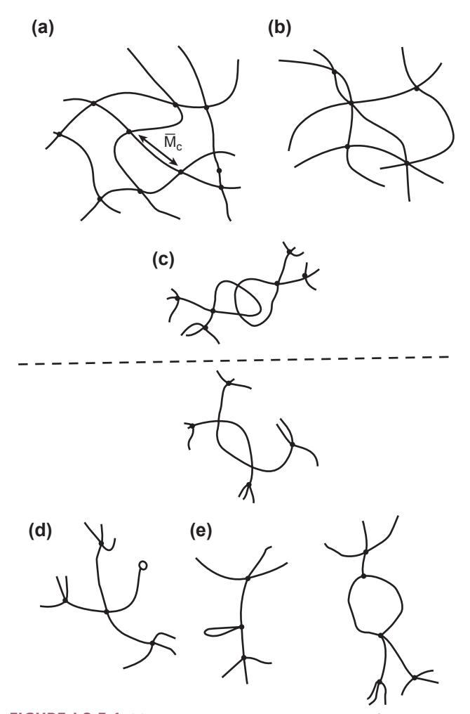
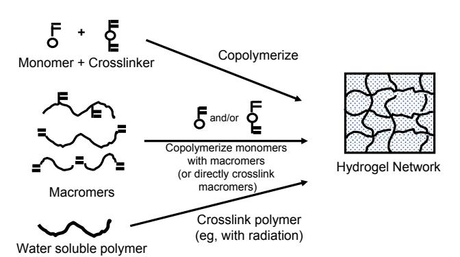
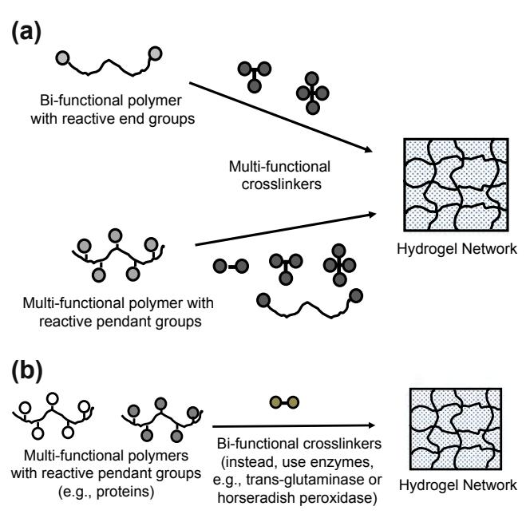
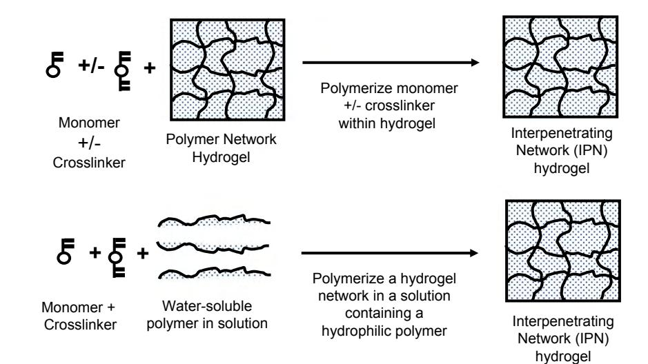
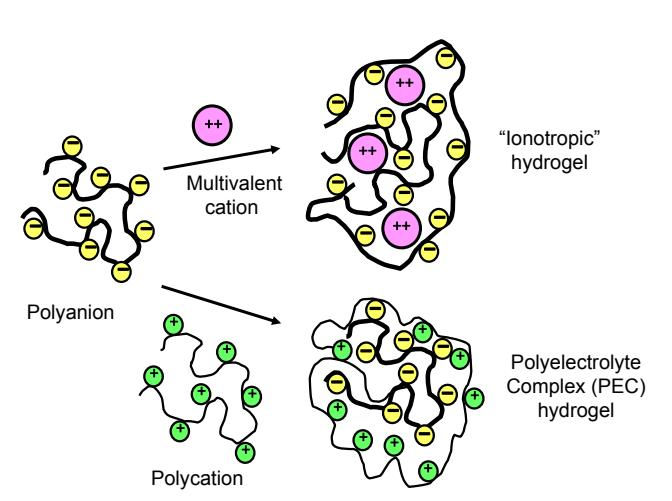
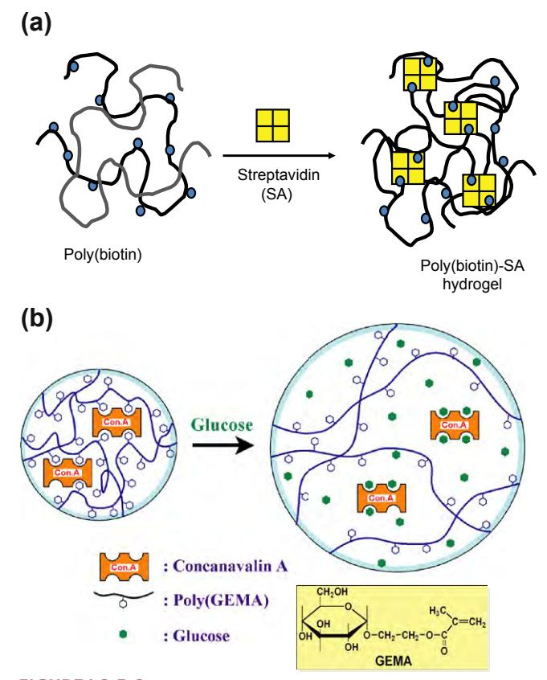
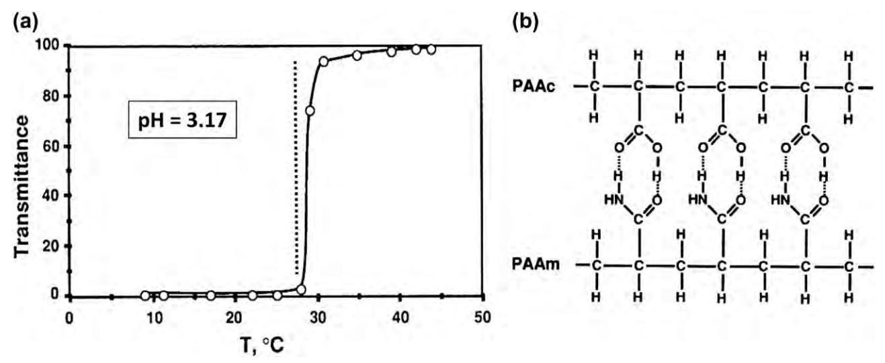
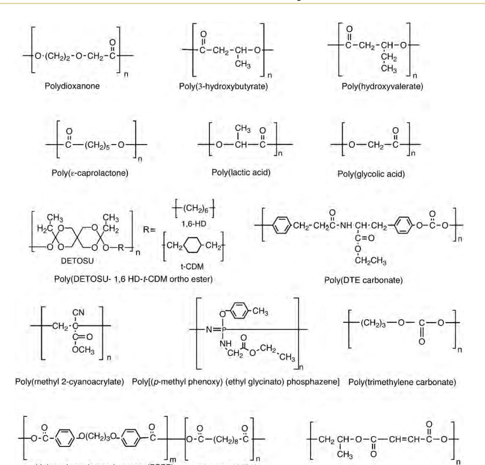

- Popat, K. C., Leary Swan, E. E., Mukhatyar, V., Chatvanichkul, K. I., Mor, G. K., Grimes, C. A., & Desai, T. A. (2005). Influence of nanoporous alumina membranes on long-term osteoblast response. *Biomaterials*, **26**, 4516–4522.
- Swan, E. E., Popat, K. C., & Desai, T. A. (2005a). Peptideimmobilized nanoporous alumina membranes for enhanced osteoblast adhesion. *Biomaterials*, **26**, 1969–1976.

## CHAPTER I.2.5 HYDROGELS

*Nicholas A. Peppas1 and Allan S. Hoffman2* 1Chemical Engineering Department, University of Texas, Austin, TX, USA 2Professor of Bioengineering and Chemical Engineering, UWEB Investigator, University of Washington, Seattle, WA, USA

## INTRODUCTION

Hydrogels have received significant attention because of their high water contents and related potential for many biomedical applications. Hydrogels are polymeric structures held together as water-swollen gels by: (1) primary covalent cross-links; (2) ionic forces; (3) hydrogen bonds; (4) affinity or "bio-recognition" interactions; (5) hydrophobic interactions; (6) polymer crystallites; (7) physical entanglements of individual polymer chains; or (8) a combination of two or more of the above interactions. The classic book by Andrade (1976) offers some of the best work that was available prior to 1975 (e.g., Ratner and Hoffman, 1976). Since then, numerous reviews and several books have addressed the preparation, structure, characterization, and applications of hydrogels (e.g., Peppas 1987, 2001; Brannon-Peppas and Harland, 1990; Lee and Mooney, 2001; Qiu and Park, 2001; Hennink and van Nostrum, 2002; Jeong et al., 2002; Miyata et al., 2002; Drury and Mooney, 2003; Patterson et al., 2010). In this chapter we focus on the preparation and characterization of the structure, and chemical and physical properties of *synthetic* hydrogels. Many natural polymers such as collagen, gelatin, fibrin, hyaluronic acid, heparin, alginates, pectins, chitosan, and others can be used to form hydrogels, and some of these gels have been used in biomedical applications. Details on these types of materials can be found throughout this textbook in other chapters.

## CLASSIFICATION AND BASIC STRUCTURES OF HYDROGELS

Depending on their method of preparation, ionic charge, or physical structure features, hydrogels may be classified in several categories. Based on the method of preparation, they may be: (1) *homopolymer hydrogels*; (2) *copolymer hydrogels*; (3) *multi-polymer hydrogels*; and (4) *interpenetrating network* (*IPN*) *hydrogels*. *Homopolymer hydrogels* are cross-linked networks of one

- Swan, E. E., Popat, K. C., Grimes, C. A., & Desai, T. A. (2005b). Fabrication and evaluation of nanoporous alumina membranes for osteoblast culture. *J. Biomed. Mater. Res. A*, **72**, 288–295.
- Tateiwa, T., Clarke, I. C., Williams, P. A., Garino, J., Manaka, M., Shishido, T., Yamamoto, K., & Imakiire, A. (2008). Ceramic total hip arthroplasty in the United States: safety and risk issues revisited. *Am. J. Orthop. (Belle Mead NJ)*, **37**, E26–E31.

type of hydrophilic monomer unit, whereas *copolymer hydrogels* are produced by cross-linking of chains composed of two comonomer units, at least one of which must be hydrophilic to render them water swellable. *Multi-polymer hydrogels* are produced from three or more comonomers reacting together (e.g., Lowman and Peppas, 1997 and 1999). Finally, *interpenetrating network* (*IPN*) *hydrogels* are produced by two methods, one within a pre-formed network and the other in solution; the most common method is to polymerize one monomer within a different cross-linked hydrogel network. The monomer polymerizes to form a polymer or a second cross-linked network that is intermeshed with the first network.

There are several other ways that hydrogels may be classified. *Ionic hydrogels*, with ionic charges on the backbone polymers, may be classified as: (1) *neutral hydrogels* (uncharged); (2) *anionic hydrogels* (having negative charges only); (3) *cationic hydrogels* (having positive charges only); or (4) *ampholytic hydrogels* (having both positive and negative charges). These last gels may end up with a net negative, positive or neutral charge.

Based on physico-chemical structural features of the network, hydrogels may also be classified as: (1) *amorphous hydrogels* (having covalent cross-links); or (2) *semi-crystalline hydrogels* (may or may not have covalent cross-links). In amorphous hydrogels, the macromolecular chains are arranged randomly. Semi-crystalline hydrogels are characterized by self-assembled regions of ordered macromolecular chains (crystallites).

Another type of classification of hydrogels includes the "*complexation*" *hydrogels*, which are held together by specific types of secondary forces. These include hydrogen bonds, hydrophobic group associations, and affinity "complexes" (e.g., (1) hetero-dimers (peptide/peptide interactions called "coil–coil"); (2) biotin/streptavidin; (3) antibody/antigen; (4) conA/glucose; (5) poly(D-lactic acid)/poly(L-lactic acid) (PDLA/PLLA) stereo-complexes; and (6) cyclodextrin (CD) inclusion complexes). The physical properties of the gels held together by such secondary associations are critically dependent on the network density of these interactions, as well as on the many environmental conditions that can affect them. Hydrogels may also be classified as stable or degradable, with the latter further categorized as hydrolytically or enzymatically degradable.

Structural evaluation of hydrogels reveals that ideal networks are only rarely observed. Figure I.2.5.1a shows an ideal macromolecular network (hydrogel) indicating tetra-functional cross-links (junctions) produced by covalent bonds. However, in real networks it is possible to encounter multi-functional junctions (Figure I.2.5.1b) or physical molecular entanglements (Figure I.2.5.1c) playing the role of semi-permanent junctions. Hydrogels with molecular defects are always possible. Figures I.2.5.1d and I.2.5.1e indicate two such effects: unreacted functionalities with partial entanglements (Figure I.2.5.1d) and chain loops (Figure I.2.5.1e).

The terms "cross-link," "junction" or "tie-point" (shown by an open circle symbol in Figure I.2.5.1d) indicate the covalent or secondary connection points of several chains. In the case of covalent linkages, these junctions may be carbon atoms, but they are usually small chemical bridges (e.g., an acetal bridge in crosslinked poly(vinyl alcohol), or an ethylene glycol diester bridge in the polyHEMA contact lens gel) with molecular weights much smaller than those of the cross-linked

**FIGURE I.2.5.1** (a) Ideal macromolecular network of a hydrogel; (b) Network with multifunctional junctions; (c) Physical entanglements in a hydrogel; (d) Unreacted functionality in a hydrogel; (e) Chain loops in a hydrogel.

polymer chains. In other situations, a junction may be crystallites or other secondary interactions, such as described above, of a permanent or semi-permanent nature. Thus, in reality, the junctions should never be considered as points without volume, which is the usual assumption made when developing theoretical models for prediction of the properties of cross-linked hydrogels (Flory, 1953). Instead, they have a finite size and contribute to the physical properties during biomedical applications.

# SYNTHESIS OF HYDROGELS

Covalently cross-linked hydrogels are usually prepared by bringing together small multi-functional molecules such as monomers and oligomers, and reacting to form a network structure. Sometimes large polymer molecules may be cross-linked with the same small multi-functional molecules. Such cross-linking may be achieved by reaction of two chemical groups on two different molecules, which can be initiated by catalysts, by photo-polymerization or by radiation cross-linking (see reviews by Peppas et al. 2000; Hoffman, 2002; Ottenbrite et al., 2010; Jin & Dijkstra, 2010).

Several methods for forming cross-linked hydrogels are based on free radical reactions. The first involves a copolymerization-cross-linking reaction between one or more monomers and one multi-functional monomer that are present in relatively small quantities. In a related method, two water-soluble polymers may be cross-linked together by formation of free radicals on both polymer molecules, which combine to form the cross-link (Figure I.2.5.2). These reactions are free radical polymerization or cross-linking reactions, and such processes for synthesis of cross-linked hydrogels can be initiated by decomposition of peroxides or azo compounds, or by using ionizing radiation or UV light. Ionizing radiation methods utilize electron beams, gamma rays or X-rays to excite a polymer and produce a cross-linked structure via free radical reactions (e.g., Chapiro, 1962). Such free radical reactions can lead to rapid formation of a three-dimensional network, and are usually carried out

**FIGURE I.2.5.2** Synthesis of hydrogels by free radical polymerization reactions and cross-linking reactions. (Hoffman, 2002.)

in the absence of oxygen or air (note: some polymers are degraded by radiation, especially in air).

In another method, chemical cross-linking calls for direct reaction of a linear or branched polymer with a di-functional or multi-functional, small molecular weight, cross-linking agent. This agent usually links two longer molecular weight chains through its di- or multifunctional groups (Figure I.2.5.3a). There are a number of well-known reactions that can be used for linking hydrophilic polymers together with each other or with cross-linkers to form hydrogels, including some recent methods with growing popularity, such as the Michael addition of dithiol compounds with divinyl compounds (e.g., see Schoenmakers et al., 2004; van de Wetering et al., 2005) and the reaction of alkynes plus azides to form triazoles (Click reaction; see Kolb et al., 2001). The reader is referred to the excellent, comprehensive book detailing such chemistries, *Bioconjugate Techniques* (Hermanson, 2008).

A similar method involves the reaction of a small bi-functional molecule and linear polymeric chains having pendant or terminal reactive groups such as –OH, –NH2, NCO, or –COOH that are cross-linked by the bifunctional molecule (Figure I.2.5.3b). Natural polymers such as proteins can also be cross-linked in a similar way by using enzymes. For example, transglutaminase catalyses the reaction of protein glutamine amide groups with lysine amino groups (or with pendant or terminal amine groups on a synthetic polymer backbone) (Sperinde and Griffith, 1997 and 2000). This reaction is:

$$
-(CH2)3 - COMH2 + -(CH2)4 - NH2 + transglutaminase \rightarrow - (CH2)3 - COMH - (CH2)4 - + NH3
$$

**FIGURE I.2.5.3** (a) Synthesis of hydrogels by cross-linking reactive polymers with multi-functional cross-linkers. (Hoffman, 2002.) (b) Synthesis of hydrogels by cross-linking of multi-functional polymers with small bi-functional molecules. (Hoffman, 2002.)

In another enzyme-catalysed cross-linking reaction, hydroxyphenylpropionic acid (tyramine) was conjugated to gelatin and cross-linked to form a hydrogel by the horseradish peroxidase (HRP)-catalysed oxidation reaction with hydrogen peroxide (H2O2) (Wang et al., 2010; Jin and Dijkstra, 2010).

Formation of hydrogel networks may also result from physico-chemical interactions, and some examples are highlighted below.

Poly(ethylene glycol) (PEG) molecules or block polymers containing PEG can "thread" through cyclodextrins (CDs), and sequences of CDs threaded on different PEG molecules can then self-associate, helping to hold together the hydrogel that is formed (Harada et al., 1992; Li et al., 2001, 2003a,b, 2006). Hetero-dimer peptide sequences that are conjugated as pendant groups on different polymer chains can complex together in "coil– coil" associations, and thereby "tie" chains together to form hydrogels (Yang et al., 2006; Xu and Kopecek, 2008). Stereo-complexes can form between D and L forms of poly(lactic acid) (known as PDLA/PLLA stereocomplexes); this complexation can lead to hydrogel formation if block copolymers that contain both PDLA and PLLA blocks, along with hydrophilic blocks as PEG are mixed together (Jin and Dijkstra, 2010).

Figure I.2.5.4 shows the formation of interpenetrating network (IPN) hydrogels. Figure I.2.5.5 shows how hydrogels can be formed by ionic interactions. Figures I.2.5.6a and I.2.5.6b show how hydrogels can be formed by affinity recognition reactions (see also Miyata, 2010, for more on formation of affinity recognition hydrogels).

# SWELLING BEHAVIOR OF HYDROGELS

The physical behavior of biomedical hydrogels is dependent on their dynamic swelling and equilibrium in water and in aqueous solutions. Much of the water within swollen hydrogels may be bound to the polymer chains by either polar or hydrophobic interactions (e.g., Ilavsky, 1982). Many solutes can diffuse into and through hydrogels only within unbound or "free" water channels. Solutes that are chaotropic may diffuse into and through hydrogels by destructuring such bound water layers around the polymer chains.

The Flory–Huggins theory is an ideal thermodynamic description of polymer solutions, and it does not consider network imperfections or the real, finite volumes of network chains and cross-links, and in the case of aqueous solutions it does not consider the presence of "bound" (versus "free") water around the network chains. It can be used to calculate thermodynamic quantities related to that mixing process. Flory (1953) developed the initial theory of the swelling of cross-linked polymer gels using a Gaussian distribution of the polymer chains. His model describing the equilibrium degree of cross-linked polymers postulated that the degree to which a polymer network swelled was governed by the elastic retractive

**FIGURE I.2.5.4** Two methods for formation of an interpenetrating network (IPN) hydrogel. (Hoffman, 2002.)

**FIGURE I.2.5.5** Formation of ionic hydrogels. (Hoffman, 2002.)

forces of the polymer chains and the thermodynamic compatibility of the polymer and the solvent molecules. In terms of the free energy of the system, the total free energy change upon swelling was written as:

$$
\Delta G = \Delta G_{elastic} + \Delta G_{mix} \tag{1}
$$

Here, ∆*G*elastic is the contribution due to the elastic retractive forces and ∆*G*mix represents the thermodynamic compatibility of the polymer and the swelling agent (water).

Upon differentiation of Equation (1) with respect to the water molecules in the system, an expression can be derived for the chemical potential change of water in terms of the elastic and mixing contributions due to swelling.

$$
\mu_1 - \mu_{1,0} = \Delta \mu_{\text{elastic}} + \Delta \mu_{\text{mix}} \tag{2}
$$

Here, *µ*1 is the chemical potential of water within the gel and *µ*1,0 is the chemical potential of pure water.

**FIGURE I.2.5.6** (a) Formation of an affinity hydrogel between polybiotin and streptavidin. (Morris et al., 1993.) (b) Glucose-responsive hydrogel swells when free glucose competes with polymeric glucose groups in a ConA-cross-linked GEMA hydrogel. (Miyata et al., 1996.)

At equilibrium, the chemical potentials of water inside and outside of the gel must be equal. Therefore, the elastic and mixing contributions to the chemical potential will balance one another at equilibrium. The chemical potential change upon mixing can be determined from the heat of mixing and the entropy of mixing. Using the Flory–Huggins theory, the chemical potential of mixing can be expressed as:

$$
\Delta \mu_{mix} = RT \left( \ln \left( 1 - v_{2,s} \right) + v_{2,s} + \chi_1 v_{2,s}^2 \right) \tag{3}
$$

where χ*1* is the polymer–water interaction parameter, *ȫ*Ó*,Ã* is the polymer volume fraction of the gel, *T* is absolute temperature, and *R* is the gas constant.

This thermodynamic swelling contribution is counterbalanced by the retractive elastic contribution of the cross-linked structure. The latter is usually described by the rubber elasticity theory and its variations (Peppas, 1987). Equilibrium is attained in a particular solvent at a particular temperature when the two forces become equal. The volume degree of swelling, *Q* (i.e., the ratio of the actual volume of a sample in the swollen state divided by its volume in the dry state) can then be determined from Equation (4).

$$
v_{2,s} = \frac{\text{volume of polymer}}{\text{volume of swollen gel}} = \frac{V_p}{V_{gel}} = 1/Q \tag{4}
$$

Researchers working with hydrogels for biomedical applications prefer to use other parameters in order to define the equilibrium-swelling behavior. For example, Yasuda et al. (1969) introduced the use of the so-called hydration ratio, *H*, which has been accepted by those researchers who use hydrogels for contact lens applications (Peppas and Yang, 1981). Another definition is that of the weight degree of swelling, *q*, which is the ratio of the weight of the swollen sample over that of the dry sample.

In general, highly water-swollen hydrogels include those of cellulose derivatives, poly(vinyl alcohol), poly(Nvinyl 2-pyrrolidone) (PNVP), and poly(ethylene glycol), among others. Moderately and poorly swollen hydrogels are those of poly(hydroxyethyl methacrylate) (PHEMA) and many of its copolymers. In general, a basic hydrophilic monomer can be copolymerized with other more or less hydrophilic monomers to achieve desired swelling properties. Such processes have led to a wide range of swellable hydrogels, as Gregonis et al. (1976), Peppas (1987, 1997), and others have noted. Park and coworkers have developed a family of high water content, rapid swelling hydrogels (Omidian and Park, 2010) and superabsorbent hydrogels (Mun et al., 2010). Knowledge of the swelling characteristics of a polymer is of utmost importance in biomedical and pharmaceutical applications since the equilibrium degree of swelling influences: (1) the solute diffusion coefficient through these hydrogels; (2) the surface properties and surface molecule mobility; (3) the optical properties, especially in relation to contact lens applications; and (4) the mechanical properties.

# DETERMINATION OF STRUCTURAL CHARACTERISTICS

The parameter that describes the basic structure of the hydrogel is the molecular weight between cross-links, *V* (as shown in Figure I.2.5.1a). This parameter defines the average molecular size between two consecutive junctions regardless of the nature of those junctions and can be calculated by Equation (5).

$$
\frac{1}{\overline{M}_c} = \frac{2}{\overline{M}_n} - \frac{(v/V_1) \left[ \ln(1 - v_{2,s}) + v_{2,s} + \chi_1 v_{2,s}^2 \right]}{\left(v_{2,s}^{1/3} - \frac{v_{2,s}}{2}\right)}\tag{5}
$$

An additional parameter of importance in structural analysis of hydrogels is the cross-linking density, *ρx*, which is defined by Equation (6).

$$
\rho_x = \frac{1}{\overline{vM}_c} \tag{6}
$$

In these equations, υ is the specific volume of the polymer (i.e., the reciprocal of the amorphous density of the polymer), and is the initial molecular weight of the uncross-linked polymer.

# BIOMEDICAL HYDROGELS

# **Acrylic Hydrogels**

Hydrogels with desired physical or chemical properties for a specific biomedical application may be "molecularly engineered" by choosing among the many types of acrylic monomers and cross-linkers available. This has led to many publications, describing a large family of acrylic hydrogels (e.g., Peppas et al., 2000; Peppas, 2001; Ottenbrite et al., 2010).

The most widely used hydrogel is water-swollen, cross-linked PHEMA, which was introduced as a biological material by Wichterle and Lim (1960). The hydrogel is inert to normal biological processes, shows resistance to degradation, is permeable to metabolites, is not absorbed by the body, is biocompatible, withstands heat sterilization without damage, and can be prepared in a variety of shapes and forms. The swelling, mechanical, diffusional, and biomedical characteristics of PHEMA gels have been studied extensively. The properties of these hydrogels are dependent upon their method of preparation, polymer volume fraction, degree of cross-linking, temperature, and swelling agent (Michalek et al., 2010).

Other acrylic hydrogels of biomedical interest include polyacrylamides and their derivatives. Tanaka (1979) has done extensive studies on the abrupt swelling and de-swelling of partially hydrolyzed acrylamide gels with changes in swelling agent composition, curing time, degree of cross-linking, degree of hydrolysis, and temperature. These studies have shown that the ionic groups produced in an acrylamide gel upon hydrolysis give the gel a structure that shows a discrete transition in equilibrium-swollen volume with environmental changes.

Discontinuous swelling in partially hydrolyzed polyacrylamide gels has been studied by Gehrke et al. (1986). Copolymers of HEMA and acrylamides with methacrylic acid (MAA) and methyl methacrylate (MMA) have proven useful as hydrogels in biomedical applications (see below).

Small amounts of MAA as a comonomer have been shown to dramatically increase the swelling of PHEMA polymers. Owing to the hydrophobic nature of MMA, copolymers of MMA and HEMA have a lower degree of swelling than pure PHEMA (Brannon-Peppas and Peppas, 1991a). One particularly interesting IPN is the double network (DN) hydrogel of Gong and Murosaki (Murosaki and Gong, 2010). These DN hydrogels are composed of two interpenetrating cross-linked networks of PAAm and PAMPS, and exhibit the unusual combination of exceptionally strong mechanical properties and high water contents. All of these materials have potential uses in advanced technology applications, including biomedical separations, drug delivery devices, and as scaffolds for tissue engineering.

# **Poly(vinyl alcohol) (PVA) Hydrogels**

Another hydrophilic polymer that has received much attention is poly(vinyl alcohol). This material holds great promise as a biological drug delivery matrix because it is non-toxic. Two methods exist for the preparation of PVA gels. In the first method, linear PVA chains are cross-linked using glyoxal, glutaraldehyde or borate. In the second method, semi-crystalline gels are prepared by exposing aqueous solutions of PVA to repeated freezing and thawing (Peppas and Hassan, 2000). The freezing and thawing induces crystal formation in the materials and allows for the formation of a network structure cross-linked with the quasi-permanent crystallites. The latter method is the preferred method for preparation as it allows for the formation of a "pure" network without the need to add cross-linking agents. Ficek and Peppas (1993) used PVA gels for the release of bovine serum albumin using novel PVA microparticles.

## **Poly(ethylene glycol) (PEG) Hydrogels**

Hydrogels of poly(ethylene oxide) (PEO) and poly(ethylene glycol) (PEG) have received increasing attention recently for biomedical applications because of the non-toxic behavior of PEG, and its wide use in PEGylation of nanoscale drug carriers (e.g., Graham, 1992; Harris, 1992; Griffith and Lopina, 1995; Kofinas et al., 1996; Lee and He, 2010; Oishi and Nagasaki, 2010).

Three major techniques exist for the preparation of PEG networks: (1) chemical cross-linking between PEG chains, such as reaction of di-functional PEGs and multi-functional cross-linking agents; (2) radiation cross-linking of PEG chains to each other; and (3) physical interactions of hydrophobic blocks of triblock copolymers containing both hydrophobic blocks and PEG blocks (e.g., see Jeong et al., 2002, and Lee and He, 2010 for detailed discussion of pioneering work by S.W. Kim and co-workers on such block copolymer hydrogels. See also discussions of PEG hydrogels in the sections on Degradable Hydrogels and Temperature-Sensitive Hydrogels in this chapter.)

The advantage of using radiation-cross-linked PEG networks is that no toxic cross-linking agents are required. However, it is difficult to control the network structure of these materials. Stringer and Peppas (1996) prepared PEG hydrogels by radiation cross-linking. In this work, they analyzed the network structure in detail. Additionally, they investigated the diffusional behavior of smaller molecular weight drugs, such as theophylline, in these gels. Kofinas et al. (1996) have prepared PEG hydrogels by a similar technique. In this work, they studied the diffusional behavior of various macromolecules in these gels. They noted an interesting, yet previously unreported, dependence between the cross-link density and protein diffusion coefficient, and the initial molecular weight of the linear PEGs.

Lowman et al. (1997) described a method for the preparation of PEG gels with controllable structures. In this work, highly cross-linked and tethered PEG gels were prepared from PEG-dimethacrylates and PEGmonomethacrylates. The diffusional behavior of diltiazem and theophylline in these networks was studied. The technique described in this work has been used for the development of a new class of functionalized PEGcontaining gels that are used for a variety of drug release applications.

## **Degradable Hydrogels**

Hydrogels may degrade and dissolve by either of two mechanisms: hydrolysis or enzymolysis of main chain, side chain, or cross-linker bonds (e.g., Gombotz and Pettit, 1995). Degradable hydrogels have mainly been designed and synthesized for applications in drug delivery and, more recently, as tissue engineering scaffolds (e.g., Park, 1993; Atzet et al., 2008; Garcia et al., 2010).

Hydrolytically degradable hydrogels have been synthesized from triblock copolymers of A–B–A structure that form hydrogels held together by hydrophobic forces, where A (or B) may be PLA, PLGA or other hydrophobic polyesters that form hydrophobic blocks, and B (or A) is PEG, a hydrophilic block. These polyester hydrogels degrade into natural, endogenous metabolites such as lactic or glycolic acids, and the PEG block is then excreted through the kidneys (e.g., Lee and He, 2010; Jeong et al., 2002). A variation of this type of degradable hydrogel is formed by an A–B–A triblock copolymer composed of PEG-degradable polyester-PEG blocks mixed with cyclodextrin (CD) molecules, which thread onto the PEG blocks, after which the CDs selfassemble, forming the hydrogel (e.g., see the work of Harada et al., 1992; Li et al., 2001, 2003(a,b), 2006; Li, 2009).

Polymerizable, cross-linked and degradable PEG gels have been prepared from acrylate- or methacrylate-terminated block copolymers that include PEG as a hydrophilic block (see the work of Hubbell and co-workers, e.g., Sawhney et al., 1993; Schoenmakers et al., 2004; van de Wetering et al., 2005; Lutolf and Hubbell, 2005; Raeber et al., 2005; Patterson et al., 2010; Patterson and Hubbell, 2010). These gels may have the simple A–B–A triblock structure of (methacrylate)–PEG–methacrylate which is photo-polymerized and later degrades by hydrolysis of the ester bonds linking PEG to the methacrylate cross-links. Another gel was formed with a more elaborate structure, (methacrylate–oligolactide–PEG– oligolactide–methacrylate), which is photo-polymerized, and later degrades and dissolves mainly by hydrolysis of the PLA in the main chains (see also Atzet et al., 2008; Kloxin et al., 2009). A third type of PEG gel may include a fibrin peptide cross-linking block, where the peptide is sequenced from fibrin that is a substrate for a naturally-occuring, fibrinolytic enzyme. The peptide block reacts by thiol addition of HS–peptide–SH to the acrylate vinyl groups, cross-linking the (acrylate)– PEG–acrylate triblock, to form: {–peptide–S–acrylate– PEG–acrylate–S–peptide–}, which then degrades and dissolves by proteolysis of the peptide by a natural, endogenous fibrinolytic enzyme.

## **Star Polymer and Dendrimer Hydrogels**

Dendrimers and star polymers (Dvornik and Tomalia, 1996; Oral and Peppas, 2004) are exciting new materials because of the large number of functional groups available in a very small molecular volume. Such systems could have great promise in drug targeting applications. In 1993 Merrill published an exceptional review of PEO star polymers and applications of such systems in the biomedical and pharmaceutical fields. Griffith and Lopina (1995) prepared gels of controlled structure and large biological functionality by irradiation of PEO star polymers. Such structures could have particularly promising drug delivery applications when combined with emerging new technologies such as molecular imprinting.

## **Self-Assembled Hydrogel Structures**

Recently there have been new, creative methods of preparation of novel hydrophilic polymers and hydrogels that may have significant drug delivery applications in the future (e.g., Li et al., 2001, 2003(a,b); Yang et al., 2006; Jin and Dijkstra, 2010; Wang et al., 2010; Miyata, 2010). In one unusual example, Stupp et al. (1997) synthesized self-assembled triblock copolymer nanogels having well-defined molecular architectures.

Hydrogels usually exhibit swelling behavior dependent on the external environment. Over the last 30 years there has been a significant interest in the development and analysis of environmentally-responsive hydrogels. These types of gels show large and significant changes in their swelling ratio due to small changes in environmental conditions, such as pH, temperature, ionic strength, nature and composition of the swelling agent (including affinity solutes), light (visible versus UV), electrical, and magnetic stimuli (e.g., Peppas, 1991, 1993; Hoffman, 1997; Hoffman et al. 2000; Yoshida and Okano, 2010). In most responsive networks, a critical point exists at which this transition occurs. These gels are sometimes referred to as "smart" or "intelligent" hydrogels.

# "SMART" OR "INTELLIGENT," STIMULI-RESPONSIVE HYDROGELS AND THEIR APPLICATIONS

An interesting characteristic of numerous stimuli-responsive "smart" gels is that the mechanism causing the network structural changes can be entirely reversible in nature. The ability of pH- or temperature-responsive gels to exhibit rapid changes in their swelling behavior and pore structure in response to changes in environmental conditions lends these materials favorable characteristics as carriers for delivery of drugs, including peptides and proteins. This type of behavior may also allow these materials to serve as self-regulated, pulsatile or oscillating drug delivery systems (Yoshida and Okano, 2010).

# **pH-Sensitive Hydrogels**

One of the most widely studied types of physiologicallyresponsive hydrogels is pH-responsive hydrogels. These hydrogels are swollen ionic networks containing either acidic or basic pendant groups. In aqueous media of appropriate pH and ionic strength, the pendant groups can ionize and develop fixed charges on the gel, leading to rapid swelling. All ionic hydrogels exhibit both pH and ionic strength sensitivity, especially around the pK of the pH-sensitive group. These gels typically contain ionizable pendant groups such as carboxylic acids or amine groups. The most commonly studied ionic polymers include poly(acrylic acid) (PAA), poly(methacrylic acid) (PMAA), poly(diethylaminoethyl methacrylate) (PDEAEMA), and poly(dimethylaminoethyl methacrylate) (PDMAEMA). The swelling and drug delivery characteristics of anionic copolymers of PMAA and PHEMA (PHEMA–co–MAA) have been investigated. In acidic media, the gels did not swell significantly; however, in neutral or basic media, the gels swelled to a high degree due to ionization of the pendant acid group (this is similar behavior to that of polymers used as enteric coatings). Brannon-Peppas and Peppas (1991b) have also studied the oscillatory swelling behavior of these gels.

One interesting example of pH-responsive "smart" polymers with great sensitivity to pK is the behavior of two poly(alkylacrylic acids): poly(ethylacrylic acid) (PEAA) (Tirrell et al., 1985) and poly(propylacrylic acid) (PPAA) (Cheung et al., 2001). These polymers phase separate sharply as pH is lowered below their pK, and this can lead to lipid bilayer membrane disruption in acidic liposome solutions or within the acidic environments of endosomes and lysosomes of cells, where the membranes of those vesicles contain proton pumps. This behavior makes such polymers very useful for endosomal escape and cytosolic delivery of biomolecular drugs such as protein and nucleic acid drugs (Stayton

and Hoffman, 2008). The swelling forces developed in pH-responsive gels are significantly increased over non-ionic hydrogels. This increase in swelling is due to the presence of mobile counter-ions (such as Na+) that electrostatically balance the fixed charges on the polymer backbone. The concentration of such counter-ions will be dependent on the concentration of the fixed polymer charges, which in turn will be dependent on the composition of the network polymer and the pH. As a result, the water content and mesh size of an ionic polymeric network can change significantly with small changes in pH, as the osmotic pressure of the counter-ions within the gel changes.

## **pH-Responsive Complexation Hydrogels**

Another promising class of hydrogels that exhibit responsive behavior is complexing hydrogels. Bell and Peppas (1995) have discussed a class of graft copolymer gels of PMAAc grafted with PEG: poly(MAAc–g–EG). These gels exhibited pH-dependent swelling behavior due to the presence of acidic pendant groups and the formation of interpolymer H-bonded complexes at low pH between the ether groups on the graft chains and protonated pendant groups. In these covalently cross-linked, complexing poly(MAA–g–EG) hydrogels, complexation resulted in the formation of temporary physical cross-links due to hydrogen bonding between the PEG grafts and the pendant and protonated -COOH groups in PMAAc. The physical cross-links were reversible in nature and dependent on the pH and ionic strength of the environment. As a result, these complexing hydrogels exhibit drastic changes in their mesh size in response to small changes of pH, which could be useful for drug delivery in varying pH environments in the body, such as in the GI tract, mouth and vagina, and on the skin.

In another study of complexation hydrogels, Hayashi et al. (2007) formed gels from PEGylated papain and PAAc at low pH. They showed how the molecular weight of the PEG and the addition of free PEG significantly affected the release rate of the PEGylated protein from the gel. A complexation gel formed as a result of H-bonding between PAAc and PAAm chains at low pH. It was unusual in that it exhibited temperature-responsive behavior, and went from a gel to a solution state as temperature rose above 30°C (Katono et al., 1991).

## **Temperature-Sensitive Hydrogels**

Another class of environmentally-sensitive gels exhibits sharp temperature-sensitive swelling-de-swelling behavior due to a change in the polymer/swelling agent compatibility over the temperature range of interest. Temperature-sensitive polymers typically exhibit a lower critical solution temperature (LCST), below which the polymer is soluble. Above this temperature, the polymers may lose their hydrophobically-bound water, and phase separate, causing the gel to collapse. Below the LCST, the cross-linked gel re-swells to significantly higher degrees because of the increased hydrophobic bonding with water. Poly(N-isopropyl acrylamide) (PNIPAAm) has been the most widely studied temperature-responsive polymer and hydrogel, with an LCST around 32–34°C (Dong and Hoffman, 1986; Park and Hoffman, 1990, 1992; Kim, 1996; Hoffman et al., 2000; Yoshida and Okano, 2010).

Some of the earliest work with PNIPAAm hydrogels was carried out by Dong and Hoffman (1986). They immobilized an enzyme in copolymer hydrogels of NIPAAm and AAm, and observed a maximum in the specific activity of the enzyme in each hydrogel as the temperature was raised. They concluded that above the maximum the gel collapsed as the copolymer LCST was surpassed, and the collapse blocked substrate diffusion into, and product out of, the gel. As the ratio of AAm/NIPAAm increased, the maximum shifted to higher temperatures due to the increasing hydrophilicity, which caused the increase in LCST of the copolymer hydrogel. Most interesting was the fact that the curves were reversible up to the maximum reached for the highest AAm/ NIPAAm ratio; above that LCST the enzyme was denatured due to the high temperature.

In other early work, Hirotsu et al. (1987) synthesized cross-linked PNIPAAm gels and determined that the LCST of the gels was 34.3°C; below this transition temperature significant gel swelling occurred. They noted that the de-swelling-swelling above and below the LCST was reversible. Similar to Dong and Hoffman (1986), they also noted that the transition temperature was raised by copolymerizing PNIPAAm with small amounts of hydrophilic ionic monomers. Dong and Hoffman (1991) prepared heterogeneous PNIPAAm gels containing silicone polymer regions; these unusual gels collapsed at significantly faster rates than homopolymers of PNIPAAm. Park and Hoffman (1990, 1992) studied the effect of temperature cycling on the efficiency of enzyme turnover in a temperature-controlled packed bed of PNIPAAm hydrogel microparticles containing the enzyme. They noted a significant increase in productivity of the reactor with thermal cycling of temperatures from above to below the LCST, where the increased efficiency was due to the collapse of the gel particles above the LCST, "squeezing" out the product followed by the re-swelling of the gel below the LCST, enhancing uptake of substrate.

Yoshida et al. (1995) and Kaneko et al. (1996) developed an ingenious method to prepare comb-type graft hydrogels of PNIPAAm chains grafted to a PNIPAAm hydrogel network. Under conditions of gel collapse (above the LCST), hydrophobic regions were developed in the pores of the gel by the collapse of the grafted chains, drawing the network chains together with the collapsing grafted chains, resulting in a very rapid collapse of the gel. These materials had the ability to collapse from a fully swollen conformation in less than 20 minutes, while comparable gels that did not contain graft chains required up to a month to fully collapse. Such systems show promise for rapid or oscillatory release of drugs such as peptides and proteins.

There is a whole class of thermally-sensitive hydrogels based on physical interactions of hydrophobic blocks of triblock copolymers that also contain PEG blocks. Pluronic® block polymers (e.g., PPO–PEO–PPO) form such gels, but they are not degradable. The most interesting block copolymers for biomedical applications are hydrolytically degradable since they contain blocks of PLA or PLGA (e.g., PLGA–PEG–PLGA or PEG–PLA–PEG), which hydrolyze and release PEG chains that can be eliminated through the kidneys. These thermally-gelling block copolymers form *in situ* gels when injected subcutaneously, and act as drug delivery depots, releasing entrapped drugs as they degrade (e.g., see Jeong et al., 2002, and Lee and He, 2010 for detailed discussion of pioneering work by S. W. Kim and co-workers on such block copolymer hydrogels). One very interesting class of such degradable block copolymer hydrogels is formed by stereocomplexation of the two stereoisomers of PLA in PLLA–PEG and PDLA–PEG block copolymers (Fujiwara et al., 2010).

## **Affinity Hydrogels**

Some hydrogels may exhibit environmental sensitivity due to the formation of complexes between chains that hold them together as a gel. Polymer complexes are macromolecular structures formed by the non-covalent association of groups on multi-functional molecules or on polymer chains that exhibit affinity for different groups on another polymer molecule. Sometimes this complexation is due to affinity recognition interactions, such as between streptavidin, with four binding sites for biotin, and a polymer with multiple pendant biotins (see Figure I.2.5.7a and Morris et al., 1993), or Concanavalin A with four binding sites for glucose and a polymer with multiple pendant glucose units (see Figure I.2.5.7b and Miyata et al., 1996), or an antibody with two binding sites for its antigens (Miyata, 2010). The complexes may form by association of repeating units on different chains (interpolymer complexes) or on separate regions of the same chain (intrapolymer complexes). The stability of these affinity hydrogels is dependent on such factors as the affinity constant of the association, the concentration of a competing, mobile affinity agent, temperature, pH, ionic strength, network composition, and structure, especially the length of the network polymer chains between association points. In these types of hydrogel, complex formation results in the formation of physical cross-links in the gel. As the degree of such physical cross-linking is increased, the network mesh size and degree of swelling will be significantly reduced. As a result, if such hydrogels are used as drug carriers, the rate of drug release will decrease dramatically upon the formation of inter-polymer complexes.

**FIGURE I.2.5.7** Temperature dependence of light transmission for two H-bonded polymers, PAAc (Polyacrylic acid) and PAAm (Polyacrylamide) at pH 3.17; (a) shows the temperature dependence of light transmission and (b) shows the hypothetical H-bonded structure that would exist at low pH and at temperatures below 30°C, where the COOH groups are protonated and the polymer chains are complexed. The H-bonding is disrupted as temperature rises above 30°C. Data are for an aqueous solution at pH 3.17 (adjusted by HCI). Polymer concentration (wt. %): PAAc, 0.5%; PAAm, 0.5%. (Katono et al., (1991).

The hydrophilic character of hydrogels makes them attractive for a variety of biomedical and pharmaceutical applications. Because of their normally high water contents, hydrogels have been useful for delivering drugs from ingested tablets and osmotic pumps. Further, they have been successful as contact lenses applied to the eye, or as drug-releasing coatings on mucosal, skin or open wound surfaces. They have also been applied as non-fouling coatings on implants and devices that may contact blood, such as catheters. More recently they are being developed as scaffolds for tissue engineering implants.

## BIOMEDICAL APPLICATIONS OF HYDROGELS

## **Contact Lenses**

One of the earliest biomedical applications of hydrogels was the use of PHEMA hydrogels in contact lenses (Wichterle and Lim, 1960). Hydrogels are particularly useful as contact lenses because of their relatively good mechanical stability and favorable refractive index (see also Tighe 1976; Peppas and Yang, 1981; Michalek et al., 2010). More recently, extended wear contact lenses have been fabricated from an IPN composed of PNVP chains entrapped within a silicone hydrogel network. In this system silicone monomers and cross-linkers are polymerized in a solution containing PNVP, and an IPN hydrogel is formed. The PNVP acts to lubricate the surface of the lens against the cornea, and the silicone hydrogel provides high oxygen transport to the cornea, as well as enhanced permeability of small nutrient molecules and ions (McCabe et al., 2003).

## **Blood-Contacting Hydrogels**

Hydrogels also exhibit properties that make them desirable candidates for blood-contacting biomaterials (Merrill et al., 1987). Nonionic hydrogels have been prepared from poly(vinyl alcohol), polyacrylamides, PNVP, PHEMA, and poly(ethylene oxide), (PEO, sometimes also referred to as PEG) (Peppas et al., 1999). Heparinized polymer hydrogels (Sefton, 1987) and heparinbased hydrogels (Tae et al., 2007) also show promise as materials for blood-contacting applications.

## **Drug Delivery from Hydrogels**

Applications of hydrogels in controlled drug delivery systems (DDS) have become very popular in recent years. They include equilibrium-swollen hydrogels, i.e., matrices that have a drug incorporated in them and are swollen to equilibrium, releasing the drug. This category of *solvent-activated*, matrix-type, controlled-release devices comprises two important types of systems: *(1) rapidly swelling*, *diffusion-controlled devices*; and *(2) slowly swelling*, *swelling-controlled devices*. In general, a drug-loaded hydrogel may be prepared by swelling the hydrogel to equilibrium in a drug solution, and carefully drying it. In the dry state it becomes a glassy polymer that can be swollen when brought in contact with water or simulated biological fluids. This swelling process may or may not be the controlling mechanism for diffusional release, depending on the relative rates of the macromolecular relaxation of the polymer and drug diffusion from the gel.

In swelling-controlled release systems, the bioactive agent is dispersed into the polymer to form nonporous films, disks, or spheres. Upon contact with an aqueous dissolution medium, a distinct front (interface) is observed that corresponds to the water penetration front into the polymer and separates the glassy from the rubbery (gel-like) state of the material. Under these conditions, the macromolecular relaxation of the polymer influences the diffusion mechanism of the drug through the rubbery state. This water uptake can lead to considerable swelling of the polymer, with a thickness that depends on time. The swelling process proceeds toward equilibrium at a rate determined by the water activity in the system and the structure of the polymer. If the polymer is cross-linked, or if it is of sufficiently high molecular weight (so that chain entanglements can maintain structural integrity), the equilibrium state is a water-swollen gel. The equilibrium water content of such hydrogels can vary from ~30% to over 90%. If the dry hydrogel contains a water-soluble drug, the drug is essentially immobile in the glassy matrix, but begins to diffuse out as the polymer swells with water. Drug release thus depends on the simultaneous rate processes of water migration into the device, polymer chain hydration and relaxation, followed by drug dissolution and diffusion outward through the swollen gel. An initial burst effect is frequently observed in matrix devices, especially if the drying process brings a higher concentration of drug to the surface. The continued swelling of the matrix causes the drug to diffuse increasingly easily, mitigating the slow tailing off of the release curve. The net effect of the swelling process is to prolong and "linearize" the release curve. Details of the process of drug delivery from hydrogels have been presented by Korsmeyer and Peppas (1981) for poly(vinyl alcohol) systems, and by Reinhart et al. (1981) for PHEMA systems and their copolymers. One of numerous examples of such swelling-controlled systems was reported by Franson and Peppas (1983) who prepared cross-linked copolymer gels of poly(HEMA–co–MAA) of varying compositions. Theophylline release was studied and it was found that near zero-order release could be achieved using copolymers containing 90% PHEMA.

## **Targeted Drug Delivery from Hydrogels**

Promising new methods for the delivery of chemotherapeutic agents using hydrogels have been recently reported. Novel biorecognizable sugar-containing copolymers have been investigated for use in targeted delivery of anti-cancer drugs. Peterson et al. (1996) have used poly(N-2-hydroxypropyl methacrylamide) carriers for the treatment of ovarian cancer.

## **Tissue Engineering Scaffolds from Hydrogels**

This is an application area that continues to expand. It is driven by the same attractive properties that drive the use of hydrogels for drug delivery applications: high water content gels that may be synthesized with degradable backbone polymers, with an added advantage of being able to attach cell adhesion ligands to the network polymer chains. There are a number of natural polymerbased hydrogel scaffolds that have been studied (e.g., collagen, gelatin, alginates, hyaluronic acid, chitosan, etc.) and the reader is referred to two chapters in this text (see Chapters I.2.7 and II.6.3) and some excellent review articles (Lee and Mooney, 2001; Lutolf and Hubbell, 2005; Jin and Dijkstra, 2010).

One very interesting observation with hydrogels that has recently been reported is that they may stimulate stem cell differentiation; that is, when stem cells are deposited on some hydrogel surfaces, depending on the composition and/or mechanical stiffness of the surface, differentiation of the stem cells into certain phenotypes may occur (e.g., Liu et al., 2010; Nguyen et al., 2011).

## **Miscellaneous Biomedical Applications of Hydrogels**

Other potential applications of hydrogels mentioned in the literature include artificial tendon materials, woundhealing bioadhesives, artificial kidney membranes, articular cartilage, artificial skin, maxillofacial and sexual organ reconstruction materials, and vocal cord replacement materials (Byrne et al., 2002a,b).

# BIBLIOGRAPHY

- Andrade, J. D. (1976). Hydrogels for Medical and Related Applications. *ACS Symposium Series*. (Vol. 31). Washington, DC: American Chemical Society.
- Atzet, S., Curtin, S., Trinh, P., Bryant, S., & Ratner, B. (2008). Degradable poly(2-hydroxyethyl methacrylate)-co-polycaprolactone hydrogels for tissue engineering scaffolds. *Biomacromol.*, **9**, 3370–3377.
- Bell, C. L., & Peppas, N. A. (1995). Biomedical membranes from hydrogels and interpolymer complexes. *Adv. Polym. Sci.*, **122**, 125–175.
- Brannon-Peppas, L., & Harland, R. S. (1990). *Absorbent Polymer Technology*. Amsterdam: Elsevier.
- Brannon-Peppas, L., & Peppas, N. A. (1991a). Equilibrium swelling behavior of dilute ionic hydrogels in electrolytic solutions. *J. Controlled Release*, **16**, 319–330.

- Brannon-Peppas, L., & Peppas, N. A. (1991b). Time-dependent response of ionic polymer networks to pH and ionic strength changes. *Inter. J. Pharm.*, **70**, 53–57.
- Byrne, M. E., Henthorn, D. B., Huang, Y., & Peppas, N. A. (2002a). Micropatterning Biomimetic Materials for Bioadhesion and Drug Delivery. In A. K. Dillow, & A. M. Lowman (Eds.), *Biomimetic Materials and Design: Biointerfacial Strategies, Tissue Engineering and Targeted Drug Delivery* (pp. 443–470). New York, NY: Dekker.
- Byrne, M. E., Park, K., & Peppas, N. A. (2002b). Molecular imprinting within hydrogels. *Adv. Drug. Deliv. Revs.*, **54**, 149–161.
- Chapiro, A. (1962). *Radiation Chemistry of Polymeric Systems*. New York, NY: Interscience.
- Cheung, C. Y., Murthy, N., Stayton, P. S., & Hoffman, A. S. (2001). A pH-sensitive polymer that enhances cationic lipidmediated gene transfer. *Bioconj. Chem.*, **12**, 906–910.
- Dong, L. C., & Hoffman, A. S. (1986). Thermally reversible hydrogels: III. Immobilization of enzymes for feedback reaction control. *J. Contr. Rel.*, **4**, 223–227.
- Dong, L. C., & Hoffman, A. S. (1991). A novel approach for preparation of pH-sensitive hydrogels for enteric drug delivery. *J. Controlled Release*, **15**, 141–152.
- Drury, J. L., & Mooney, D. J. (2003). Hydrogels for tissue engineering: Scaffold design variables and applications. *Biomaterials*, **24**, 4337–4351.
- Dvornik, P. R., & Tomalia, D. A. (1996). Recent advances in dendritic polymers. *Current Opinion in Colloid* & *Interface Science*, **1**, 221–235.
- Ficek, B. J., & Peppas, N. A. (1993). Novel preparation of poly(vinyl alcohol) microparticles without cross-linking agent. *J. Controlled Rel.*, **27**, 259–264.
- Flory, P. J. (1953). *Principles of Polymer Chemistry*. Ithaca, NY: Cornell University Press.
- Franson, N. M., & Peppas, N. A. (1983). Influence of copolymer composition on water transport through glassy copolymers. *J. Appl. Polym. Sci.*, **28**, 1299–1310.
- Fujiwara, T., Yamaoka, T., & Kimura, Y. (2010). Thermoresponsive Biodegradable Hydrogels from Stereocomplexed Polylactides. In R. M. Ottenbrite, K. Park, & T. Okano (Eds.), *Biomedical Applications of Hydrogels Handbook* (pp. 157– 178). New York, NY: Springer.
- Garcia, L., Aguilar, M. R., & San Román, J. (2010). Biodegradable Hydrogels for Controlled Drug Delivery. In R. M. Ottenbrite, K. Park, & T. Okano (Eds.), *Biomedical Applications of Hydrogels Handbook* (pp. 147–155). New York, NY: Springer.
- Gehrke, S. H., Andrews, G. P., & Cussler, E. L. (1986). Chemical aspects of gel extraction. *Chem. Eng. Sci.*, **41**, 2153–2160.
- Gombotz, W. R., & Pettit, D. K. (1995). Biodegradable polymers for protein and peptide drug delivery. *Bioconjugate Chemistry*, **6**, 332–351.
- Graham, N. B. (1992). Poly(ethylene glycol) Gels and Drug Delivery. In J. M. Harris (Ed.), *Poly(Ethylene Glycol) Chemistry, Biotechnical and Biomedical Applications* (pp. 263–281). New York, NY: Plenum Press.
- Gregonis, D. E., Chen, C. M., & Andrade, J. D. (1976). The Chemistry of Some Selected Methacrylate Hydrogels. In J. D. Andrade (Ed.), *ACS Symposium Series*: *Hydrogels for Medical and Related Applications Vol. 31*, (pp. 88–104). Washington, DC: American Chemical Society.
- Griffith, L., & Lopina, S. T. (1995). Network structures of radiation cross-linked star polymer gels. *Macromolecules*, **28**, 6787–6794.
- Harada, A., Li, J., & Kamachi, M. (1992). The molecular necklace: A rotaxane containing many threaded α-cyclodextrins. *Nature*, **356**, 325–327.

- Harris, J. M. (Ed.), (1992). *Poly(Ethylene Glycol) Chemistry, Biotechnical and Biomedical Applications*. New York, NY: Plenum Press.
- Hassan, C. M., & Peppas, N. A. (2000). Cellular Freeze/Thawed PVA hydrogels. *J. Appl. Polym. Sci.*, **76**, 2075–2079.
- Hayashi, Y., Harris, J. M., & Hoffman, A. S. (2007). Delivery of PEGylated drugs from mucoadhesive formulations by pHinduced disruption of H-bonded complexes of PEG-drug with poly(acrylic acid). *Reactive and Functional Polymers*, **67**, 1330–1337.
- Hennink, W. E., & van Nostrum, C. F. (2002). Novel cross-linking methods to design hydrogels. *Adv. Drug. Del. Revs.*, **54**, 13–36.
- Hermanson, G. T. (2008). *Bioconjugate Techniques* (2nd ed.). New York, NY: Elsevier.
- Hickey, A. S., & Peppas, N. A. (1995). Mesh size and diffusive characteristics of semicrystalline poly(vinyl alcohol) membranes. *J. Membr. Sci.*, **107**, 229–237.
- Hirotsu, S., Hirokawa, Y., & Tanaka, T. (1987). Swelling of gels. *J. Chem. Phys.*, **87**, 1392–1395.
- Hoffman, A. S. (1997). Intelligent Polymers. In K. Park (Ed.), *Controlled Drug Delivery*. Washington, DC: ACS Publications, ACS.
- Hoffman, A. S. (2002). Hydrogels for biomedical applications. *Adv. Drug. Del. Revs.*, **43**, 3–12.
- Hoffman, A. S., Stayton, P. S., Bulmus, V., Chen, J., Cheung, C., et al. (2000). Really smart bioconjugates of smart polymers and receptor proteins. *J. Biomed. Mater. Res.*, **52**, 577–586.
- Ilavsky, M. (1982). Phase transition in swollen gels. *Macromolecules*, **15**, 782–788.
- Jeong, B., Kim, S. W., & Bae, Y. H. (2002). Thermosensitive solgel reversible hydrogels. *Adv. Drug. Del. Revs.*, **54**, 37–51.
- Jin, R., & Dijkstra, P. J. (2010). Hydrogels for Tissue Engineering Applications. In R. M. Ottenbrite, K. Park, & T. Okano (Eds.), *Biomedical Applications of Hydrogels Handbook* (pp. 203–226). New York, NY: Springer.
- Kaneko, Y., Saki, K., Kikuchi, A., Sakurai, Y., & Okano, T. (1996). Fast swelling/deswelling kinetics of comb-type grafted poly(N-isopropyl acrylamide) hydrogels. *Macromol. Symp.*, **109**, 41–53.
- Katono, H., Maruyama, A., Sanui, K., Ogata, N., Okano, T., & Sakurai, Y. (1991). Thermo-responsive swelling and drug release switching of interpenetrating polymer networks composed of poly(acrylamide-co-butyl methacrylate) and poly (acrylic acid). *J. Contr. Rel.*, **16**, 215–227.
- Kim, S. W. (1996). Temperature Sensitive Polymers for Delivery of Macromolecular Drugs. In N. Ogata, S. W. Kim, J. Feijen, & T. Okano (Eds.), *Advanced Biomaterials in Biomedical Engineering and Drug Delivery Systems* (pp. 125–133). Tokyo: Springer.
- Kloxin, A. M., Kasko, A., Salinas, C. N., & Anseth, K. S. (2009). Photodegradable hydrogels for dynamic tuning of physical and chemical properties. *Science*, **324**, 59–63.
- Kofinas, P., Athanassiou, V., & Merrill, E. W. (1996). Hydrogels prepared by electron beam irradiation of poly(ethylene oxide) in water solution: Unexpected dependence of cross-link density and protein diffusion coefficients on initial PEO molecular weight. *Biomaterials*, **17**, 1547–1550.
- Kolb, H. C., Finn, M. G., & Sharpless, K. B. (2001). Click chemistry: Diverse chemical function from a few good reactions. *Angewandte Chemie International Edition*, **40**(11), 2004–2021.
- Korsmeyer, R. W., & Peppas, N. A. (1981). Effects of the morphology of hydrophilic polymeric matrices on the diffusion and release of water soluble drugs. *J. Membr. Sci.*, **9**, 211–227.
- Lee, D. S., & He, C. (2010). *In-Situ* Gelling Stimuli-Sensitive PEG-Based Amphiphilic Copolymer Hydrogels. In R. M. Ottenbrite, K. Park, & T. Okano (Eds.), *Biomedical Applications of Hydrogels Handbook* (pp. 123–146). New York, NY: Springer.

- Lee, K. Y., & Mooney, D. J. (2001). Hydrogels for tissue engineering. *Chem. Revs.*, **101**, 1869–1879.
- Li, J. (2009). Cyclodextrin inclusion polymers forming hydrogels. *Adv. Polym. Sci.*, **222**, 79–113.
- Li, J., Li, X., Zhou, Z., Ni, H., & Leong, K. W. (2001). Formation of supramolecular hydrogels induced by inclusion complexation between Pluronics and cyclodextrin. *Macromolecules*, **34**, 7236–7237.
- Li, J., Ni, X., Zhou, Z., & Leong, K. W. (2003a). Preparation and characterization of polypseudorotaxanes based on blockselected inclusion complexation between poly(propyleneoxide) poly(ethylene oxide)-poly(propylene oxide) triblock copolymers and a-cyclodextrin. *J. Am. Chem. Soc.*, **125**, 1788–1795.
- Li, J., Ni, X., & Leong, K. W. (2003b). Injectable drug-delivery systems based on supramolecular hydrogels formed by poly(ethylene oxide)s and cyclodextrin. *J. Biomed. Mater. Res.*, **65A**, 196–202.
- Li, J., Li, X., Ni, X., Wang, X., Li, H., & Leong, K. W. (2006). Self-assembled supramolecular hydrogels formed by biodegradable PEO-PHB-PEO triblock copolymers and a-cyclodextrin for controlled drug delivery. *Biomaterials*, **27**, 4132–4140.
- Liu, S. Q., Tay, R., Khan, M., Lai, P., Ee, R., et al. (2010). Synthetic hydrogels for controlled stem cell differentiation. *Soft Matter.*, **6**, 67–81.
- Lowman, A. M., & Peppas, N. A. (1997). Analysis of the complexation/decomplexation phenomena in graft copolymer networks. *Macromolecules*, **30**, 4959–4965.
- Lowman, A. M., & Peppas, N. A. (1999). Hydrogels. In E. Mathiowitz (Ed.), *Encyclopedia of Controlled Drug Delivery* (pp. 397–418). New York, NY: Wiley.
- Lowman, A. M., Dziubla, T. D., & Peppas, N. A. (1997). Novel networks and gels containing increased amounts of grafted and cross-linked poly(ethylene glycol). *Polymer Preprints*, **38**, 622–623.
- Lutolf, M. P., & Hubbell, J. A. (2005). Synthetic biomaterials as instructive extracellular microenvironments for morphogenesis in tissue engineering. *Nature Biotechnology*, **23**, 47–55.
- McCabe, K., et al. (2003). Biomedical devices containing internal wetting agents. Johnson & Johnson, US Patent # 20030162862.
- Merrill, E. W. (1993). Poly(ethylene oxide) star molecules: Synthesis, characterization, and applications in medicine and biology. *J. Biomater. Sci. Polym. Edn*, **5**, 1–11.
- Merrill, E. W., Pekala, P. W., & Mahmud, N. A. (1987). Hydrogels for Blood Contact. In N. A. Peppas (Ed.), *Hydrogels in Medicine and Pharmacy* (Vol. 3, pp. 1–16). Boca Raton, FL: CRC Press.
- Michalek, J., Hobzova, R., Pradny, M., & Duskova, M. (2010). Hydrogel Contact Lenses. In R. M. Ottenbrite, K. Park, & T. Okano (Eds.), *Biomedical Applications of Hydrogels Handbook* (pp. 303–316). New York, NY: Springer.
- Miyata, T. (2010). Biomolecule-Responsive Hydrogels. In R. M. Ottenbrite, K. Park, & T. Okano (Eds.), *Biomedical Applications of Hydrogels Handbook* (pp. 65–86). New York, NY: Springer.
- Miyata, T., Jikihara, A., Nakamae, K., Uragami, T., Hoffman, A. S., Kinomura, K., & Okumura, M. (1996). Preparation of glucose-sensitive hydrogels by entrapment or copolymerization of concanavalin A in a glucosyloxyethyl mathacrylate hydrogel. In N. Ogata, S. W. Kim, J. Feijen, & T. Okano (Eds.), *Advanced Biomaterials in Biomedical Engineering and Drug Delivery Systems* (pp. 237–238). Springer.
- Miyata, T., Uragami, T., & Nakamae, K. (2002). Biomoleculesensitive hydrogels. *Adv. Drug. Del. Revs.*, **54**, 79–98.
- Morris, J. E., Fischer, R., & Hoffman, A. S. (1993). Affinity Precipitation of Proteins with Polyligands. *J. Anal. Biochem.*, **41**, 991–997.

- Mun, G., Suleimenov, I., Park, K., & Omidian, H. (2010). Superabsorbant Hydrogels. In R. M. Ottenbrite, K. Park, & T. Okano (Eds.), *Biomedical Applications of Hydrogels Handbook* (pp. 375–392). New York, NY: Springer.
- Murosaki, T., & Gong, J. P. (2010). Double Network Hydrogels as Tough, Durable Tissue Substitutes. In R. M. Ottenbrite, K. Park, & T. Okano (Eds.), *Biomedical Applications of Hydrogels Handbook* (pp. 285–302). New York, NY: Springer.
- Nguyen, L. H., Kudva, A. K., Guckert, N. L., Linse, K. D., & Roy, K. (2011). Unique biomaterial compositions direct bone marrow stem cells into specific chondrocyte phenotypes corresponding to the various zones of articular cartilage. *Biomaterials.*, **32**, 1327–1338.
- Oishi, M., & Nagasaki, Y. (2010). Stimuli-responsive PEGylated Nanogels for Smart Nanomedicine. In R. M. Ottenbrite, K. Park, & T. Okano (Eds.), *Biomedical Applications of Hydrogels Handbook* (pp. 87–106). New York, NY: Springer.
- Okano, T. (1993). Molecular Design of Temperature-Responsive Responsive Polymers as Intelligent Materials. In K. Dusek (Ed.), *Gels: Volume Transitions II*. New York, NY: Springer-Verlag.
- Omidian, H., & Park, K. (2010). Engineered High Swelling Hydrogels. In R. M. Ottenbrite, K. Park, & T. Okano (Eds.), *Biomedical Applications of Hydrogels Handbook* (pp. 351–374). New York, NY: Springer.
- Oral, E., & Peppas, N. A. (2004). Responsive and recognitive hydrogels using star polymers. *J. Biomed. Mater. Res.*, **68A**, 439–447.
- Ottenbrite, R. M., Park, K., & Okano, T. (Eds.), (2010). *Biomedical Applications of Hydrogels Handbook*. New York, NY: Springer.
- Park, K. (1993). *Biodegradable Hydrogels for Drug Delivery*. Lancaster, PA: Technomic Publishing Co., Inc.
- Park, T. G., & Hoffman, A. S. (1990). Immobilized biocatalysts in reversible hydrogels. *NY. Acad. Sci.*, **613**, 588–593.
- Park, T. G., & Hoffman, A. S. (1992). Synthesis and characterization of pH and temperature-sensitive hydrogels. *J. Appl. Poly. Sci.*, **46**, 659–671.
- Patterson, J., & Hubbell, J. A. (2010). Enhanced proteolytic degradation of molecularly-engineered PEG hydrogels in response to MMP-1 and MMP-2. *Biomaterials*, **31**, 7836–7845.
- Patterson, J., et al. (2010). Biomimetic materials in tissue engineering. *Mater. Today*, **13**, 14–22.
- Peppas, N. A. (1987). *Hydrogels in Medicine and Pharmacy*. Boca Raton, FL: CRC Press.
- Peppas, N. A. (1991). Physiologically-responsive hydrogels. *J Bioact. Compat. Polym.*, **6**, 241–246.
- Peppas, N. A. (1993). Fundamentals of pH- and Temperaturesensitive Delivery Systems. In R. Gurny, H. E. Juninger, & N. A. Peppas (Eds.), *Pulsatile Drug Delivery* (pp. 41–56). Stuttgart: Wissenschaftliche Verlagsgesellschaft.
- Peppas, N. A. (1997). Hydrogels and drug delivery. *Critical Opinion in Colloid and Interface Science*, **2**, 531–537.
- Peppas, N. A. (2001). Gels for Drug Delivery. In *Encyclopedia of Materials: Science and Technology* (pp. 3492–3495). Amsterdam: Elsevier.
- Peppas, N. A., & Yang, W. H. M. (1981). Properties-based optimization of the structure of polymers for contact lens applications. *Contact Intraocular Lens. Med. J.*, **7**, 300–321.
- Peppas, N. A., Keys, K. B., Torres-Lugo, M., & Lowman, A. M. (1999). Poly(ethylene glycol)-containing hydrogels in drug delivery. *J. Controlled Release*, **62**, 81–87.
- Peppas, N. A., Huang, Y., Torres-Lugo, M., Ward, J. H., & Zhang, J. (2000). Physicochemical foundations and structural design of hydrogels in medicine and biology. *Ann. Revs. Biomed. Eng.*, **2**, 9–29.
- Peppas, N. A., Wood, K. M., & Blanchette, J. O. (2004). Hydrogels for oral delivery of therapeutic proteins. *Expert Opin. Biol. Ther.*, **4**, 881–887.

- Peppas, N. A., Hilt, J. Z., Khademhosseini, A., & Langer, R. (2006). Hydrogels in biology and medicine: From fundamentals to bionanotechnology. *Adv. Mater.*, **18**, 1345–1360.
- Peterson, C. M., Lu, J. M., Sun, Y., Peterson, C. A., Shiah, J. G., Straight, R. C., & Kopecek, J. (1996). Combination chemotherapy and photodynamic therapy with N-(2-hydroxypropyl) methacrylamide copolymer-bound anticancer drugs inhibit human ovarian carcinoma heterotransplanted in nude mice. *Cancer Research*, **56**, 3980–3985.
- Qiu, Y., & Park, K. (2001). Environment-sensitive hydrogels for drug delivery. *Adv. Drug. Del. Revs.*, **53**, 321–339.
- Raeber, G. P., Lutolf, M., & Hubbell, J. A. (2005). Molecularly engineered PEG hydrogels: A novel model system for proteolytically mediated cell migration. *Biophys. J.*, **89**, 1374–1388.
- Ratner, B. D., & Hoffman, A. S. (1976). Synthetic Hydrogels for Biomedical Applications. In J. D. Andrade (Ed.), *Hydrogels for Medical and Related Applications* (Vol. 31, pp. 1–36). Washington, DC: ACS Symposium Series, American Chemical Society.
- Reinhart, C. T., Korsmeyer, R. W., & Peppas, N. A. (1981). Macromolecular Network Structure and its Effects on Drug and Protein Diffusion. *Intern. J. Pharm. Techn.*, **2**(2), 9–16.
- Sawhney, A. S., Pathak, C. P., & Hubbell, J. A. (1993). Bioerodible hydrogels based on photopolymerized poly(ethylene glycol) co-poly(alpha-hydroxy acid) diacrylate macromers. *Macromolecules*, **26**, 581–587.
- Schoenmakers, R. G., van de Wetering, P. Elbert, D. L., & Hubbell, J. A. (2004). The effect of the linker on the hydrolysis rate of drug-linked ester bonds. *J. Contr. Rel.*, **95**, 291–300.
- Sefton, M. V. (1987). Heparinized Hydrogels. In N. A. Peppas (Ed.), *Hydrogels in Medicine and Pharmacy* (Vol. 3, pp. 17–52). Boca Raton, FL: CRC Press.
- Sperinde, J. J., & Griffith, L. G. (1997). Synthesis and characterization of enzymatically-cross-linked poly(ethylene glycol) hydrogels. *Macromolecules*, **30**, 5255–5264.
- Sperinde, J. J., & Griffith, L. G. (2000). Control and prediction of gelation kinetics in enzymatically cross-linked poly(ethylene glycol) hydrogels. *Macromolecules*, **33**, 5476–5480.
- Stayton, P. S., & Hoffman, A. S. (2008). Smart pH-Responsive Carriers for Intracellular Delivery of Biomolecular Drugs. In V. Torchilin (Ed.), *Multifunctional Pharmaceutical Nanocarriers*. New York, NY: Springer.
- Stringer, J. L., & Peppas, N. A. (1996). Diffusion in radiationcross-linked poly(ethylene oxide) hydrogels. *J. Controlled Rel.*, **42**, 195–202.
- Stupp, S. I., LeBonheur, V., Walker, K., Li, L. S., Huggins, K. E., et al. (1997). Supramolecular materials: Self-organized nanostructures. *Science*, **276**, 384–389.
- Tae, G., Kim, Y. J., Choi, W. I., Kim, M., Stayton, P. S., et al. (2007). Formation of a novel heparin-based hydrogel in the presence of heparin-binding biomolecules. *Biomacromol.*, **8**, 1979–1986.
- Tanaka, T. (1979). Phase transitions in gels and a single polymer. *Polymer*, **20**, 1404–1412.
- Tighe, B. J. (1976). The design of polymers for contact lens applications. *Brit. Polym. J.*, **8**, 71–90.
- Tirrell, D. A., Takigawa, D. Y., & Seki, K. (1985). pH sensitization of phospholipid vesicles via complexation with synthetic poly(carboxylic acid)s. *Ann. NY. Acad. Sci.*, **446**, 237–248.
- van de Wetering, P., Metters, A. T., Schoenmakers, R. G., & Hubbell, J. A. (2005). Poly(ethylene glycol) hydrogels formed by conjugate addition with controllable swelling, degradation, and release of pharmaceutically active proteins. *J. Contr. Rel.*, **102**, 619–627.
- Wang, L. S., Boulaire, J., Chan, P. P.Y., Chung, J. E., & Kurisawa, M. (2010). The role of stiffness of gelatin-hydroxyphenylpropionic acid hydrogels formed by enzyme-mediated cross-linking on the differentiation of human mesenchymal stem cell. *Biomaterials*, **31**, 1148–1157 and 8608–8616.
- Wichterle, O., & Lim, D. (1960). Hydrophilic gels for biological use. *Nature*, **185**, 117–118.

- Xu, C., & Kopecek, J. (2008). Genetically engineered block copolymers: Influence of the length and structure of the coiled-coil block on hydrogel self-assembly. *Pharm. Res.*, **25**, 674–682.
- Yang, J., Xu, C., Wang, C., & Kopecek, J. (2006). Refolding hydrogels self-assembled from HPMA graft copolymers by antiparallel coiled-coil formation. *Biomacromol.*, **7**, 1187–1195.
- Yasuda, H., Peterlin, A., Colton, C. K., Smith, K. A., & Merrill, E. W. (1969). Permeability of solutes through hydrated polymer membranes. III. Theoretical background for the selectivity of dialysis membranes. *Makromol. Chemie.*, **126**, 177–186.
- CHAPTER I.2.6 DEGRADABLE AND RESORBABLE BIOMATERIALS

*Matthew Treiser,1 Sascha Abramson,2 Robert Langer,3 and Joachim Kohn2*

1Department of Biomedical Engineering, Rutgers, The State University of New Jersey, New Brunswick, NJ, USA

2Department of Chemistry, Rutgers, The State University of New Jersey, New Brunswick, NJ, USA

3Department of Chemical Engineering, Massachusetts Institute of Technology, Cambridge, MA, USA

## INTRODUCTION

Clinical circumstances often require the application of implants that must serve a temporary rather than a permanent purpose (Table I.2.6.1). In these situations degradable polymers are of interest because the implants fabricated from these materials do not need to be surgically removed. The surgical removal of an implant with a temporary purpose is undesirable, as the process creates another wound with the possibility of surgical complication and infection. Additionally, the use of degradable implants can sometimes circumvent problems related to the long-term safety of permanent implants, such as long-term immune rejection, chronic inflammation at the implant–tissue interface, and failure of the device. However, degradable implants are not without their own safety concerns, such as the toxicity of their degradation products, and the degradation-related, premature failure of the implant. Therefore, designing a degradable implant requires careful testing for potential toxicity of its degradation products and careful consideration of the implant's mechanical integrity during the required service life of the implant. To facilitate a better understanding of the complex decisions that have to be made during the design of a degradable implant, this chapter covers basic definitions relating to the process of degradation and/or erosion, the most prominent types of *synthetic*, degradable polymers available today, a classification of degradable medical implants, and considerations specific for the design and use of degradable medical polymers.

- Yoshida, R., & Okano, T. (2010). Stimuli-Responsive Hydrogels and their Application to Functional Materials. In R. M. Ottenbrite, K. Park, & T. Okano (Eds.), *Biomedical Applications of Hydrogels Handbook* (pp. 19–44). New York, NY: Springer.
- Yoshida, R., Uchida, K., Kaneko, Y., Sakai, K., Kikcuhi, A., et al. (1995). Comb-type grafted hydrogels with rapid deswelling response to temperature changes. *Nature*, **374**, 240–242.

## DEFINITIONS RELATING TO THE PROCESSES OF DEGRADATION VERSUS BIODEGRADATION, AND EROSION VERSUS BIOEROSION

The term "degradation" refers to a chemical process resulting in the cleavage of covalent bonds. Hydrolysis is the most common chemical process by which polymers degrade, but degradation can also occur via oxidative, photodegradative, and enzymatic mechanisms. In contrast, the term "erosion" refers to physical changes in size, shape or mass of a device, which could be the consequence of degradation, dissolution, ablation or mechanical wear. Thus, it is important to realize that erosion can occur in the absence of degradation, and degradation can occur in the absence of erosion. For example, erosion without degradation occurs when a sugar cube is placed in water: the sugar cube loses its mass through dissolution, e.g., it erodes, but the sugar does not degrade as its chemical structure remains unchanged. Degradation without erosion is observed when an implant made of poly(lactic acid) (PLA) is first placed into the body of a patient: PLA clearly starts to degrade, as evidenced by the reduction of its molecular weight, but the initial degradation of the polymer is not associated with erosion, as evidenced by the lack of mass loss of the implant. Only when the degradation of PLA is well advanced do the first signs of implant erosion become evident.

It is important to distinguish between the many different terms that describe the conversion of a solid biomaterial into a solution of the biomaterial or its molecular fragments. The list of terms includes dGITCdCVKQP, DKQdGITCdCVKQP, DKQCDUQTRVKQP, DKQTGUQTRVKQP, GTQUKQP, DKQGTQUKQP, UWTHCEG-GTQUKQP, and DWNM-GTQUKQP. These terms are often used in an inconsistent fashion in the biomaterials literature; the reader is encouraged to read this section carefully and also the Glossary of Key Terms at the end of the chapter.

All polymers undergo some degree of degradation. Therefore, the practice of designating certain polymers as "degradable" and others as "non-degradable" represents a certain amount of arbitrariness. For the purposes

| TABLE I.2.6.1                                                       |  | Some "Short Term" Medical Applications of Degradable Polymeric Biomaterials                                                                                                                                                                                                                            |
|---------------------------------------------------------------------|--|--------------------------------------------------------------------------------------------------------------------------------------------------------------------------------------------------------------------------------------------------------------------------------------------------------|
| Application                                                         |  | Comments                                                                                                                                                                                                                                                                                               |
| Sutures                                                             |  | The earliest successful application of synthetic, degradable polymers in human medicine                                                                                                                                                                                                                |
| Drug delivery devices                                               |  | One of the most widely investigated medical applications for degradable polymers. Commonly used in clinical devices for the delivery of chemotherapeutics for the treatment of cancer                                                                                                               |
| Orthopedic fixation devices                                         |  | Requires polymers of exceptionally high mechanical strength and stiffness                                                                                                                                                                                                                              |
| Adhesion prevention                                                 |  | Requires polymers that can form soft membranes or films                                                                                                                                                                                                                                                |
| Temporary vascular grafts and stents made of degradable polymers |  | Only investigational devices are presently available. Blood compatibility and fouling, as well as device fragmentation upon degradation, are major concerns                                                                                                                                         |
| Tissue engineering or guided tissue regeneration scaffold        |  | Attempts to recreate or improve native tissue function using degradable scaffolds. Cells may be seeded with the scaffolds before implantation. Bioactives (e.g., growth factors, short selective peptide sequences, etc.) are sometimes included in the scaffolds to modulate cellular responses |

of this chapter, we will use the criteria as described by Göpferich that "degradable polymers" are those that degrade within the time scales of their expected service life or shortly thereafter (Göpferich, 1996). Conversely, "non-degradable" polymers have degradation times that are substantially longer than their service life.

Currently, at least four different terms (biodegradation, bioerosion, bioabsorption, and bioresorption) are used to indicate that a given material or device will eventually disappear after having been introduced into a living organism. However, within the literature, no consistent distinctions in the meaning of these four terms are evident. Likewise, the meaning of the prefix "bio" is not well established, often leading to the interchangeable use of the terms "degradation" and "biodegradation", or "erosion" and "bioerosion." Although efforts have been made to establish generally applicable and widely accepted definitions for all aspects of biomaterials research (Williams, 1987), there is still confusion even among experienced researchers in the field as to the correct terminology of various degradation processes.

In the context of this chapter, we follow the usage suggested by the Consensus Conference of the European Society for Biomaterials (Williams, 1987), and refer to "biodegradation" when we wish to emphasize that a biological agent (enzyme, cell or microorganism) is causing the chemical breakdown of the implanted device. After extensive discussion in the literature, it is now widely believed that the chemical degradation of the polymeric backbone of poly(lactic acid) (PLA) is predominantly controlled by simple hydrolysis and occurs independently of any biological agent (Li, 1999). Consequently, in these instances, the degradation of PLA to lactic acid should not be described as "biodegradation" but rather as "degradation." (Only under rare conditions may the enzyme proteinase K catalyze the hydrolytic degradation of PLA (Williams, 1981; Tsuji and Miyauchi, 2001); that situation is so rare that we will not consider it further here.)

In agreement with Heller's suggestion (Heller, 1987), we define a "bioerodible polymer" as a water-insoluble polymer that is converted under physiological conditions into water-soluble material(s) without regard to the specific mechanism involved in the erosion process. "Bioerosion" includes, therefore, both physical processes (such as dissolution) and chemical processes (such as backbone cleavage). Here the prefix "bio" indicates that the erosion occurs under physiological conditions, as opposed to other erosion processes caused, for example, by high temperature, strong acids or bases, UV light, mechanical stresses or weather conditions. The terms "bioresorption" and "bioabsorption" are used interchangeably and often imply that the polymer or its degradation products are removed by cellular activity (e.g., phagocytosis) in a biological environment. While commonly found within the literature, these terms have not been consistently defined.

An understanding of the distinct definitions of degradation and bioerosion are necessary to facilitate the subsequent discussion of degradable polymers and devices. The mechanisms and of degradation and bioerosion are discussed more thoroughly on pages 189–190: The Process of Bioerosion, Mechanisms of Chemical Degradation, and Factors that Influence the Rate of Bioerosion.

## OVERVIEW OF CURRENTLY AVAILABLE DEGRADABLE POLYMERS

The development of highly stable materials has always been a major research challenge. Today, many polymers are available for clinical purposes that are virtually non-destructible in biological systems, e.g., Teflon™ (poly(tetrafluoroethylene)), Kevlar™ (poly(paraphenylene terephthalamide)), poly(ether-ether-ketone) (PEEK), or poly(ethylene terephthalate) (PET). On the other hand, the development of degradable biomaterials is a relatively new area of research. The variety of available, degradable biomaterials is still too limited to cover a wide enough range of diverse material properties. Thus, the design and synthesis of new, degradable biomaterials is currently an important research challenge. Within the context of tissue engineering, new biomaterials that provide predetermined and controlled cellular responses are a critically needed component of most practical applications (Anderson et al., 2004).

Degradable materials must fulfill more stringent requirements, in terms of their biocompatibility, than non-degradable materials. In addition to the potential problem of toxic contaminants leaching from the implant (residual monomers, stabilizers, polymerization initiators, emulsifiers, sterilization byproducts), one must also consider the potential toxicity of the degradation products and subsequent metabolites. The practical consequence of this consideration is that only a limited number of non-toxic, monomeric starting materials have been successfully applied to the preparation of degradable biomaterials.

Over the last decade a number of hydrolytically unstable polymers have been suggested as degradable biomaterials. However, in most cases, no attempts have been made to develop these new materials for specific medical applications. Thus, detailed toxicological studies *in vivo*, investigations of degradation rate and mechanism, and careful evaluations of the physico-mechanical properties have so far been published for only a small fraction of those polymers. An even smaller number of synthetic, degradable polymers have so far been used in medical implants and devices that have gained approval by the Food and Drug Administration (FDA) for use in patients. The FDA does not approve polymers or materials *per se*, but only specific medical devices and drug delivery formulations. As of 2006, only seven distinct synthetic, degradable polymer classes have been approved for use in a narrow range of clinical applications (Kohn et al., 2007). These polymers are polyesters containing lactic acid, polyesters containing glycolic acid, polyesters containing dioxanone, polyesters containing caprolactone, poly(trimethylene carbonate)s, polyanhydrides containing sebacic acid, and tyrosine-derived polyarylates. Various other synthetic, degradable biomaterials currently in clinical use are blends or copolymers of these base materials, such as a wide range of copolymers of lactic and glycolic acid. This listing does not include polymers derived from animal sources such as collagen, gelatin or hyaluronic acid.

It is important to note that no polymer will degrade or erode by either hydrolytic or enzymatic processes unless water molecules can reach and "interact with" the molecular groups of the polymer chains. Thus, the "degree of hydrophobicity," the presence of crystallites, and the resultant absorption of water by the polymer are critical factors for all degradation/resorption processes.

Recent research has led to several well-established investigational polymers that may find practical applications as degradable implants within the next decade. This chapter will concern itself mostly with *synthetic* degradable polymers, since *natural* polymers (e.g., polymers derived from animal or plant sources) are described elsewhere in this book. Furthermore, the chapter on Hydrogels (Chapter I.2.5) contains a section on degradable hydrogels, and therefore, that subject won't be covered in this chapter.

Table I.2.6.2 provides an overview of some representative degradable polymers. For completeness, some of the natural polymers have also been included here. Structural formulas of commonly investigated synthetic degradable polymers are provided in Figure I.2.6.1. A large proportion of the currently investigated, *synthetic*, degradable polymers are polyesters. It remains to be seen whether some of the alternative backbone structures such as polyanhydrides, polyphosphazenes, polyphosphonates, polyphosphoesters, polyamides, or polycarbonates will be able to challenge the predominant position of the polyesters in the future.

**Poly(glycolic acid) and poly(lactic acid) and their copolymers** are currently the most widely investigated, and most commonly used, synthetic, bioerodible polymers. In view of their importance in the field of biomaterials, their properties and applications will be described in more detail.

Poly(glycolic acid) (PGA) is the simplest linear, aliphatic polyester (Figure I.2.6.1). Since PGA is highly crystalline, it has a high melting point and low solubility in organic solvents. PGA was used in the development of the first totally synthetic, absorbable suture (Herrmann et al., 1970). PGA sutures have been commercially available under the trade name "Dexon™" since 1970. A practical limitation of Dexon™ sutures is that they tend to lose their mechanical strength rapidly, typically over a period of two to four weeks after implantation. PGA has also been used in the design of internal bone fixation devices (bone pins). These pins have become commercially available under the trade name "Biofix™."

To adapt the material properties of PGA to a wider range of possible applications, copolymers of glycolic acid with the more hydrophobic lactic acid were intensively investigated (Gilding and Reed, 1979). The hydrophobicity of lactic acid limits the water uptake of poly(lactic acid) (PLA) thin films to about 2%, and reduces the rate of backbone hydrolysis as compared to PGA. Sutures composed of copolymers of lactic acid and glycolic acid, poly(lactide-co-glycolide) (PLGA), were developed as an alternative to PGA sutures. The suture and the 90:10 PLGA copolymer it is composed of are distributed under the trade names "Vicryl™" and "Polyglactin 910™."

It is noteworthy that there is no linear relationship between the ratio of glycolic acid to lactic acid and the physico-mechanical properties of the corresponding copolymers. Whereas PGA is highly crystalline, crystallinity is rapidly lost in copolymers of glycolic acid and lactic acid. These morphological changes lead to an increase in the rates of hydration and hydrolysis. Thus, 50:50 PLGA copolymers degrade more rapidly than either PGA or PLA.

Since lactic acid is a chiral molecule, it exists in two stereoisomeric forms which give rise to four morphologically distinct polymers: the two-stereoregular polymers, D-PLA and L-PLA; and the racemic form D,L-PLA. A fourth morphological form, meso-PLA, can be obtained from D,L lactide but is rarely used in practice.

| TABLE I.2.6.2                                                                          | Degradable Polymers and Applications Under Investigation                                                                                                                                                                                                                                                                   |  |
|----------------------------------------------------------------------------------------|----------------------------------------------------------------------------------------------------------------------------------------------------------------------------------------------------------------------------------------------------------------------------------------------------------------------------|--|
| Synthetic Degradable Polyesters                                                     | Current Major Research Applications                                                                                                                                                                                                                                                                                        |  |
| Poly(glycolic acid) (PGA), poly(lactic                                                 | Barrier membranes, drug delivery, hormone delivery, guided tissue regeneration (in dental applications),                                                                                                                                                                                                                   |  |
| acid) (PLA) and copolymers                                                             | orthopedic applications, vascular/urological stents, staples, sutures, injectable fillers, dura mater substitutes, skin replacement materials, tissue engineering                                                                                                                                                       |  |
| Poly(hydroxybutyrate) (PHB), poly(hydroxyvalerate) (PHV), and copolymers thereof | Long-term drug delivery, orthopedic applications, stents, artificial skin, surgical patching materials for congenital heart defects, sutures                                                                                                                                                                            |  |
| Polycaprolactone (PCL)                                                                 | Long-term drug delivery, implantable contraceptive drug devices, orthopedic applications, staples, stents                                                                                                                                                                                                                  |  |
| Polydioxanone (PDS)                                                                    | Fracture fixation in non-load-bearing bones, sutures, wound clips                                                                                                                                                                                                                                                          |  |
| Other Synthetic Degradable Polymers                                                 |                                                                                                                                                                                                                                                                                                                            |  |
| Polyanhydrides                                                                         | Drug delivery                                                                                                                                                                                                                                                                                                              |  |
| Polycyanoacrylates                                                                     | Adhesives, drug delivery                                                                                                                                                                                                                                                                                                   |  |
| Poly(amino acid)s and "pseudo"- poly(amino acid)s                                   | Drug delivery, tissue engineering, orthopedic applications, stents, anti-adhesion barriers                                                                                                                                                                                                                                 |  |
| Poly(ortho ester) (POE)                                                                | Drug delivery, and stents                                                                                                                                                                                                                                                                                                  |  |
| Polyphosphazenes                                                                       | Blood contacting devices, drug delivery, skeletal reconstruction, vaccine adjuvants                                                                                                                                                                                                                                        |  |
| Poly(propylene fumarate) (PPF)                                                         | Orthopedic applications                                                                                                                                                                                                                                                                                                    |  |
| Poly(trimethylene carbonate) (PTMC)                                                    | Sutures, orthopedic applications                                                                                                                                                                                                                                                                                           |  |
| Some Natural Resorbable Polymers                                                    |                                                                                                                                                                                                                                                                                                                            |  |
| Collagen                                                                               | Drug delivery, gene delivery, artificial skin, coatings to improve cellular adhesion, guided tissue regenera tion in dental applications, spinal dural repair, orthopedic applications, soft tissue augmentation, tissue engineering, scaffold for reconstruction of blood vessels, wound closure, hemostatic agents |  |
| Fibrinogen and fibrin                                                                  | Tissue sealant, cell delivery                                                                                                                                                                                                                                                                                              |  |
| Elastin-like peptides (ELP)                                                            | Drug delivery, coating of vascular grafts                                                                                                                                                                                                                                                                                  |  |
| Gelatin                                                                                | Capsule coating for oral drug delivery, hemorrhage arrester                                                                                                                                                                                                                                                                |  |
| Hyaluronic acid                                                                        | Wound dressing applications, drug delivery, tissue engineering, synthetic bone grafts, synovial fluid substitutes                                                                                                                                                                                                       |  |
| Cellulose                                                                              | Adhesion barrier, hemostat                                                                                                                                                                                                                                                                                                 |  |
| Various polysaccharides such as chitosan, alginate                                  | Drug/vaccine delivery, encapsulation of cells, sutures, wound dressings/healing                                                                                                                                                                                                                                            |  |
| Starch and amylose                                                                     | Oral drug delivery                                                                                                                                                                                                                                                                                                         |  |

The polymers derived from the optically active D and L monomers are semicrystalline materials, while the optically inactive D,L-PLA is always amorphous. Generally, L-PLA is more frequently employed than D-PLA, since the hydrolysis of L-PLA yields L(+) lactic acid, which is the naturally occurring stereoisomer of lactic acid.

The differences in the crystallinity of D,L-PLA and L-PLA have important practical ramifications. Since D,L-PLA is an amorphous polymer, it is usually considered for applications such as drug delivery, where it is important to have a homogeneous dispersion of the active species within the carrier matrix. On the other hand, the semicrystalline L-PLA is preferred in applications where high mechanical strength and toughness are required, such as sutures and orthopedic devices.

PLA and PGA and their co-polymers have been investigated for more applications than any other degradable polymer. The high interest in these materials is not based on their superior material's properties, but mostly on the fact that these polymers have already been used successfully in a number of approved medical implants and are considered safe, non-toxic, and biocompatible by regulatory agencies in virtually all developed countries. Therefore, implantable devices prepared from PLA, PGA or their copolymers can be brought to market in less time and for a lower cost than similar devices prepared from novel polymers whose biocompatibility is still unproven.

Currently available and approved products include: sutures; suture reinforcements; GTR membranes for dentistry; orthopedic fixation devices; injectable fillers for restoration of facial volume; skin replacement materials; dura mater substitutes; hormone delivery systems; and implantable drug delivery systems. The polymers are also being widely investigated in the design of vascular and urological stents, and as scaffolds for tissue engineering and tissue reconstruction. In many of these applications, PLA, PGA and their copolymers have performed with moderate to high degrees of success. However, there are still unresolved issues: first, in tissue culture experiments, most cells do not attach to PLA or PGA surfaces and do

**FIGURE I.2.6.1** Chemical structures of widely investigated degradable polymers.

not grow as vigorously as on the surface of other materials, indicating that these polymers are actually poor substrates for cell growth *in vitro*. Second, the degradation products of PLA and PGA are relatively strong acids (lactic acid and glycolic acid). When these degradation products accumulate at the implant site, a delayed inflammatory response is often observed months to years after implantation (Bergsma et al., 1995; Ignatius and Claes, 1996; Törmälä et al., 1998).

Poly(ethylene glycol) (PEG) has been used to initate lactide and/or glycolide ring opening, producing A–B–A triblock copolymers, which are degradable, producing LA, GA, and PEG as byproducts. They have been made into a variety of PEG-based hydrogels and used in drug delivery, and as tissue engineering scaffolds. They are discussed in detail in the chapter on Hydrogels (Chapter I.2.5).

**Polydioxanone (PDS)** is a poly(ether-ester) made by a ring opening polymerization of p-dioxanone monomer. PDS was first introduced in the early 1980s and has gained increasing interest in the medical and pharmaceutical fields due to the low toxicity of its degradation products *in vivo*. The degradation time of PDS *in vivo* is approximately 60 days, with complete mass loss within 9 to 12 months (Maurus and Kaeding, 2004). This degradation time is comparable to PGA. PDS has a lower modulus and glass transition temperature than PLA or PGA. PDS became the first degradable polymer to be used to make a monofilament suture (Ray et al., 1981). PDS has also been introduced to the market as a suture clip, a degradable ligating device, as well as a bone pin marketed under the name OrthoSorb® in the USA and Ethipin® in Europe.

**Poly(hydroxybutyrate) (PHB), poly(hydroxyvalerate) (PHV), and their copolymers** represent examples of resorbable polyesters that are derived from microorganisms. PHB and PHV are intracellular storage polymers providing a reserve of carbon and energy to microorganisms similar to the role of starch in plant metabolism. Therefore, although these classes of polymers are examples of *natural* materials (as opposed to *synthetic* materials), they are included here because they have similar properties and similar areas of

application as the widely investigated poly(lactic acid). The polymers can be degraded by soil bacteria (Senior et al., 1972), but are relatively stable under physiological conditions (pH 7.4, 37°C). PHB is currently available as either poly(3-hydroxybutyrate) (P3HB) or poly(4-hydroxybutyrate) (P4HB). P3HB and its copolymers with up to 30% of 3-hydroxyvaleric acid are commercially available under the trade name "Biopol®" (Miller and Williams, 1987). P4HB is likewise available for clinical applications under the trade name "PHA4400." Within a relatively narrow window, the rate of degradation can be modified slightly by varying the copolymer composition between PHB and PHV. Members of the P3HB family of polymers require several years for complete resorption *in vivo*, while P4HB members require 8–52 weeks. *In vivo*, P3HB and P4HB degrade to D-3-hydroxybutyric acid and D-4-hydroxybutyric acid, respectively, which are natural metabolites present in the brain, heart, lung, liver, kidney, and muscle (Nelson et al., 1981). The low toxicity of PHBs may at least in part be due to this fact.

The mechanical properties of PHBs are dependent on the morphology considered. P3HB homopolymer is a highly crystalline and brittle material, while the copolymers of PHB with hydroxyvaleric acid are less crystalline, more flexible, and more readily processible (Barham et al., 1984). In contrast, P4HB is a strong, pliable thermoplastic material that is more flexible than PLA and PGA with an elongation break around 1000% (Martin and Williams, 2003). These polymers have been considered in several biomedical applications, such as: controlled drug release devices; sutures; artificial skin; surgical patching materials for congenital cardiovascular defects; heart valves; vascular grafts; and also in industrial applications such as medical disposables (Martin and Williams, 2003). P3HB is especially attractive for orthopedic applications due its slow degradation time. The polymer typically retains 80% of its original stiffness over 500 days upon *in vivo* degradation (Knowles, 1993).

**Polycaprolactone (PCL)** was first synthesized via ringopening polymerization in the 1930s (Van Natta et al., 1934). However, its degradability was identified in the 1970s and it became available commercially following efforts at Union Carbide to identify synthetic polymers that could be degraded by microorganisms (Huang, 1985). Based on a large number of tests, ε-caprolactone and polycaprolactone are currently regarded as nontoxic and tissue-compatible materials. It is a semicrystalline polymer having a low glass transition temperature. The high solubility of polycaprolactone, its low melting point (59–64°C), and exceptional ability to form blends has stimulated research on its application as a biomaterial. Polycaprolactone degrades at a slower rate than PLA and has a high permeability to many drugs, therefore prompting its use in drug delivery devices that remain active for over one year (Sinha et al., 2004). The release characteristics of polycaprolactone have been investigated in detail by Pitt and his co-workers (Pitt et al., 1979). The Capronor™ system, a one-year implantable contraceptive device, has been commercially available in Europe and the USA. The toxicology of polycaprolactone has been extensively studied as part of the evaluation of Capronor™. In Europe, polycaprolactone is already in clinical use as a degradable staple (for wound closure). A monofilament suture derived from copolymers of polycaprolactone and PGA is widely used clinically and is available under the brand name Monocryl™ (Bezwada et al., 1995). Caprolactones have also been used in block copolymers with glycolide, lactide, and poly(ethylene glycol) for a commercially available drug delivery device under the brand name SynBiosys™.

**Polyanhydrides** were explored as possible substitutes for polyesters in textile applications, but failed due to their pronounced hydrolytic instability. It was this property that prompted Langer and his co-workers to explore polyanhydrides as degradable implant materials (Tamada and Langer, 1993). The main advantages of polyanhydrides are that: their production requires a single-step synthesis scheme with inexpensive reagents; they have controllable molecular weights and predictable degradation/drug release profiles; they are easily processable; and they are relatively non-toxic upon degradation (Kumar et al., 2002).

The polyanhydride library includes a large number of synthetic materials that all contain degradable anhydride bonds within the backbone of the polymer chain. To date, polyanhydrides have been synthesized with aliphatic monomers, unsaturated monomers, aromatic monomers, and linear fatty acid monomers (Nair and Laurencin, 2007). Aliphatic polyanhydrides degrade within days, whereas some aromatic polyanhydrides degrade over several years. Thus, aliphatic–aromatic copolymers are usually employed to achieve intermediate rates of degradation which are dependant on the monomer composition (Göpferich and Tessmar, 2002).

Polyanhydrides are among the most reactive and hydrolytically unstable polymers currently used as biomaterials. The high chemical reactivity is both an advantage and a limitation of polyanhydrides. Many polyanhydrides degrade by surface erosion without the need to incorporate various catalysts or excipients into the device formulation. While this property makes them good candidates for drug delivery applications, their hydrolytic instability limits shelf life. To maintain their integrity, polyanhydride materials must be stored under anhydrous and low temperature conditions. Additionally, polyanhydrides can react with drugs containing free amino groups or other nucleophilic functional groups, especially during high temperature processing (Leong et al., 1986). The potential reactivity of the polymer matrix toward nucleophiles limits the type of drugs that can be successfully incorporated into a polyanhydride matrix by melt processing techniques.

A comprehensive evaluation of the toxicity of polyanhydrides, as reviewed by Katti et al. demonstrates that, in general, the polyanhydrides possess excellent *in vivo*

biocompatibility (Katti et al., 2002). The most immediate applications for polyanhydrides have been in the field of drug delivery. Drug loaded devices made of polyanhydrides can be prepared by compression, injection or melt molding, solvent casting or microencapsulation (Kumar et al., 2002). Depending on the monomer composition, polyanhydrides are able to release drugs with zero order kinetics over time periods ranging from days to years (Nair and Laurencin, 2007). A wide variety of drugs and proteins including insulin, bovine growth factors, angiogenesis inhibitors (e.g., heparin and cortisone), enzymes (e.g., alkaline phosphatase and β-galactosidase), and anesthetics have been incorporated into polyanhydride matrices with their *in vitro* and *in vivo* release characteristics evaluated (Katti et al., 2002; Kumar et al., 2002). The first polyanhydride-based drug delivery system to enter clinical use was for the delivery of chemotherapeutic agents. An example of this application is the delivery of BCNU (bis-chloroethylnitrosourea) to the brain for the treatment of glioblastoma multiforme, a highly fatal brain cancer (Brem et al., 1993). For this application, BCNU-loaded implants made of the polyanhydride derived from bis-p-carboxyphenoxypropane and sebacic acid received FDA regulatory approval in the fall of 1996 and are currently being marketed under the name Gliadel™. Septacin™, a drug delivery vehicle for gentamicin sulfate has been developed for the treatment of osteomyelitis (Li et al., 2002).

**Poly(ortho ester)s (POE)** are a family of synthetic, degradable polymers that have been under development for a number of years (Heller and Gurny, 1999). Currently, there are four major types of poly(ortho ester)s: first generation (POE I); second generation (POE II); third generation (POE III); and fourth generation (POE IV) (Heller et al., 2002). (See also the chapter on Drug Delivery, Chapter II.5.16.)

POE I were first prepared by Choi and Heller via the transesterification of 2,2′ -dimethoxyfuran with a diol (Heller and Gurny, 1999). Unfortunately, the hydrolysis of POE I is an acid-sensitive process that itself results in the release of acidic degradation products. This leads to autocatalysis of the polymer, limiting its utility for clinical applications. The second generation of poly(ortho ester)s (POE II) were based on an acid catalyzed addition reaction of diols with diketeneacetals (Heller, 1990). Unlike POE I, the degradation products of this polymer are neutral in pH, therefore preventing the autocatalysis of the polymer. The mechanical properties of the POE II can be controlled to a large extent by the choice of the diols used in the synthesis. Materials ranging from stiff materials to those that are quite soft at room temperature can be achieved. Since the ortho ester linkage in POE I and II is far more stable in base than in acid, Heller and his coworkers controlled the rate of polymer degradation by incorporating acidic or basic excipients into the polymer matrix. The third generation of poly(ortho ester)s (POE III) were very soft and were even viscous liquids at room temperature (Merkli et al., 1993). POE III can be used in the formulation of drug delivery systems that are injected rather than implanted into the body. Release profiles of the chemotherapeutic agent 5-fluorouracil demonstrated zero order kinetics and were investigated for ocular implants (Heller, 2005). Unfortunately, difficulties in synthesis and reproducibility limited the practical applications of this material, and currently it is no longer under development. The final generation of poly(ortho ester)s (POE IV) was synthesized by Heller and his co-workers to address the need for excipients in POE I and II (Ng et al., 1997). This polymer achieves consistent degradation profiles via the incorporation of glycolic or lactic acid to the polymer backbone. Upon degradation, the acid segments are released, therefore catalyzing the hydrolysis of the ortho ester linkages.

POE IV is naturally "surface eroding", while POE I and II can erode by "surface erosion" if appropriate excipients are incorporated into the polymeric matrix. One concern about the "surface erodability" of poly(ortho ester)s is that the incorporation of highly water-soluble drugs into the polymeric matrix can result in swelling of the polymer matrix. The increased amount of water imbibed into the matrix can then cause the polymeric device to exhibit "bulk erosion" instead of "surface erosion" (see the section The Process of Bioerosion, pp. 189–190, for a more detailed explanation of these erosion mechanisms) (Okada and Toguchi, 1995). Since surface eroding, slab-like devices tend to release drugs embedded within the polymer at a constant rate, poly(ortho ester)s appear to be particularly suited for controlled release drug delivery applications. For example, poly(ortho ester)s have been studied for the controlled delivery of cyclobenzaprine and steroids, and a significant number of publications describe the use of poly(ortho ester)s for various drug delivery applications (Heller and Gurny, 1999) (see Chapter II.5.16).

**Poly(amino acid)s and "pseudo"-poly(amino acid)s**: since proteins are composed of amino acids, researchers explored the possible use of poly(amino acid)s in biomedical applications (Anderson et al., 1985). Poly(amino acid)s were regarded as promising candidates since the amino acid side chains offer sites for the attachment of drugs, cross-linking agents, or pendent groups that can be used to modify the physico-mechanical properties of the polymer. Additionally, they initially held potential as degradable polymer materials because they possessed long range order, defined conformations in solution, and their amino acid-derived building blocks lacked toxicity (Kohn, 1993). Poly(amino acid)s have been investigated for use as suture materials (Williams, 1982), as artificial skin substitutes (Spira et al., 1969), and as drug delivery systems (Matsumura, 2008). Various drugs have been attached to the side chains of poly(amino acid)s, usually via a spacer unit that distances the drug from the backbone. Poly(amino acid)–drug combinations investigated for chemotherapy include poly(L-lysine) with methotrexate and pepstatin

(Campbell et al., 1980), poly(glutamic acid) with adriamycin and cisplatin (Van Heeswijk et al., 1985), and PEG-polyaspartate with paclitaxel (Matsumura, 2008).

Despite their apparent potential as biomaterials, poly(amino acid)s have actually found few practical applications due to several synthetic disadvantages: the expense of production; insolubility in common organic solvents; and thermal degradation upon melting limiting processibility. Poly(amino acid)s have a pronounced tendency to swell in aqueous media, therefore making the prediction of drug release rates difficult. Furthermore, the antigenicity of polymers containing three or more amino acids limits their use in biomedical applications (Kohn, 1993). Due to these difficulties, only a few poly(amino acid)s have been investigated for clinical uses. While some poly(amino acid) derivatives of poly(glutamic acid) carrying various pendent chains at the γ-carboxylic acid group have been investigated as implant materials (Lescure et al., 1989), the majority of their clinical success has been in the drug delivery of chemotherapeutics. As of 2008, PEG-poly(glutamic acid) nanocarrier formulations are in Phase 1 clinical trials for the delivery of paclitaxel and camptothecin, while Phase 2 trials are underway for cisplatin delivery against stomach cancer (Matsumura, 2008). So far, no implantable devices made of a poly(amino acid) have been approved for clinical use in the USA.

In an attempt to circumvent the problems associated with conventional poly(amino acid)s, backbone-modified "pseudo"-poly(amino acid)s were introduced in 1984 (Kohn and Langer, 1984, 1987). The first "pseudo" poly(amino acid)s investigated were a polyester from N-protected trans-4-hydroxy-L-proline, and a polyiminocarbonate derived from tyrosine dipeptide. The tyrosine-derived "pseudo"-poly(amino acid)s are processable by solvent or heat methods and exhibit a high degree of biocompatibility.

The reason for the improved physico-mechanical properties of "pseudo"-poly(amino acid)s relative to conventional poly(amino acid)s can be traced to the reduction in the number of interchain hydrogen bonds. In conventional poly(amino acid)s, individual amino acids are polymerized via repeated amide bonds, leading to strong interchain hydrogen bonding. In natural peptides, hydrogen bonding is one of the interactions leading to the spontaneous formation of secondary structures such as α-helices or β-pleated sheets. Strong hydrogen bonding also results in high processing temperatures and low solubility in organic solvents, which tends to lead to intractable polymers with limited applications. In "pseudo"-poly(amino acid)s, half of the amide bonds are replaced by other linkages (such as, for example, carbonate, ester, or iminocarbonate bonds) which have a much lower tendency to form interchain hydrogen bonds, leading to better processibility and, generally, a loss of crystallinity.

For example, tyrosine-derived polycarbonates (Pulapura and Kohn, 1992; Bourke and Kohn, 2003) are high

strength materials that may be useful in the formulation of degradable orthopedic implants. One of the tyrosinederived pseudo-poly(amino acid)s, poly(DTE carbonate) exhibits a high degree of bone conductivity (e.g., bone tissue will grow directly along the polymeric implant) (Choueka et al., 1996; James et al., 1999; Asikainen et al., 2006). As of 2012, tyrosine derived "pseudo" poly(amino acid)s have been used in two FDA approved devices (a hernia repair device and an antimicrobial pacemaker pouch from TyRx Pharma, Inc.) and a third is in clinical trials (a resorbable cardiovascular stent from REVA Medical, Inc.).

**Polycyanoacrylates** are used as bioadhesives and have been investigated for drug delivery. These adhesives are known for their high rates of curing, high adhesive strength, and good adhesion to both tissue and inorganic materials. Cyanoacrylates undergo spontaneous polymerization at room temperature in the presence of water. Their toxicity and erosion rate after polymerization differs with the length of their alkyl chain (Vezin and Florence, 1980). Methyl cyanoacrylates are more commonly used as general-purpose glues and are commercially available as "Crazy Glue." Methyl cyanoacrylate was used during the Vietnam War as an emergency tissue adhesive, but is no longer used today. Butyl cyanoacrylate is a slowly degrading polymer approved for use in Canada and Europe as a dental adhesive. n-Butyl-cyanoacrylate is used in veterinary glues, while 2-octyl cyanoacrylate (Dermabond™) is used in liquid bandages. Polycyanoacrylates have several limiting properties: first, the monomers (cyanoacrylates) are very reactive compounds that often have significant toxicity; second, upon degradation polycyanoacrylates release formaldehyde resulting in intense inflammation in the surrounding tissue. In spite of these inherent limitations, polycyanoacrylates have been investigated as potential drug delivery matrices, have been suggested for use in ocular drug delivery (Deshpande et al., 1998) and the delivery of nucleic acids (Fattal and Couvreur, 2004), and are in late stage clinical trials for cancer therapy (Vauthier et al., 2003).

**Polyphosphazenes** are polymers whose backbone consists of nitrogen–phosphorous bonds. These polymers are at the interface between inorganic and organic polymers, and have unusual material properties. Polyphosphazenes have found industrial applications, mainly because of their high thermal stability. They have also been used in investigations for the formulation of controlled drug delivery systems (Allcock, 1990). Polyphosphazenes are interesting biomaterials in many respects. Most polyphosphazenes are not degradable, but the incorporation of certain chemical groups into the polymer structure may render these materials degradable (Allcock, 1999). They have been claimed to be biocompatible, and their chemical structure provides a readily accessible "pendent chain" to which various drugs, peptides or other biological compounds can be attached and later released via hydrolysis. Polyphosphazenes have been examined for use in skeletal tissue regeneration and have been shown to be osteocompatible (Qiu and Zhu, 2000; Nair et al., 2006). Another novel use of polyphosphazenes is in vaccine design, where these materials were used as immunological adjuvants (Andrianov et al., 1998).

**Poly(propylene fumarate)s (PPF) and Poly(trimethylene carbonate) (PTMC)** are polyester based materials, like PGA and PLA. PPF is most commonly synthesized using a two-step process (Shung et al., 2002) that results in the formation of either a viscous liquid or a yellow solid. The formation of the liquid or the solid depends on the molecular weight of the synthesized polymer, with high molecular weights yielding the solid, and low molecular weights yielding the liquid. PPF, unlike PGA and PLA, is an unsaturated polyester. Since a double bond is present within the backbone, various chemical modifications, including cross-linking, can be used to alter the physicomechanical properties of the material. Cross-linking of the liquid polymer allows the material to be processed and molded into any number of shapes both pre-implantation and *in situ*. The ability to harden the materials *in situ* via thermal or photo initiated processes coupled with their osteoconductivity *in vitro* (Yaszemski et al., 1995) and *in vivo* (Lewandrowski et al., 2000; Fisher et al., 2002) has prompted exploration of these materials as cements and scaffolding materials for bone. PFF is degraded via hydrolytic cleavage of its ester bonds yielding propylene glycol and fumarate upon complete degradation. Both propylene glycol and fumarate are non-toxic *in vivo*. PPF, like PGA and PLA, releases acidic products upon degradation. However, PPF seems to lack susceptibility to autocatalyzed degradation as crosslinking density governs degradation rates to a far greater extent than local pH (Timmer et al., 2003).

PTMC is an elastomeric polyester with high flexibility but poor mechanical properties. It is synthesized via the ring opening polymerization of trimethyl carbonate and has a degradation rate that is 20 times slower than poly (ε-caprolactone) in phosphate buffered saline *in vitro* (Zhu et al., 1991). Interestingly, the *in vivo* degradation time of PTMC is significantly faster than its *in vitro* degradation, thus strongly suggesting a role for enzymatic degradation (Zhu et al., 1991; Zhang et al., 2006). This makes PTMC a polymer that truly undergoes "biodegradation." Copolymers of trimethylene carbonate and glycolide have been used as sutures and orthopedic fixation devices under the brand names Maxon™ and Acufex™ respectively. Additionally, a terpolymer of trimethylene carbonate, glycolide, and dioxane has been used to create a degradable suture under the brand name of BioSyn™ (Suzuki and Ikada, 2005).

**Polyurethanes** represent a class of elastomeric materials that have been used in the fabrication of a number of medical devices. While considered to be resistant to hydrolysis, polyurethane pacemaker leads were found to degrade through oxidative, enzymatic, and cellular mechanisms (Mcmillin, 1991). Recent work has focused on the incorporation of degradable linkages to impart predictable degradation kinetics. Linkages based on chemicals such as lysine diisocyanate have allowed the creation of degradable polyurethanes that are non-toxic. Polyurethanes are of particular interest in implantables because they have robust mechanical properties and good biocompatibility (Gunatillake and Adhikari, 2003). Non-degradable polyurethanes are currently used in a number of clinical devices, but have gained particular interest as vascular grafts. This stems from the observation that protein adsorption, and therefore clotting, is less pronounced on polyurethanes as compared to other materials. Degradable polyurethanes have also been investigated as artificial skin (Bruin et al., 1990), orthopedic injectables, and tissue engineering scaffolds (Degrapol™) (Saad et al., 1997; Zhang et al., 2000).

## APPLICATIONS OF SYNTHETIC, DEGRADABLE POLYMERS AS BIOMATERIALS

## **Classification of Degradable Medical Implants**

Some typical short-term applications of biodegradable polymers are listed in Table I.2.6.1. From a practical perspective, it is convenient to distinguish between five main types of degradable implants: the temporary support device; the temporary barrier; the drug delivery device; the tissue-engineering scaffold; and the multi-functional implant.

**A temporary support device** is used in those circumstances in which the natural tissue bed has been weakened by disease, injury or surgery, and requires some artificial support. A healing wound, a broken bone or a damaged blood vessel are examples of such situations. Sutures, bone fixation devices (e.g., bone nails, screws or plates), and vascular grafts would be examples of the corresponding support devices. In all of these instances, the degradable implant would provide temporary, mechanical support until the natural tissue heals and regains its strength. In order for a temporary support device to work properly, a gradual stress transfer should occur: as the natural tissue heals, the degradable implant should gradually weaken. The need to adjust the degradation rate of the temporary support device to the healing of the surrounding tissue represents one of the major challenges in the design of such devices.

A successful example of a temporary support device, the first synthetic, degradable sutures were made of PGA and became available under the trade name "Dexon™" in 1970. This represented the first routine use of a degradable polymer in a major clinical application (Frazza and Schmitt, 1971). Later, copolymers of lactic acid and glycolic acid were developed. The widely used "Vicryl™" suture, for example, is a 90:10 copolymer of lactic and glycolic acid, introduced into the market in 1974. Sutures