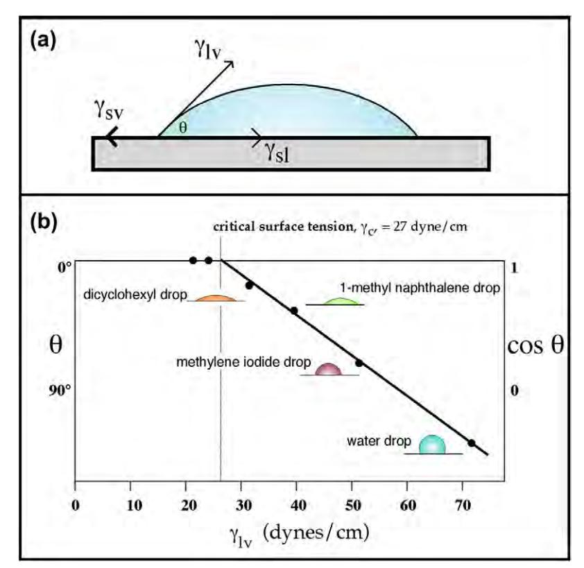
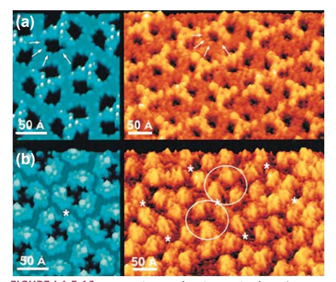

# BIBLIOGRAPHY

- Bicanic, N., & Johnson, K. W. (1979). Who was "Raphson?" *Int. J. Num. Meth. Eng.*, 148–152.
- Ge, L., Jones, S. C., Sotiropoulos, F., Healy, T. M., & Yoganathan, A. P. (2003). Numerical simulation of flow in mechanical heart valves: Grid resolution and the assumption of flow symmetry. *J. Biomech. Eng.*, **125**, 709–718.
- George, P. L. (1991). *Automatic Mesh Generation: Application to Finite Element Methods*. New York, NY: Wiley.
- Govindarajan, V., Udaykumar, H. S., Herbertson, L. H., Deutsch, S., Manning, K. B., et al. (2010). Two-dimensional FSI simulation of closing dynamics of a tilting disc mechanical heart valve. *J. Med. Device*, **4**, 11001.
- Lacroix, D., Murphy, L. A., & Prendergast, P. J. (2000). Threedimensional finite element analysis of glenoid replacement prostheses: A comparison of keeled and pegged anchorage systems. *J. Biomech. Eng.*, **122**, 430–436.
- Middleton, J., Jones, M. L., & Pande, G. N. (1996). *Computer Methods in Biomechanics and Biomedical Engineering*. Amsterdam: Gordon and Breach.
- Pegoretti, A., Fambri, L., Zappini, G., & Bianchetti, M. (2002). Finite element analysis of a glass fibre reinforced composite endodontic post. *Biomaterials*, **23**, 2667–2682.

## CHAPTER I.1.5 SURFACE PROPERTIES AND SURFACE CHARACTERIZATION OF BIOMATERIALS

*Buddy D. Ratner*

Professor, Bioengineering and Chemical Engineering, Director of University of Washington Engineered Biomaterials (UWEB), Seattle, WA, USA

# INTRODUCTION

*Nothing is rich but the inexhaustible wealth of nature. She shows us only surfaces, but she is a million fathoms deep. Ralph Waldo Emerson*

Biomaterials "show" to the world (and the biological environment) only surfaces. Atoms and molecules make up the outermost surface of a biomaterial (the interface between the material and the world). As we shall discuss in this section, these atoms and molecules that reside at the surface have a special organization and reactivity. They require special methods to characterize them, novel methods to tailor them, and they drive many of the biological reactions that occur in response to the biomaterial (protein adsorption, cell adhesion, cell growth, blood compatibility, etc.). The importance of surfaces for biomaterials science has been appreciated since the 1960s. Almost every biomaterials meeting will have sessions addressing surfaces and interfaces. In this chapter we focus on the special properties of surfaces, definitions of terms, methods to characterize surfaces, and some implications of surfaces as the drivers of bioreaction to biomaterials.

Atoms and molecules that reside at the surface of a biomaterial have special reactivity and direct biological response.

- Sacks, M. S., & Schoen, F. J. (2002). Collagen fiber disruption occurs independent of calcification in clinically explanted bioprosthetic heart valves. *J. Biomed. Mater. Res.*, **62**, 359–371.
- Schoen, F. J. (2005). Cardiac valves and valvular pathology: Update on function, disease, repair, and replacement. *Cardiovasc. Pathol.*, **14**, 189–194.
- Stylianopoulos, T., & Barocas, V. H. (2007). Volume-averaging theory for the study of the mechanics of collagen networks. *Comput. Method. in Applied M.*, **196**, 2981–2990.
- Sun, W., & Sacks, M. S. (2005). Finite element implementation of a generalized Fung-elastic constitutive model for planar soft tissues. *Biomech. Model Mechanobiol.*, **4**(2–3), 190–199.
- Sun, W., Sacks, M. S., & Scott, M. J. (2005). Effects of boundary conditions on the estimation of the planar biaxial mechanical properties of soft tissues. *J. Biomech. Eng.*, **127**, 709–715.
- Tottenham, H., & Brebbia, C. A. (1970). *Finite Element Techniques in Structural Mechanics*. Southampton, UK: Southampton University Press.
- Zienkiewicz, O. C. (1971). *The Finite Element Method in Engineering Science*. London, UK: McGraw-Hill.
- Zienkiewicz, O. C., & Irons, B. M. (1969). Finite element methods in stress analysis. In I. Holand, & K. Bell (Eds.), Trondheim Tapir Press.

During the development of biomedical implant devices and materials, we are concerned with physical properties, durability, and biocompatibility. The understanding of physical properties (e.g., mechanical strength, permeability, elasticity) has evolved over hundreds of years and is relatively well-understood – the standard tools of engineers and materials scientists are appropriate to characterize and study physical properties (see Chapters I.1.2, I.1.3). Durability, particularly in the biological environment, is less well-understood. Still, the tests we need to evaluate durability are clear (see Chapters I.1.2, II.4.3, II.4.4). Biocompatibility represents a frontier of knowledge in this field, and its study is often assigned to the biochemist, biologist, and physician (see Chapters II.3.2, II.3.3, II.3.4). However, an important question in biocompatibility is how the device or material "transduces" its structural make-up to direct or influence the response of proteins, cells, and the organism to it. For devices and materials that do not leach undesirable substances (i.e., that have passed routine toxicological evaluation; see Chapter II.3.3), this transduction occurs through the surface structure. The body "reads" the surface structure and responds to the particular chemistry and organization. For this reason we must understand the surface structure of biomaterials, and thus there is an important role for the physical scientist in understanding surfacedriven biointeractions. Chapter III.1.4 elaborates on the biological implications of this idea.

# **General Surface Considerations and Definitions**

This is the appropriate point to highlight general ideas about surfaces, especially solid surfaces. First, the surface

**FIGURE I.1.5.1** (a) A two-dimensional representation of a crystal lattice suggesting bonding orbitals (red or pink ovals). For atoms in the center (bulk) of the crystal (pink ovals), all binding sites have associations with those of other atoms (sharing electrons). At planar exterior surfaces, one of the bonding sites is unfulfilled (red oval). At corners, two bonding sites are unfulfilled. The single atom on top of the crystal (an adatom) has three unfulfilled valencies. Energy is minimized where more of these unfulfilled valencies can interact. Where interactions do not satisfy all binding orbitals, there is an asymmetric electrical field driving a surface dipole. (b) In a "real-world" material (a block of metal from an orthopedic device, for example), if we cleave the block (under ultrahigh vacuum to prevent recontamination), we should find hydrocarbon on the outermost layer (perhaps 3 nm, surface energy ~22 ergs/cm2), polar organic molecules (>1 nm, surface energy ~45 ergs/cm2), adsorbed water (<1 nm, surface energy ~72 ergs/cm2), metal oxide (approximately 5 nm, surface energy ~200 ergs/cm2), and finally, the uniform bulk interior (surface energy ~1000 ergs/cm2). The interface between air and material has the lowest interfacial energy (~22 ergs/cm2). The layers are not drawn to scale.

region of a material is known to be of unique reactivity (Figure I.1.5.1a). Catalysis (for example, as used in petrochemical processing) and microelectronics both capitalize on special *surface* organization and reactivity – biology also exploits this enhanced surface reactivity to do its work. Second, the surface of a material is inevitably different from the bulk. The traditional techniques used to analyze the bulk structure of materials are not suitable for surface determination, because they typically do not have the sensitivity to observe the small amount of material comprising the unique surface chemistry/ structure. Third, there is not much total mass of material at a surface. An example may help us to appreciate this – on a 1 cm3 cube of titanium, the 100 Å oxide surrounding the cube is in the same proportion as a 5 meter-wide beach on each coast of the United States is to the roughly 5,000,000 meters distance from coast to coast. Fourth, surfaces readily contaminate with components from the vapor phase (some common examples are hydrocarbons, silicones, sulfur compounds, iodine). Under ultrahigh vacuum conditions (pressures <10−7 Pa) we can retard this contamination. However, in view of the atmospheric pressure conditions under which all biomedical devices are used, we must learn to live with some contamination. The key questions here are whether we can make devices with controlled and acceptable levels of contamination and also avoid undesirable contaminants. This is critical so that a laboratory experiment on a biomaterial generates the same results when repeated after 1 day, 1 week

or 1 year, and so that the biomedical device is dependable and has a reasonable shelf-life. Finally, the surface structure of a material is often mobile. A modern view of what might be seen at the surface of a real-world material is illustrated in Figure I.1.5.1b.

#### Five Points About Surfaces

- 1. Surfaces have unique reactivity
- 2. The surface is inevitably different from the bulk
- 3. The mass of material that makes up the surface zone is very small
- 4. Surfaces readily contaminate
- 5. Surface molecules can exhibit considerable mobility.

The movement of atoms and molecules near the surface in response to the outside environment is often highly significant. In response to a hydrophobic environment (e.g., air), more hydrophobic (lower energy) components may migrate to the surface of a material – a process that reduces interfacial energy (Figure I.1.5.1b). Responding to an aqueous environment, the surface may reverse its structure and point polar (hydrophilic) groups outward to interact with the polar water molecules. Again, energy minimization drives this process. An example of this is schematically illustrated in Figure I.1.5.2. For metal alloys, one metal tends to dominate the surface, for example, silver in a silver–gold alloy or chromium in stainless steel.

**FIGURE I.1.5.2** Many materials can undergo a reversal of surface structure when transferred from air into a water environment. In this schematic illustration, a hydroxylated polymer (for example a pHEMA contact lens) exhibits a surface rich in methyl groups (from the polymer chain backbone) in air, and a surface rich in hydroxyl groups under water. This has been observed experimentally, see Ratner et al. (1978). *J Appl Polym Sci*, 22, 643; Chen et al. (1999). *J Am Chem Soc*, 121(2); 446.

The nature of surfaces is complex and is the subject of much independent investigation. The reader is referred to one of many excellent monographs on this important subject for a complete and rigorous introduction (see Somorjai, 1981; Andrade, 1985; Adamson and Gast, 1997; Garbassi et al., 1998; Somorjai and Li, 2010). Biosurfaces, with particular relevance for biomaterials, are reviewed in articles and books (Ratner, 1988; Castner and Ratner, 2002; Kasemo, 2002; Tirrell et al., 2002).

When we say "surface," a question that immediately comes to mind is: "how deep into the material does it extend?" Although formal definitions are available, for all practical purposes, the surface is the zone where the structure and composition, influenced by the interface, differs from the average (bulk) composition and structure. This value often scales with the size of the molecules making up the surface. For an "atomic" material, for example gold, after penetration of about 5 atomic layers (0.5–1 nm), the composition becomes uniform from layer to layer (i.e., you are seeing the bulk structure). At the outermost atomic layer, the organization of the gold atoms at the surface (and their reactivity) can be substantially different from the organization in the averaged bulk. The gold, in air, will always have a contaminant overlayer, largely hydrocarbon, which may be roughly 2 nm thick. There is also a difference in composition between bulk and surface, but it is not the atomic/ molecular rearrangements we are discussing here. For a polymer, the unique surface zone may extend from 10 nm to 100 nm (depending on the polymeric system and the chain molecular weight). Figure I.1.5.1b addresses some of these issues about surface definitions. Two more definitions must be considered. An interface is the transition between two phases, in principle an infinitely thin separation plane. An interphase is the unique compositional zone between two phases. For the example, for gold, we might say that the interphase between gold and air is 3 nm thick (the structurally rearranged gold atoms plus the contaminant layer).

# **What Surface Properties are we Interested in?**

A surface is fully described by many parameters (Figure I.1.5.3). The more of these parameters we measure, the more we can piece together a complete description of the surface. A complete characterization requires a cadre of techniques to examine the many facets that contribute to the surface properties. Unfortunately, we cannot yet specify which parameters are most important for understanding specific biological responses to surfaces. Studies have been published on the importance of roughness, patterns, wettability, surface mobility, chemical composition, electrical charge, crystallinity, modulus and heterogeneity to biological reaction. Since we cannot be certain which surface factors are predominant in each situation, the controlling variable or variables must be independently measured and correlated. We use surface analysis techniques to measure these surface properties.

## SURFACE ANALYSIS TECHNIQUES: PRINCIPLES AND METHODS

# **Sample Preparation**

A guiding principle of surface analysis sample preparation is that the sample should resemble, as closely as possible, the material or device in the form that it is used for biological testing or implantation. Needless to say, fingerprints on the surface of the sample will obscure surface properties of interest. If the sample is placed in a package for shipping or storage prior to surface analysis, it is critical to know whether the packaging material may deliver surface contamination. Plain paper in contact with most specimens will transfer contaminants (often metal ions) to the surface of the material. Many plastics are processed with silicone oils or other additives that can migrate to the specimen. The packaging material used should be examined by surface analysis methods

**FIGURE I.1.5.3** What might be measured to define surface structure? (A) Surfaces can be rough, stepped or smooth. (B) Surfaces can be comprised of different chemistries (atomic, supramolecular, macromolecular). (C) Surfaces may be structurally or compositionally inhomogeneous in the plane of the surface such as phase-separated domains or micro-contact printed lanes. (D) Surfaces may be inhomogeneous with depth into the specimen or simply overlayered with a thin film. (E) Surfaces may be highly crystalline or disordered. (F) Crystalline surfaces are found with many organizations such as a silicon (100) unreconstructed surface or a silicon (111) (7 × 7) reconstructed surface.

to ascertain its purity. Samples can be surface analyzed prior to and after storage in containers to ensure that the surface composition measured is not due to the container. As a general rule, the polyethylene press-close bags used in electron microscopy and cell culture plasticware are clean storage containers. However, abrasive contact must be avoided, and each brand must be evaluated so that a meticulously prepared specimen is not ruined by contamination. Many brands of aluminum foil are useful for packing specimens, but some are treated with a surface layer of stearic acid that can surface-contaminate biomaterials, implants or medical devices. Aluminum

| TABLE I.1.5.1                   | Common Methods to Characterize Biomaterial Surfaces                                          |                   |                       |                                           |        |
|---------------------------------|----------------------------------------------------------------------------------------------|-------------------|-----------------------|-------------------------------------------|--------|
| Method                          | Principle                                                                                    | Depth Analyzed | Spatial Resolution | Analytical Sensitivity                 | Cost   |
| Contact Angles                  | Liquid wetting of surfaces is used to estimate the energy of surfaces                     | 3–20 Å            | 1 mm                  | Low or high depending on the chemistry | \$     |
| ESCA (XPS)                      | X-rays induce the emission of electrons of characteristic energy                          | 10–250 Å          | 10–150 µm             | 0.1 atom %                                | \$\$\$ |
| Auger Electron Spectroscopy* | A focused electron beam stimulates the emission of Auger electrons                        | 50–100 Å          | 100 Å                 | 0.1 atom %                                | \$\$\$ |
| SIMS                            | Ion bombardment sputters secondary ions from the surface                                  | 10 Å–1 µm**       | 100 Å                 | Very high                                 | \$\$\$ |
| FTIR-ATR                        | IR radiation is adsorbed and excites molecular vibrations                                    | 1–5 µm            | 10 µm                 | 1 mole %                                  | \$\$   |
| STM                             | Measurement of the quantum tunneling current between a metal tip and a conductive surface | 5 Å               | 1 Å                   | single atoms                              | \$\$   |
| SEM                             | Secondary electron emission induced by a focused electron beam is spatially imaged        | 5 Å               | 40 Å typically        | High, but not quantitative             | \$\$   |

\*Auger electron spectroscopy is damaging to organic materials, and best used for inorganics.

\*\*Static SIMS ≈ 10 Å, dynamic SIMS to 1 µm.

\$: up to \$5000 \$\$: \$5000–\$100,000

\$\$\$: >\$100,000

foil should be checked for surface contamination layers by surface analysis methods prior to wrapping important specimens.

# **Surface Analysis: General Comments**

Two general principles guide sample analysis. First, all methods used to analyze surfaces also have the potential to alter the surface. The analyst must be aware of the damage potential of the method used. Second, because of the potential for artifacts and the need for corroborative information to construct a complete picture of the surface (Figure I.1.5.3), more than one method should be used whenever possible. The data derived from two or more methods should be internally consistent. When data are contradictory, be suspicious and question why. A third or fourth method may then be necessary to draw confident conclusions about the nature of a surface. These general principles are applicable to all materials.

There are properties (only a few of which will be presented here) that are specific to specific classes of materials. Compared to metals, ceramics and glasses, organic, and polymeric materials are more easily damaged by surface analysis methods. Polymeric systems also exhibit greater surface molecular mobility than inorganic systems. The surfaces of inorganic materials are contaminated more rapidly than polymeric materials because of their higher surface energy. Electrically conductive metals and carbons will often be easier to characterize than insulators using electron, X-ray, and ion interaction methods. Insulators accumulate a surface electrical charge that requires special methods (e.g., a low energy electron beam) to neutralize. To learn about other concerns in surface analysis that are specific to specific classes of materials, published papers become a valuable resource for understanding the pitfalls that can lead to artifact or inaccuracy.

Table I.1.5.1 summarizes the characteristics of many common surface analysis methods, including their depth of analysis under standard conditions and their spatial resolution (spot size analyzed). A few of the more frequently applied techniques are described in the next section. However, space limitations prevent an intensive discussion of these methods. The reader is referred to many comprehensive books on the general subject of surface analysis (Briggs and Seah, 1983; Andrade, 1985; Feldman and Mayer, 1986; Vickerman and Gilmore, 2009). References describing specific surface analysis methods will be presented in sections on each of the key methods.

# **Contact Angle Methods**

A drop of liquid sitting on a solid surface represents a simple, but potentially powerful, method to probe surface properties. Experience tells us that a drop of water on a highly polished automobile body surface will stand up (bead up), while on an old, weathered car, the liquid will flow evenly over the surface. This observation, for those knowledgeable about contact angles, tells us that the highly polished car probably has silicones or hydrocarbons at its surface, while the unpolished car surface is oxidized material. Quantitative contact angle measurement has, in fact, been used to predict the performance of vascular grafts, and the adhesion of cells to surfaces.

The phenomenon of the contact angle can be explained as a balance between the force with which the molecules of the drop liquid are being attracted to each other (a

**FIGURE I.1.5.4** (a) An equilibrium is established between surface tension forces contracting a liquid drop to a spherical shape and forces interacting the drop with the surface. The force balance between the liquid–vapor surface tension (*γ*lv) of a liquid drop and the interfacial tension between a solid and the drop (*γ*sl), manifested through the contact angle (*θ␣*) of the drop can be used to quantitatively characterize the surface–vapor interfacial tension (*γ*sv). (b) The Zisman method permits a critical surface tension value, an approximation to the solid surface tension, to be measured. Drops of liquids of different surface tensions are placed on the solid, and the contact angles of the drops are measured. The plot of liquid surface tension versus angle is extrapolated to zero contact angle to give the critical surface tension value.

cohesive force) and the attraction of the liquid molecules for the surface (an adhesive force). An equilibrium is established between these forces. The force balance between the liquid–vapor surface tension (γlv) of a liquid drop and the interfacial tension between a solid and the drop (γsl), manifested through the contact angle (θ) of the drop with the surface, can be used to quantitatively characterize the energy of the surface (γsv) (Figure I.1.5.4a). The basic relationship describing this force balance is:

#### ʑSV ʑSL  ʑLV COSʖ

The surface energy, closely related to wettability, is a useful parameter that has often been correlated with biological interaction. Unfortunately, γsv cannot be directly obtained since this equation contains two unknowns, γsl and γsv. Therefore, the γsv is sometimes approximated by the Zisman method for obtaining the critical surface tension (Figure I.1.5.4b) or calculated by solving simultaneous equations with data from liquids of different surface tensions. Some critical surface tensions for common materials are listed in Table I.1.5.2.

Experimentally, there are a number of ways to measure the contact angle. Some of these are illustrated in Figure I.1.5.5. Contact angle methods can be inexpensive and, with some practice, easy to perform. A contact angle goniometer (a telescope to observe the drop that is equipped with a protractor eyepiece) is the least expensive method for contact angle measurement. A number of companies now offer video systems that compute the contact angle and other surface energy parameters from digitial image analysis of the liquid drop profile. Accessories to control humidity and temperature and deposit drops of liquid are available.

Contact angles directly measure surface wettability, and indirectly probe surface energy, roughness, heterogeneity, contamination, and molecular mobility.

Contact angle measurements provide a "first line" characterization of materials and can be performed in any laboratory. Contact angle measurements provide unique insight into how the surface will interact with the external world. However, in performing such measurements, a number of concerns must be addressed to obtain meaningful data (Table I.1.5.3). Review articles are available on contact angle measurement for surface characterization (Zisman, 1964; Andrade, 1985; Ratner, 1988; Good, 1993).

#### **TABLE I.1.5.2** Critical Surface Tension Values for Common Polymeric Materials Calculated from Contact Angle Measurements **Material Critical Surface Tension (dynes/cm)** Polytetrafluoroethylene 19 Poly(dimethyl siloxane) 24 Poly(vinylidine fluoride) 25 Poly(vinyl fluoride) 28 Polyethylene 31 Polystyrene 33 Poly(2-hydroxyethyl methacrylate) 37 Poly(vinyl alcohol) 37 Poly(methyl methacrylate) 39

| Poly(vinyl chloride)         | 39 |  |
|------------------------------|----|--|
| Polycaproamide (nylon 6)     | 42 |  |
| Poly(ethylene oxide)-diol    | 43 |  |
| Poly(ethylene terephthalate) | 43 |  |
| Polyacrylonitrile            | 50 |  |
|                              |    |  |

## **TABLE I.1.5.3** Concerns in Contact Angle Measurement

- The measurement is operator dependent (for manual, goniometer instruments)
- Surface roughness influences the results
- Surface heterogeneity influences the results
- The liquids used are easily contaminated (typically reducing their γlv)
- Liquid evaporation and temperature changes can impact measurement
- The liquids used can reorient the surface structure
- The liquids used can absorb into the surface, leading to swelling
- The liquids used can dissolve the surface
- Few sample geometries are appropriate for contact angle measurement
- Information on surface structure must be inferred from the data obtained

**FIGURE I.1.5.5** Four possibilities for contact angle measurement: (a) sessile drop; (b) captive air bubble method; (c) capillary rise method; (d) Wilhelmy plate method.

## **Electron Spectroscopy for Chemical Analysis**

Electron spectroscopy for chemical analysis (ESCA) provides a comprehensive qualitative and quantitative overview of a surface that would be challenging to obtain by other means (Dilks, 1981; Andrade, 1985; Ratner and McElroy, 1986; Ratner, 1988; Watts and Wolstenholme, 2003; Ratner and Castner, 2009). In contrast to the contact angle technique, ESCA requires complex, expensive apparatus (Figure I.1.5.6a) and demands considerable training to perform the measurements. However, since ESCA is available from commercial laboratories, university analytical facilities, national centers (for example, NESAC/BIO at the University of Washington), and specialized research laboratories, most biomaterials scientists can access instrumentation for sample analysis. ESCA has contributed significantly to the development of biomaterials and medical devices, and to understanding the fundamentals of biointeraction.

The ESCA method (also called X-ray photoelectron spectroscopy, XPS) is based upon the photoelectric effect, properly described by Einstein in 1905. X-rays are focused upon a specimen. The interaction of the X-rays with the atoms in the specimen causes the emission of core level (inner shell) electrons. The energy of these electrons is measured and their values provide information about the nature and environment of the atom or atoms from which they came. The basic energy balance describing this process is given by the relationship:

#### "% Hʛ å +%

where BE is the energy binding the electron to an atom (the value desired), KE is the kinetic energy of the emitted electron (the value measured in the ESCA spectrometer), and hν is the energy of the X-rays, a known value. A schematic diagram illustrating an ESCA instrument is shown in Figure I.1.5.6b. Table I.1.5.4 lists the types of information about the nature of a surface that can be obtained by using ESCA. The origin of the surface sensitivity of ESCA is described in Figure I.1.5.7.

ESCA has many advantages, and a few disadvantages, for studying biomaterials. The advantages include high information content, surface localization of the measurement (outermost 8–10 nm), speed of analysis, low damage potential, and the ability to analyze most samples with no special specimen preparation. The latter advantage is particularly important since biomedical devices (or parts of devices) can often be inserted, as fabricated and sterilized, directly in the analysis chamber for study. The disadvantages include the need for vacuum compatibility (i.e., no outgassing of volatile components), the vacuum environment and its impact on the specimen (particularly for hydrated specimens), the possibility of sample damage by X-rays if long analysis times are used, the need for experienced operators, and the cost associated with this complex instrumentation. The vacuum limitations can be sidestepped by using an ESCA system with a cryogenic sample stage. At liquid nitrogen temperatures, samples with volatile components, or even wet, hydrated samples, can be analyzed.

ESCA analyzes to approximately 10 nm and gives information on elements present, their concentrations and their bonding environments.

The use of ESCA is best illustrated with a brief example. A poly(methyl methacrylate) (PMMA) ophthalmologic device is to be examined. Taking care not to touch or damage the surface of interest, the device is inserted into the ESCA instrument introduction chamber. The introduction chamber is then pumped down to 10−6 torr (1.33 × 10−4 Pa) pressure. A gate valve between the introduction chamber and the analytical chamber is opened and the specimen is moved into the analysis chamber. In the analysis chamber, at 10−9 torr (1.33 × 10−7 Pa) pressure, the specimen is positioned using a microscope or TV camera and the X-ray source is turned on. The ranges of electron energies to be observed are computer-controlled with the retardation lens on the spectrometer. First, a wide scan is made in which the energies of all emitted electrons over a 1000 eV range are detected (Figure I.1.5.8). Then, narrow scans are made in which each of the elements detected in the wide scan is examined in higher resolution (Figure I.1.5.9).

From the wide scan, we learn that the specimen contains carbon, oxygen, nitrogen, and sulfur. The presence of sulfur and nitrogen is unexpected for PMMA. We can calculate atomic percentage composition from the wide scan spectral data. The sample surface contains 58.2% carbon, 27.7% oxygen, 9.5% nitrogen, and 4.5% sulfur. The narrow scan for the carbon region (C1s spectrum) suggests four classes of compounds: hydrocarbons; carbons singly bonded to oxygen (the predominant species); carbons in amide-like molecular environments; and carbons in carboxylic acid or ester environments. This is quite different from the spectrum expected for pure PMMA. An examination of the peak position in the narrow scan of the sulfur region (S2p spectrum) suggests sulfonate-type groups. The shape of the C1s spectrum, the position of the sulfur peak, and the presence of nitrogen all suggest that heparin was immobilized to the surface of the PMMA device. Since the stoichiometry of the lens surface does not match that for pure heparin, this suggests that we are seeing either some of the PMMA substrate through a <100 Å layer of heparin or we are seeing some of the bonding links used to immobilize the heparin to the lens surface. Further ESCA analysis will permit the extraction of more detail about this surfacemodified device, including an estimate of surface modification thickness, further confirmation that the coating is indeed heparin, and additional information about the nature of the immobilization chemistry.

**FIGURE I.1.5.6** (a) Photograph of a contemporary ESCA instrument (photo by Kratos Analytical Corp.). (b) Schematic diagram of a monochromatized ESCA instrument.

#### **TABLE I.1.5.4** Information Derived From an ESCA Experiment

#### **In the outermost 100 Å of a surface, ESCA can provide:**

- Identification of all elements (except H and He) present at concentrations >0.1 atomic %
- Semiquantitative determination of the approximate elemental surface composition (±10%)
- Information about the molecular environment (oxidation state, bonding atoms, etc.)
- Information about aromatic or unsaturated structures from shake-up π\* ← π) transitions
- Identification of organic groups using derivatization reactions
- Nondestructive elemental depth profiles 100 Å into the sample and surface heterogeneity assessment using angular-dependent ESCA studies and photoelectrons with differing escape depths
- Destructive elemental depth profiles several thousand angstroms into the sample using argon etching (for inorganics)
- Lateral variations in surface composition (spatial resolution 8–150 µm, depending upon the instrument)
- "Fingerprinting" of materials using valence band spectra and identification of bonding orbitals
- Studies on hydrated (frozen) surfaces

**FIGURE I.1.5.7** ESCA is a surface-sensitive method. Although the X-ray beam can penetrate deeply into a specimen, electrons emitted deep in the specimen (D, E, F, G) will lose their energy in inelastic collisions and never emerge from the surface. Only those electrons emitted near the surface that lose no energy (A, B) will contribute to the ESCA signal used analytically. Electrons that lose some energy, but still have sufficient energy to emerge from the surface (C) contribute to the background signal.

# **Secondary Ion Mass Spectrometry**

Secondary ion mass spectrometry (SIMS) is an information-rich tool that the surface analyst can bring to bear on a biomedical problem. SIMS produces a mass spectrum of the outermost 1–2 nm of a surface. Like ESCA, it requires complex instrumentation and an ultrahigh vacuum chamber for the analysis. However, it provides unique information that is complementary to ESCA, and greatly aids in understanding surface composition. Some of the analytical capabilities of SIMS are summarized in Table I.1.5.5. Review articles on SIMS are available (Benninghoven, 1983; Scheutzle et al., 1984; Ratner,

**FIGURE I.1.5.8** ESCA wide scan of a surface-modified poly(methyl methacrylate) ophthalmologic device.

**FIGURE I.1.5.9** The carbon 1s narrow scan ESCA spectrum of a surface-modified poly(methyl methacrylate) ophthalmologic device. Narrow scan spectra can be generated for each element seen in low energy resolution mode in Figure I.1.5.8.

### **TABLE I.1.5.5** Analytical Capabilities of SIMS

|                                                                       | Static SIMS | Dynamic SIMS |
|-----------------------------------------------------------------------|----------------|-----------------|
| Identify hydrogen and deuterium                                       | '              | '               |
| Identify other elements (often must be inferred from the data)     | '              | '               |
| Suggest molecular structures (inferred from the data)              | '              | —               |
| Observe extremely high mass fragments (proteins, polymers)         | '              | —               |
| Detection of extremely low concentrations                             | '              | '               |
| Depth profile to 1 µm into the sample                                 | *              | '               |
| Observe the outermost 1–2 atomic layers                               | '              | —               |
| High spatial resolution (features as small as approximately 400 Å) | '              | '               |
| Semiquantitative analysis (for limited sets of specimens)          | '              | —               |
| Useful for polymers                                                   | '              | —               |
| Useful for inorganics (metals, ceramics, etc.)                        | '              | '               |
| Useful for powders, films, fibers, etc.                               | '              | '               |

\*Cluster ion sources allow depth profiling with static-SIMS-like information content.

1988; Briggs, 1986; Vickerman et al., 1989; Davies and Lynn, 1990; Van Vaeck et al., 1999; Belu et al., 2003; Michel and Castner, 2006).

In SIMS analysis, a surface is bombarded with a beam of accelerated ions. The collision of these ions with the atoms and molecules in the surface zone can transfer enough energy that they sputter from the surface into the vacuum phase. The process is analogous to racked pool balls that are ejected from the ball cluster by the impact of the cue ball; the harder the cue ball hits the rack of balls, the more balls are emitted from the rack. In SIMS, the "cue balls" are positive ions (cesium, gallium, bismuth, C60-buckyballs, and cluster ions are commonly used) that are accelerated at the surface to be analyzed with energies of 5000–20,000 eV. The particles ejected from the surface are positive and negative ions (secondary ions), radicals, excited states, and neutrals. Only the secondary ions are measured in SIMS. In ESCA, the energy of emitted particles (electrons) is measured. SIMS measures the mass of emitted ions (more rigorously, the ratio of mass to charge, m/z) using a time-of-flight (TOF) mass analyzer, magnetic sector analyzer or, in older instruments, a quadrupole mass analyzer.

There are two modes for SIMS analysis, dynamic and static. Dynamic SIMS uses high ion doses over a given analysis time. The primary ion beam sputters sufficient material from the surface that the surface erodes away at an appreciable rate. We can capitalize on this to depthprofile into a specimen, and this works particularly well for metallic, semiconductor, and ceramic materials. The intensity of the m/z peak of a species of interest (e.g., sodium ion, m/z = 23) might be followed as a function of time. If the ion beam is well-controlled and the sputtering rate is constant, the sodium ion signal intensity measured at any time will be directly related to its concentration at the erosion depth of the ion beam into the specimen. A concentration depth profile (sodium concentration versus depth) can be constructed from the outermost atoms to a micron or more into the specimen. Depending on the primary ion used, for example, cesium or gallium, and its energy, the high-flux ion beam can destroy organic samples and relevant organic fragments, and predominantly atomic fragments (e.g., C−, CH−, O−, OH−, Na+, etc.) will be detected. Also, as the beam erodes deeper into the specimen, more artifacts are introduced in the data by "knock-in" and scrambling of atoms.

Static SIMS, in contrast, induces minimal surface destruction. The ion dose is adjusted so that during the period of the analysis less than 10% of one monolayer of surface atoms is sputtered. Since there are typically 1013–1015 atoms in 1 cm2 of surface, a total ion dose of less than 1013 ions/cm2 during the analysis period is appropriate. Under these conditions, extensive degradation and rearrangement of the chemistry at the surface does not take place, and large, relatively intact molecular fragments can be ejected into the vacuum for measurement. Examples of molecular fragments are shown in Figure I.1.5.10. This figure also introduces some of the ideas behind SIMS spectral interpretation. A more complete introduction to the concepts behind static SIMS spectral interpretation can be found in Van Vaeck et al. (1999) or in standard texts on mass spectrometry.

Static SIMS provides qualitative information on the atomic and molecular composition in the outermost 1–2 nm of surface with high analytical sensitivity and excellent *x*,*y* spatial resolution.

Magnetically or electrostatically focusing the primary ion beam permits the SIMS technique to have high spatial resolution in the *x*,*y* plane. In fact, SIMS analysis can be performed in surface regions of 10 nm diameter on optimal specimens. For static SIMS analysis, only 1–10% of the atoms in any area are sampled. Thus, as the spot size gets smaller, the challenge to achieve high analytical sensitivity increases sharply. Still, static SIMS measurements have been performed in areas as small as 40 nm. Newly-developed cluster ion sources (for example, using gold molecular clusters, Au3, C60 or argon clusters as the impacting primary particles) show high secondary ion yields, and relatively low surface damage. These improve spatial resolution and also permit depth profiling of organic surfaces by sputtering down into a surface, while monitoring secondary ion emission as a function of time (Ninomiya et al., 2009).

If the focused primary ion beam is rastered over the surface, and the *x*,*y* position of the beam correlated with the signal emitted from a given spot, the SIMS data can be converted into an elemental image. Patterning and spatial control of chemistry is becoming increasingly important in biomaterials surface design. For example, microcontact printing allows patterned chemistry to be transferred to surfaces at the micron level using a relatively simple rubber stamp. Imaging SIMS is well-suited to studying and monitoring such spatially defined chemistry (Dubey et al., 2009; Bolles et al., 2010). An example is presented in Figure I.1.5.11. Imaging SIMS is also valuable for observing defects in thin films (pinholes), analyzing the chemistry of fine particulates or assessing causes of implant failure.

## **Scanning Electron Microscopy**

Scanning electron microscopy (SEM) images of surfaces have great resolution and depth of field, with a threedimensional quality that offers a visual perspective familiar to most users. SEM images are widely used, and much has been written about the technique. The comments here are primarily oriented toward SEM as a surface analysis tool.

SEM functions by focusing and rastering a relatively high-energy electron beam (typically, 5–100 keV) on a specimen that is under vacuum. Low-energy secondary electrons (1–20 eV) are emitted from each spot where the

**FIGURE I.1.5.10** Static positive and negative ion SIMS spectra of a poly(ethylene glycol)–poly(dimethyl siloxane) copolymer containing disulfide side groups on a gold surface. The primary peaks are identified. The low mass region of the negative ion spectrum offers little insight into the polymer structure, but the high mass region is rich in information. In this case, the low mass positive spectrum is rich in information. Further details on this class of polymers can be found in *Macromolecules*, 27, 3053 (1994). (Figure supplied by D. Castner.)

focused electron beam makes an impact. The intensity of the secondary electron emission is a function of the atomic composition of the sample and the geometry of the features under observation. The image of the surface is spatially reconstructed on a phosphor screen (or CCD detector) from the intensity of the secondary electron emission at each point. Because of the shallow penetration depth of low-energy electrons produced by the primary electron beam, only the secondary electrons generated near the surface can escape and be detected (this is analogous to the surface sensitivity described in Figure I.1.5.7). Consequently, SEM is a surface analysis method.

SEM provides a high resolution image of the surface. On insulating materials, metallic coating is required and the image is actually of the coating surface, not the underlying material.

Nonconductive materials observed in the SEM are typically coated with a thin, electrically grounded layer

**FIGURE I.1.5.11** Negative TOF-SIMS ion images exploring the N-hydroxysuccinimide (NHS) reaction used to immobilize biomolecules to surfaces. Yellow colors show regions rich in NHS groups based on peaks at m/z 42, 98, 107, and 114. The image shows a spatially defined sample with freshly prepared, hydrolyzed and regenerated photopatterned surfaces. Further details can be found in Dubey et al. (2009). (Used with permission of the publisher.)

of metal to minimize negative charge accumulation from the electron beam. However, this metal layer is always thick enough (>200 Å) so that the electrons emitted from the sample beneath cannot penetrate. Therefore, in SEM analysis of nonconductors, the surface of the metal coating is, in effect, what is being monitored. If the metal coat is truly conformal, a good representation of the surface geometry will be conveyed. However, the specimen surface chemistry no longer influences secondary electron emission. Also, at very high magnifications, the texture of the metal coat and not the surface may be under observation.

SEM, in spite of these limitations, is an important corroborative method to use in conjunction with other surface analysis methods. Surface roughness and texture can have a profound influence on data from ESCA, SIMS, and contact angle determinations. Therefore, SEM provides important information in the interpretation of data from these methods.

The development of low-voltage SEM does study the surface chemistry (and geometry) of nonconductors. With the electron accelerating voltage lowered to approximately 1 keV, charge accumulation is not as critical and metallization is not required. Low-voltage SEM has been used to study platelets and phase separation in polymers. Also, the environmental SEM (ESEM) permits wet, uncoated specimens to be studied.

The primary electron beam also stimulates the emission of X-rays. These X-rays are used to identify elements with the technique called energy-dispersive X-ray analysis (EDXA). However, the high-energy primary electron beam penetrates deeply into a specimen (a micron or more). The X-rays produced from the interaction of these electrons with atoms deep in the bulk of the specimen can penetrate through the material and be detected. Therefore, EDXA is not a surface analysis method.

The primary use of SEM is to image topography. SEM for this application is elaborated upon in the chapter on microscopy in biomaterials research (Chapter II.3.8).

# **Infrared Spectroscopy**

Infrared spectroscopy provides information on the bond vibrations of molecular species. It is a widely used analytical method that can reveal information on specific chemistries and the orientation of structures. Fourier transform infrared (FTIR) spectrometry offers outstanding signal-to-noise ratio (S/N) and spectral accuracy. However, even with this high S/N, the small absorption signal associated with the minute mass of material in a surface region can challenge the sensitivity of the spectrometer. Also, the problem of separating the vastly larger bulk absorption signal from the surface signal must be addressed.

Surface FTIR methods couple the infrared radiation to the sample surface to increase the intensity of the surface signal and reduce the bulk signal (Allara, 1982; Leyden and Murthy, 1987; Urban, 1993; Dumas et al., 1999). Some of these sampling modes, and their characteristics, are illustrated in Figure I.1.5.12.

The attenuated total reflectance (ATR) mode of sampling has been used most often in biomaterials studies. The penetration depth into the sample is 1–5 µm. Therefore, ATR is not highly surface sensitive, but observes a broad region near the surface. However, it does offer the wealth of rich structural information common to infrared spectra. With extremely high S/N FTIR instruments, ATR studies of proteins and polymers under water have been performed. In these experiments, the water signal (which is typically 99% or more of the total signal) is subtracted from the spectrum to leave only the surface material (e.g., adsorbed protein) under observation. Micro-ATR, coupling a microscope, IR spectrometer, and micro-ATR crystal, permits ATR analysis with high spatial resolution (approximately 1 µm2 pixel size).

ATR-IR permits detailed molecular analysis of the outermost 1–5 microns of a sample.

Another infrared method that has proven immensely valuable for observing extremely thin films on reflective surfaces is infrared reflection absorption spectroscopy (IRAS) (Figure I.1.5.12). This method has been widely applied to self assembled monolayers (SAMs), but is applicable to many surface films that are less than 10 nm in thickness. The surface upon which the thin film resides must be highly reflective and metal surfaces work best, although a silicon wafer can be used. IRAS gives information about composition, crystallinity, and molecular orientation. Infrared spectroscopy is one member of a family of methods called vibrational spectroscopies. Two other vibrational spectroscopies, sum

**FIGURE I.1.5.12** Three surface-sensitive infrared sampling modes. (a) Attenuated total reflectance infrared (ATR-IR); (b) infrared reflection absorption spectroscopy (IRAS); (c) diffuse reflectance infrared spectroscopy.

frequency generation and Raman (in particular, surface enhanced), will be mentioned below in the section on newer methods.

**Scanning Tunneling Microscopy (STM), Atomic Force Microscopy (AFM), and the Scanning Probe Microscopies (SPM).** In the 16 years since the first edition of this book, scanning tunneling microscopy (STM) and atomic force microscopy (AFM) have devolved from novel research tools to key methods for biomaterials characterization. AFM is more widely used than STM because electrically conductive surfaces are not needed with AFM and quantitative force measurements can be made. General review articles are available (Binnig and Rohrer, 1986; Albrecht et al., 1988; Avouris, 1990) and articles oriented toward biological studies with these methods (Hansma et al., 1988; Miles et al., 1990; Rugar and Hansma, 1990; Jandt, 2001; Dufrêne, 2004).

The STM was invented in 1981 and led to a Nobel Prize for G. Binnig and H. Rohrer in 1986. The STM capitalizes on quantum tunneling to generate an atomscale, electron density image of a surface. A metal tip terminating in a single atom is brought within 5–10 Å of an electrically conducting surface. At these distances, the electron cloud of the atom at the "tip of the tip" will significantly overlap the electron cloud of an atom on the surface. If a potential is applied between the tip and the surface, an electron tunneling current will be established whose magnitude, J, follows the proportionality:

#### \* ʏ E å!K3

where A is a constant, k0 is an average inverse decay length (related to the electron affinity of the metals), and S is the separation distance in angstrom units. For most metals, a 1 Å change in the distance of the tip to the surface results in an order of magnitude change in tunneling current. Even though this current is small, it can be measured with good accuracy.

To image a surface, this quantum tunneling current is used in one of two ways. In constant current mode, a piezoelectric driver scans a tip over a surface. When the tip approaches an atom protruding above the plane of the surface, the current rapidly increases, and a feedback circuit moves the tip up to keep the current constant. Then, a plot is made of the tip height required to maintain constant current versus distance along the plane. In constant height mode, the tip is moved over the surface and the change in current with distance traveled along the plane of the surface is directly recorded. A schematic diagram of a scanning tunneling microscope is presented in Figure I.1.5.13. Two STM scanning modes are illustrated in Figure I.1.5.14.

The STM measures electrical current, and therefore is well suited for conductive and semiconductor surfaces. However, biomolecules (even proteins) on conductive substrates appear amenable to imaging. STM does not "see" atoms, but rather monitors electron density. The conductive and imaging mechanism for proteins is not well-understood. Still, publications suggest that information-rich images of biomolecules on conductive surfaces can be obtained (Campbell et al., 2007).

The AFM uses a similar piezo drive mechanism. However, instead of recording tunneling current, the deflection of a tip mounted on a flexible cantilever arm due to van der Waals forces and electrostatic repulsion/attraction between an atom at the tip and an atom on the surface is measured. Atomic-dimension measurements of cantilever arm movements can be made by reflecting a laser beam off a mirror on the cantilever arm (an optical lever). A one-atom deflection of the cantilever arm can easily be measured by monitoring the position of the laser reflection on a spatially resolved photosensitive detector. Other principles are also used to measure the deflection of the tip. These include capacitance measurements and interferometry. A diagram of a typical AFM is presented in Figure I.1.5.15. Images of protein molecules recorded by AFM are shown in Figure I.1.5.16 to demonstrate the subnanometer resolution possible on biological specimens.

Tips are important in AFM, as the spatial resolution is significantly associated with tip terminal diameter and shape. Tips are made from microlithographically fabricated silicon or silicon nitride. Also carbon whiskers,

**FIGURE I.1.5.13** Schematic diagram illustrating the principle of the scanning tunneling microscope – a tip terminating in a single atom permits localized quantum tunneling current from surface features (or atoms) to tip. This tunneling current can be spatially reconstructed to form an image.

**FIGURE I.1.5.14** Scanning tunneling microscopy can be performed in two modes. In constant height mode, the tip is scanned a constant distance from the surface (typically 5–10 Å) and the change in tunneling current is recorded. In constant current mode, the tip height is adjusted so that the tunneling current is always constant, and the tip distance from the surface is recorded as a function of distance traveled in the plane of the surface.

nanotubes, and a variety of nanospherical particles have been mounted on AFM tips to increase their sharpness or improve the ability to precisely define tip geometry. Tips are also surface-modified to alter the strength and types of interactions with surfaces (static SIMS can be used to image these surface modifications). Finally, cantilevers are sold in a range of stiffnesses, so that the analysis modes can be tuned to needs of the sample and the type of data being acquired. The forces associated with the interaction of an AFM tip with a surface as it approaches

**FIGURE I.1.5.15** Schematic diagram illustrating the principle of the atomic force microscope.

**FIGURE I.1.5.16** An AFM image of porin proteins from the outer membrane of *E. coli* imaged with nanoscale resolution. Comparison of high-resolution AFM images of OmpF crystals (in brown-yellow) and the atomic model rendered at 3 Å (in blue). (From Müller, D. J. & Engel, A. (1999). Journal of Molecular Biology, **285**, 1347, used with permission of the authors and the publisher.)

and is retracted are illustrated in Figure I.1.5.15. Since force is being measured and Hooke's Law applies to the deformation of an elastic cantilever, AFM can be used to quantify the forces between surface and tip. Quantitative AFM is now widely used to measure the strength of interaction between biomolecules (Chilkoti et al., 1995; Muller and Dufrêne, 2008) and the mechanical properties of proteins (Li and Cao, 2010).

AFM instruments are commonly applied to surface problems using many possible tip interaction modes. Some AFM modes are contact, lateral force, non-contact, tapping, force modulation, and phase imaging. In contact mode, the tip is in contact with the surface (or at least the electron clouds of tip and surface essentially overlap). The pressures resulting from the force of the cantilever delivered through the extremely small surface area of the tip can be damaging to soft specimens (proteins, polymers, etc.). However, for more rigid specimens, excellent topographical imaging can be achieved in contact mode. In tapping mode, the tip is oscillated at a frequency near the resonant frequency of the cantilever. The tip barely grazes the surface. The force interaction of tip and surface can affect the amplitude of oscillation and the oscillating frequency of the tip. In standard tapping mode, the amplitude change is translated into topographic spatial information. Many variants of tapping mode have been developed allowing imaging under different conditions, and using the phase shift between the applied oscillation to the tip and the actual tip oscillation in the force field of the surface to provide information about the mechanical properties of the surface (in essence, the viscoelasticity of the surface can be appreciated).

AFM allows imaging of surfaces at sub-nanometer resolutions, and also provides detail on surface mechanics and molecular interactions.

The potential of the AFM to explore surface problems has been greatly expanded by ingenious variants of the technique. In fact, the term "atomic force microscopy" has been generalized to "scanning probe microscopy" (SPM). Table I.1.5.6 lists many of these creative applications of the AFM/STM idea.

Since the AFM measures force, it can be used with both conductive and nonconductive specimens. Force must be applied to bend a cantilever, so AFM is subject to artifacts caused by damage to fragile structures on the surface. Both AFM and STM can function well for specimens under water, in air or under vacuum. For exploring biomolecules or mobile organic surfaces, the "pushing around" of structures by the tip is a significant concern. This surface artifact can be capitalized upon to write and fabricate surface structures at the nanometer scale (Figure I.1.5.17) (Quate, 1997; Boland et al., 1998; Rosa and Liang, 2009).

## **Newer Methods**

There are many other surface characterization methods that have the potential to become important in future years. Some of these are listed in Table I.1.5.7. A few of these evolving techniques which will be specifically mentioned here include sum frequency generation (SFG), Raman, and synchrotron methods.

SFG is a vibration spectroscopy method that looks at the outmost surface of materials in aqueous, air or vacuum. SFG uses two high intensity, pulsed laser beams, one in the visible range (frequency = ωvisible), and one in

| TABLE I.1.5.6                                                            | Scanning Probe Microscopy (SPM) Modes |           |                                                                                                                              |
|--------------------------------------------------------------------------|---------------------------------------|-----------|------------------------------------------------------------------------------------------------------------------------------|
| Name                                                                     |                                       | Acronym   | Use                                                                                                                          |
| Contact mode                                                             |                                       | CM-AFM    | Topographic imaging of harder specimens                                                                                      |
| Tapping (intermittent force) mode                                        |                                       | IF-AFM    | Imaging softer specimens                                                                                                     |
| Non-contact mode                                                         |                                       | NCM-AFM   | Imaging soft structures                                                                                                      |
| Force modulation (allows slope of force-distance curve to be measured |                                       | FM-AFM    | Enhances image contrast based on surface mechanics                                                                           |
| Scanning surface potential microscopy (Kelvin probe microscopy)       |                                       | SSPM, KPM | Measures the spatial distribution of surface potential                                                                       |
| Magnetic force microscopy                                                |                                       | MFM       | Maps the surface magnetic forces                                                                                             |
| Scanning thermal microcopy                                               |                                       | SThM      | Maps the thermal conductivity characteristics of a surface                                                                   |
| Recognition force microscopy                                             |                                       | RFM       | Uses a biomolecule on a tip to probe for regions of specific biorecognition on a surface                                  |
| Chemical force microscopy                                                |                                       | CFM       | A tip derivatized with a given chemistry is scanned on a surface to spatially measure differences of interaction strength |
| Lateral force microscopy                                                 |                                       | LFM       | Maps frictional force on a surface                                                                                           |
| Electrochemical force microscopy                                         |                                       | EFM       | The tip is scanned under water and the electrochemical potential between tip and surface is spatially measured            |
| Nearfield scanning optical microscopy                                    |                                       | NSOM      | A sharp optical fiber is scanned over a surface allowing optical microscopy or spectroscopy at 100 nm resolution          |
| Electrostatic force microscopy                                           |                                       | EFM       | Surface electrostatic potential are mapped                                                                                   |
| Scanning capacitance microscopy                                          |                                       | SCM       | Surface capacitance is mapped                                                                                                |
| Conductive atomic force microscopy                                       |                                       | CAFM      | Surface conductivity is mapped with an AFM instrument                                                                        |
| Nanolithographic AFM                                                     |                                       | NAFM      | An AFM tip etches, oxidizes or reacts a space permitting pattern fabrication at 10 nm or better resolution                |
| Dip-pen nanolithography                                                  |                                       | DPN       | An AFM tip, inked with a thiol or other molecule, writes on a surface at the nanometer scale                              |

**FIGURE I.1.5.17** An AFM tip, using relatively high force, was used to scratch a rectangular feature into a thin (70 Å) plasma-deposited film. The AFM also characterized the feature created.

the infrared (frequency = ωir), to illuminate a specimen. The light emitted from the specimen by a non-linear optical process, ωsum = ωvisible + ωir, is detected and quantified (Figure I.1.5.18). The intensity of the light at ωsum is proportional to the square of the sample's second-order nonlinear susceptibility (χ2). The term susceptibility refers to the effect of the light field strength in polarizing molecules (molecular polarizability). The ωsum light intensity vanishes where a material has inversion symmetry, i.e., in the bulk of the material there is compositional homogeneity so on either side of an introduced plane, there is symmetry. At an interface, the inversion symmetry is broken and an SFG signal is generated. Thus, SFG is exquisitely sensitive to the plane of the interface. In practice, ωir is scanned over a vibrational frequency range.

This leads to vibrational absorptions that occur with only interface molecules. For this case, the SFG signal is resonantly enhanced and we see a vibrational spectrum. The advantages of SFG are the superb surface sensitivity, the cancellation of bulk spectral intensity (for example, this allows measurements at a water/solid interface), the richness of information from vibrational spectra, and the ability to study molecular orientation by the polarization of the laser light. SFG is not yet a routine method. The lasers and optical components are expensive and require precision alignment. However, the power of SFG for biomaterials studies has already been proven with studies on hydrated hydrogels, polyurethanes, surface active polymer additives, proteins, and non-fouling surfaces (Shen, 1989; Chen et al., 2002; Stein et al., 2009).

SFG is among the most surface-sensitive of all surface methods. It provides vibrational spectroscopic detail on surface composition, orientation, and interactions.

In Raman spectroscopy a bright light is focused on a specimen; most of the light scatters back at the same frequency as the incident beam. However, a tiny fraction of this light excites vibrations in the specimen, and thereby loses or gains energy. The frequency shift of the light corresponds to vibrational bands indicative of the molecular structure of the specimen. The Raman spectroscopic technique has been severely limited for surface studies due to its low signal level. However, in recent years

| TABLE I.1.5.7                                                 | Methods Applicable for the Surface Characterization of Biomaterials                                                                                                           |  |
|---------------------------------------------------------------|-------------------------------------------------------------------------------------------------------------------------------------------------------------------------------|--|
| Method                                                        | Information Obtained                                                                                                                                                          |  |
| Second-harmonic generation (SHG)                              | Detect submolayer amounts of adsorbate at any light-accessible interface (air–liquid, solid–liquid, solid–gas)                                                             |  |
| Surface-enhanced Raman spectroscopy (SERS)                    | High-sensitivity Raman at rough metal interfaces                                                                                                                              |  |
| Ion scattering spectroscopy (ISS)                             | Elastically reflected ions probe only the outermost atomic layer                                                                                                              |  |
| Laser desorption mass spectrometry (LDMS)                     | Mass spectra of adsorbates at surfaces                                                                                                                                        |  |
| Matrix assisted laser desorption ionization (MALDI)           | Though generally a bulk mass spectrometry method, MALDI has been used to analyze large adsorbed proteins                                                                   |  |
| IR photoacoustic spectroscopy (IR-PAS)                        | IR spectra of surfaces with no sample preparation based on wavelength-dependent thermal response                                                                           |  |
| High-resolution electron energy loss spectroscopy (HREELS) | Vibrational spectroscopy of a highly surface-localized region, under ultrahigh vacuum                                                                                         |  |
| X-ray reflection                                              | Structural information about order at surfaces and interfaces                                                                                                                 |  |
| Neutron reflection                                            | Thickness and refractive index information about interfaces from scattered neutrons – where H and D are used, unique information on interface organization can be obtained |  |
| Extended X-ray absorption fine structure (EXAFS)              | A synchrotron method giving atomic-level chemical and nearest-neighbor (morphological) information                                                                         |  |
| Near edge X-ray absorption fine structure (NEXAFS)            | A synchrotron method providing information about bonding environments and chain orientation                                                                                |  |
| Scanning Auger microprobe (SAM)                               | Spatially defined Auger analysis at the nanometer scale                                                                                                                       |  |
| Surface plasmon resonance (SPR)                               | Study aqueous adsorption events in real time by monitoring changes in surface refractive index                                                                             |  |
| Rutherford backscattering spectroscopy (RBS)                  | Depth profiling of complex, multiplayer interfacial systems                                                                                                                   |  |

**FIGURE I.1.5.18** Schematic diagram of a sum frequency generation (SFG) apparatus. (Based upon a diagram by Polymer Technology Group, Inc.)

great strides in detector sensitivity have allowed Raman to be applied for studying the minute mass of material at a surface. Also, surface enhanced Raman spectroscopy (SERS), Raman spectra taken from molecules on a roughened metal surface, can enhance Raman signal intensity by 106 or more. Raman spectra will be valuable for biomedical surface studies, because water, which absorbs radiation very strongly in the infrared range, has little effect on Raman spectra that are often acquired with visible light (Storey et al., 1995; Smith, 2008).

Synchrotron sources generate energetic radiation that can be used to probe matter. Such sources were originally confined to the physics community and devoted to fundamental studies. However, there are now many synchrotron sources offering access to researchers in all communities, with better instrumentation and improved data interpretation. Synchrotron sources are typically national facilities costing more than \$100,000,000, and often occupying hundreds of acres (Figure I.1.5.19). By accelerating electrons to near the speed of light in a large, circular ring, energies covering a broad swathe of the electromagnetic spectrum (IR to energetic X-rays) are emitted. A synchrotron source (and ancillary equipment) permits a desired energy of the probe beam to be "dialed in" or scanned through a frequency range. Other advantages include high source intensity (bright light), and polarized light. Some of the experimental methods that can be performed with great success at synchrotron sources include crystallography, scattering, spectroscopy, microimaging, and nanofabrication. Specific surface spectroscopic methods include scanning photoemission microscopy (SPEM, 100 nm spatial resolution) (Leung et al., 2010), ultraESCA (100 µm spatial resolution, high energy resolution), and near edge X-ray absorption spectrometry (NEXAFS).

# STUDIES WITH SURFACE METHODS

Hundreds of studies have appeared in the literature in which surface methods have been used to enhance the understanding of biomaterial systems. A few studies that demonstrate the power of surface analytical methods for biomaterials science are briefly described here.

# **Platelet Consumption and Surface Composition**

Using a baboon arteriovenous shunt model of platelet interaction with surfaces, a first-order rate constant of

**FIGURE I.1.5.19** The National Synchrotron Light Source, Brookhaven National Laboratories. (Images Courtesy of Brookhaven National Laboratory.)

reaction of platelets with a series of polyurethanes was measured. This rate constant, the platelet consumption by the material, correlated in an inverse linear fashion with the fraction of hydrocarbon-type groups in the ESCA C1s spectra of the polyurethanes (Hanson et al., 1982). Thus, surface analysis revealed a chemical parameter about the surface that could be used to predict long-term biological reactivity of materials in a complex *ex vivo* environment.

## **Contact-Angle Correlations**

The adhesion of a number of cell types, including bacteria, granulocytes, and erythrocytes, has been shown, under certain conditions, to correlate with solid–vapor surface tension as determined from contact-angle measurements. In addition, immunoglobulin G adsorption is related to γsv (Neumann et al., 1983).

# **Contamination of Intraocular Lenses**

Commercial intraocular lenses were examined by ESCA. The presence of sulfur, sodium, and excess hydrocarbon at their surfaces suggested contamination by sodium dodecyl sulfate (SDS) during the manufacture of the lenses (Ratner, 1983). A cleaning protocol was developed using ESCA to monitor results that produced a lens surface of clean PMMA.

# **Titanium**

The discoloration sometimes observed on titanium implants after autoclaving was examined by ESCA and SIMS (Lausmaa et al., 1985). The discoloration was found to be related to accelerated oxide growth, with oxide thicknesses to 650 Å. The oxide contained considerable fluorine, along with alkali metals, and silicon. The source of the oxide was the cloth used to wrap the implant storage box during autoclaving. Since fluorine strongly affects oxide growth, and since the oxide layer has been associated with the biocompatibility of titanium implants, the authors advise avoiding fluorinated materials during sterilization of samples. Another paper by this group contains detailed surface characterization of titanium using a battery of surface methods, and addresses surface preparation, contamination, and cleaning (Lausmaa, 1996).

## **SIMS for Adsorbed Protein Identification and Quantification**

All proteins are comprised of the same 20 amino acids and thus, on average, are compositionally similar. Surface analysis methods have shown the ability to detect and quantify surface-bound protein, but biological tools have, until recently, been needed to identify specific proteins. Modern static SIMS instrumentation, using a multivariate statistical analysis of the data, has demonstrated the ability to distinguish between more than 13 different proteins adsorbed on surfaces (Wagner and Castner, 2001). Also, the limits of detection for adsorbed proteins on various surfaces were compared by ESCA and SIMS (Wagner et al., 2002).

## **Poly(glycolic acid) Degradation Studied by SIMS**

The degradation of an important polymer for tissue engineering, poly(glycolic acid), has been studied by static SIMS. As well as providing useful information on this degradation process, the study illustrates the power of SIMS for characterizing synthetic polymers and their molecular weight distributions (Chen et al., 2000).

**Peptides on Polystyrene Studied by SFG and NMR.** Although proteins at interfaces are critically important to biomaterials science, we have an incomplete picture of what proteins really look like and behave like on surfaces. Using the surface method, SFG, and a traditional bulk analysis method, solid-state NMR, an elegant picture of peptides on surfaces emerges. The study quantified, with site specificity and atomic resolution, the orientation and dynamics of side chains in labeled, synthetic model peptides adsorbed onto polystyrene (Weidner et al., 2010).

# CONCLUSIONS

The instrumentation of surface analysis steadily advances, and newer instruments and techniques can provide invaluable information about biomaterials and medical devices. The information obtained can be used to monitor contamination, ensure surface reproducibility, and explore fundamental aspects of the interaction of biological systems with living systems. Considering that biomedical experiments, especially *in vivo* experiments, are typically expensive to perform, the costs for surface analysis are modest to ensure that the surface is as expected, stable, and identical from experiment to experiment. Surface analysis can also contribute to the understanding of medical device failure (and success). Myriad applications for surface methods are found in device optimization, manufacture, and quality control. Predicting biological reaction based on measured surface structure is a frontier area for surface analysis.

# ACKNOWLEDGMENT

Support was received from the UWEB21 Engineering Research Center and the NESAC/BIO National Resource, NIH grant EB-002027, during the preparation of this chapter and for some of the studies described herein.

## BIBLIOGRAPHY

- Adamson, A. W., & Gast, A. (1997). *Physical Chemistry of Surfaces* (6th ed.). New York, NY: Wiley-Interscience.
- Albrecht, T. R., Dovek, M. M., Lang, C. A., Grutter, P., Quate, C. F., et al. (1988). Imaging and modification of polymers by scanning tunneling and atomic force microscopy. *J. Appl. Phys.*, **64**, 1178–1184.
- Allara, D. L. (1982). Analysis of surfaces and thin films by IR, Raman, and optical spectroscopy. *ACS Symp. Ser.*, **199**, 33–47.
- Andrade, J. D. (1985). Surface and Interfacial Aspects of Biomedical Polymers. *Surface Chemistry and Physics* (Vol. 1). New York, NY: Plenum Publishers.
- Avouris, P. (1990). Atom-resolved surface chemistry using the scanning tunneling microscope. *J. Phys. Chem.*, **94**, 2246–2256.
- Belu, A. M., Graham, D. J., & Castner, D. G. (2003). Time-offlight secondary ion mass spectrometry: Techniques and applications for the characterization of biomaterial surfaces. *Biomaterials*, **24**, 3635–3653.
- Benninghoven, A. (1983). Secondary ion mass spectrometry of organic compounds (review). In A. Benninghoven (Ed.), *Springer Series of Chemical Physics: Ion Formation from Organic Solids* (Vol. 25, pp. 64–89). Berlin: Springer-Verlag.
- Binnig, G., & Rohrer, H. (1986). Scanning tunneling microscopy. *IBM J. Res. Develop.*, **30**, 355–369.
- Boland, T., Johnston, E. E., Huber, A., & Ratner, B. D. (1998). Recognition and nanolithography with the atomic force microscope. In B. D. Ratner, & V. V. Tsukruk (Eds.), *Scanning Probe Microscopy of Polymers Chapter 21* (Vol. 694, pp. 342–350). Washington, DC: American Chemical Society.
- Bolles, K. M., Cheng, F., Burk-Rafel, J., Dubey, M., & Ratner, D. M. (2010). Imaging analysis of carbohydrate-modified surfaces using ToF-SIMS and SPRi. *Materials*, **3**, 3948–3964.
- Briggs, D. (1986). SIMS for the study of polymer surfaces: A Review. *Surf. Interface Anal.*, **9**, 391–404.
- Briggs, D., & Seah, M. P. (1983). *Practical Surface Analysis*. Chichester, UK: Wiley.
- Campbell, S., Smith, J., Jungblut, H., & Lewerenz, H. (2007). Protein imaging on a semiconducting substrate: A scanning tunnelling microscopy investigation. *J. Electroanal. Chem*., **599**, 313–322.
- Castner, D. G., & Ratner, B. D. (2002). Biomedical surface science: Foundations to frontiers. *Surface Science*, **500**, 28–60.
- Chen, J., Lee, J. -W., Hernandez, N. L., Burkhardt, C. A., Hercules, D. M., et al. (2000). Time-of-flight secondary ion mass spectrometry studies of hydrolytic degradation kinetics at the surface of poly(glycolic acid). *Macromolecules*, **33**, 4726–4732.