### CHAPTER I.2.4 CERAMICS, GLASSES, AND GLASS-CERAMICS: BASIC PRINCIPLES

*Larry L. Hench1, Serena M. Best2* 1Imperial College, London, UK 2University of Cambridge, Cambridge, UK

Ceramics, glasses, and glass-ceramics include a broad range of inorganic/nonmetallic compositions. In the medical industry, these materials have been essential for eyeglasses, diagnostic instruments, chemical ware, thermometers, tissue culture flasks, and fiber optics for endoscopy. Insoluble porous glasses have been used as carriers for enzymes, antibodies, and antigens, offering the advantages of resistance to microbial attack, pH changes, solvent conditions, temperature, and packing under high pressure required for rapid flow (Hench and Ethridge, 1982). Insoluble glasses have also been developed as a microinjectable delivery system for radioactive isotopes for *in situ* treatment of tumors. The glass microspheres go to the site of the tumor by way of the blood supply, and the radiation kills the cancer cells with very little damage to the other tissues, saving thousands of patients (Hench et al., 2010). Ceramics are also widely used in dentistry as restorative materials, such as in gold–porcelain crowns, glass-filled ionomer cements, and dentures. These dental ceramics are discussed by Phillips (1991). Glass-ceramics are also widely used for dental restorations, including inlays, onlays, crowns, and multi-unit bridges. This is one of the most rapidly growing applications of this class of biomaterials (Hench et al., 2010).

This chapter focuses on ceramics, glasses, and glassceramics used as implants. Although dozens of compositions have been explored in the past, relatively few have achieved clinical success. This chapter examines differences in processing and structure, describes the chemical and microstructural basis for their differences in physical properties, and relates properties and tissue response to particular clinical applications. For a historical review of these biomaterials, see Hulbert et al. (1987). For a summary of clinical applications see Hench (1998) and Hench et al. (2004).

### TYPES OF BIOCERAMICS: TISSUE ATTACHMENT

It is essential to recognize that no one material is suitable for all biomaterial applications. As a class of biomaterials, ceramics, glasses, and glass-ceramics are generally used to repair or replace skeletal hard connective tissues. Their success depends upon: (1) achieving a stable attachment to connective tissue when used as bulk implants; or (2) stimulating repair and regeneration of bone when used as particulates for bone grafting.

The mechanism of tissue attachment is directly related to the type of tissue response at the implant–tissue interface. No material implanted in living tissue is inert because all materials elicit a response from living tissues. There are four types of tissue response (Table I.2.4.1) and four different means of attaching prostheses to the skeletal system (Table I.2.4.2).

A comparison of the relative chemical activity of the different types of bioceramics, glasses, and glass-ceramics is shown in Figure I.2.4.1. The relative reactivity that is shown in Figure I.2.4.1A correlates very closely with the rate of formation of an interfacial bond of ceramic, glass or glass-ceramic implants with bone (Figure I.2.4.1B). Figure I.2.4.1B is discussed in more detail in the section on bioactive glasses and glass-ceramics in this chapter.

The relative level of reactivity of an implant influences the thickness of the interfacial zone or layer between the material and tissue. Analyses of implant material failures often show failure originating at the biomaterial–tissue interface. When biomaterials are nearly inert (type 1 in Table I.2.4.2 and Figure I.2.4.1) and the interface is not chemically or biologically bonded, there is relative movement and progressive development of a fibrous capsule in soft and hard tissues. The presence of movement at the biomaterial–tissue interface eventually leads to deterioration in function of the implant or the tissue at the interface, or both. Wear particles can accelerate the deterioration of the tissue–implant interface. The thickness of the non-adherent capsule varies, depending upon both material (Figure I.2.4.2) and extent of relative motion.

The fibrous tissue at the interface of dense Al2O3 (alumina) implants is very thin. Consequently, if alumina devices are implanted with a very tight mechanical fit and are loaded primarily in compression, they are very successful. In contrast, if a type 1 nearly inert implant is loaded so that interfacial movement can occur, the fibrous capsule can become several hundred micrometers thick, and the implant can loosen very quickly.

The mechanism behind the use of nearly inert microporous materials (type 2 in Table I.2.4.2 and Figure I.2.4.1) is the ingrowth of tissue into pores on the surface or throughout the implant. The increased interfacial area between the implant and the tissues results in an increased resistance to movement of the device in the tissue. The interface is established by the living tissue in the pores. Consequently, this method of attachment is often termed "biological fixation." It is capable of withstanding more complex stress states than type 1 implants

| TABLE I.2.4.1                                                                                  | Types of Implant–Tissue Response                                                                                    |  |  |
|------------------------------------------------------------------------------------------------|------------------------------------------------------------------------------------------------------------------------|--|--|
|                                                                                                | If the material is toxic, the surrounding tissue dies.                                                                 |  |  |
|                                                                                                | If the material is nontoxic and biologically inactive (nearly inert), a fibrous tissue of variable thickness forms. |  |  |
| If the material is nontoxic and biologically active (bioactive), an interfacial bond forms. |                                                                                                                        |  |  |
| replaces it.                                                                                   | If the material is nontoxic and dissolves, the surrounding tissue                                                      |  |  |

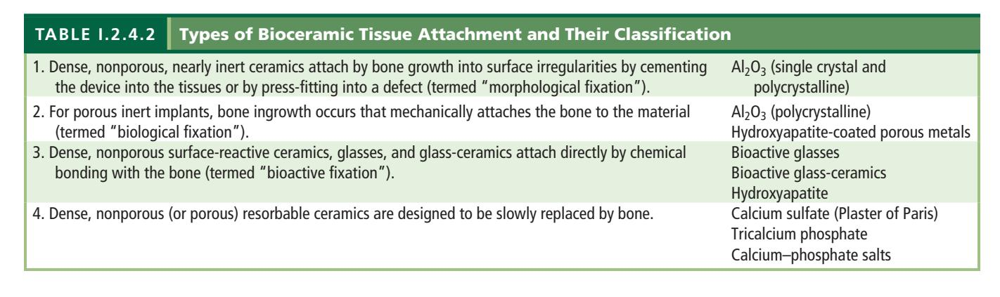

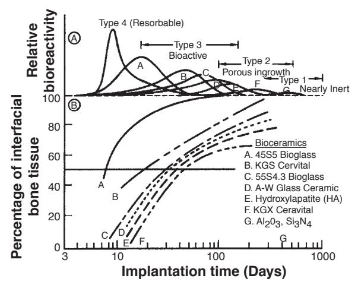

**FIGURE I.2.4.1** Bioactivity spectra for various bioceramic implants: (A) Relative rate of bioreactivity; (B) Time-dependence of formation of bone bonding at an implant interface.

with "morphological fixation." The limitation with type 2 porous implants, however, is that for the tissue to remain viable and healthy, it is necessary for the pores to be greater than 50 to 150 µm (Figure I.2.4.2). The large interfacial area required for porosity is due to the need to provide a blood supply to the ingrown connective tissue (vascular tissue does not appear in pore sizes less than 100 µm). Also, if micromovement occurs at the interface of a porous implant and tissue is damaged, the blood supply may be cut off, the tissues will die, inflammation will ensue, and the interfacial stability will be destroyed. When the material is a porous metal, the large increase in surface area can provide a focus for corrosion of the implant and loss of metal ions into the tissues. This can be mediated by using a bioactive ceramic material such as hydroxyapatite (HA) as a coating on the metal. The fraction of large porosity in any material also degrades the strength of the material proportional to the volume fraction of porosity. Consequently, this approach to solving interfacial stability works best when materials are used as coatings or as unloaded space fillers in tissues.

Resorbable biomaterials (type 4 in Table I.2.4.2 and Figure I.2.4.1) are designed to degrade gradually over a period of time, and to be replaced by the natural host

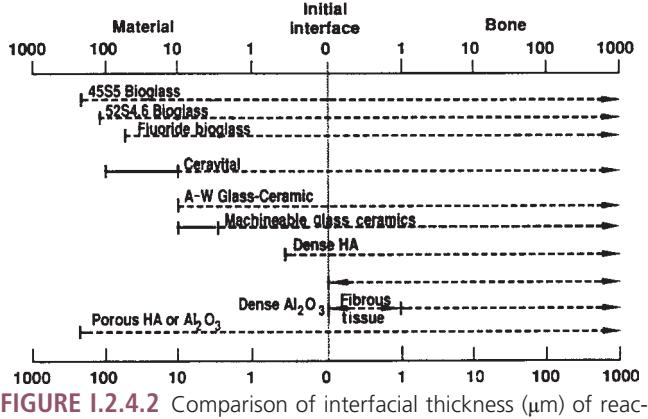

tion layer of bioactive implants of fibrous tissue of inactive bioceramics in bone.

tissue. This leads to a very thin or nonexistent interfacial thickness (Figure I.2.4.2). This is the optimal biomaterial solution, if the requirements of strength and short-term performance can be met, since natural tissues can repair and replace themselves throughout life. Thus, resorbable biomaterials are based on biological principles of repair that have evolved over millions of years. Complications in the development of resorbable bioceramics are: (1) maintenance of strength and the stability of the interface during the degradation period and replacement by the natural host tissue; and (2) matching resorption rates to the repair rates of body tissues (Figure I.2.4.1A) (e.g., some materials dissolve too rapidly and some too slowly). Because large quantities of material may be replaced, it is also essential that a resorbable biomaterial consist only of metabolically acceptable substances. This criterion imposes considerable limitations on the compositional design of resorbable biomaterials. Successful examples of resorbable polymers include poly(lactic acid) and poly(glycolic acid) used for sutures, which are metabolized to CO2 and H2O and therefore are able to function for an appropriate time and then dissolve and disappear. Porous or particulate calcium phosphate ceramic materials such as tricalcium phosphate (TCP) have proved successful for resorbable hard tissue replacements when low loads are applied to the material.

Another approach to solving problems of interfacial attachment is the use of bioactive materials (type 3 in Table I.2.4.2 and Figure I.2.4.1). Bioactive materials are intermediate between resorbable and bioinert. A bioactive material is one that elicits a specific biological response at the interface of the material, resulting in the formation of a bond between the tissues and the material. This concept has now been expanded to include a large number of bioactive materials with a wide range of rates of bonding and thicknesses of interfacial bonding layers (Figures I.2.4.1 and I.2.4.2). They include bioactive glasses such as 45S5 Bioglass; bioactive glassceramics such as A-W glass-ceramic; dense HA and bioactive composites such as HA-polyethylene. All of these materials form an interfacial bond with adjacent tissue. However, the time dependence of bonding, the strength of bond, the mechanism of bonding, and the thickness of the bonding zone differ for the various materials. Relatively small changes in the composition of a biomaterial can dramatically affect whether it is bioinert, resorbable or bioactive. These compositional effects on surface reactions are discussed in the section on bioactive glasses and glass-ceramics.

### CHARACTERISTICS AND PROCESSING OF BIOCERAMICS

The types of implants listed in Table I.2.4.2 are made using different processing methods. The characteristics and properties of the materials, summarized in Table I.2.4.3, differ greatly, depending upon the processing method used.

The primary methods of processing ceramics, glasses, and glass-ceramics are summarized in Figure I.2.4.3. These methods yield five categories of microstructures:

- 1. Glass;
- 2. Cast or plasma-sprayed polycrystalline ceramic;
- 3. Liquid-phase sintered (vitrified) ceramic;
- 4. Solid-state sintered ceramic;
- 5. Polycrystalline glass-ceramic.

Differences in the microstructures of the five categories are primarily a result of the different thermal processing steps required to produce them. Alumina and calcium phosphate bioceramics are made by fabricating the product from fine grained particulate solids. For example, a desired shape may be obtained by mixing the particulates with water and an organic binder, then pressing them in a mold. This is termed "forming." The formed piece is called green ware. Subsequently, the temperature is raised to evaporate the water (i.e., drying) and the binder is burned out, resulting in bisque ware. At a very much higher temperature, the part is densified during firing. After cooling to ambient temperature, one or more finishing steps may be applied, such as polishing. Porous ceramics are produced by adding a second phase that decomposes prior to densification, leaving behind holes or pores (Schors and Holmes, 1993) or transforming natural porous organisms, such as coral, to porous HA by hydrothermal processing (Roy and Linnehan, 1974).

| TABLE I.2.4.3                                                                                                                    | Bioceramic Material Characteristics and Properties |  |  |  |
|----------------------------------------------------------------------------------------------------------------------------------|-------------------------------------------------------|--|--|--|
| Composition                                                                                                                      |                                                       |  |  |  |
| Microstructure Number of phases Percentage of phases Distribution of phases Size of phases Connectivity of phases |                                                       |  |  |  |
| Phase state                                                                                                                      |                                                       |  |  |  |
| Crystal structure                                                                                                                |                                                       |  |  |  |
| Defect structure                                                                                                                 |                                                       |  |  |  |
| Amorphous structure                                                                                                              |                                                       |  |  |  |
| Pore structure                                                                                                                   |                                                       |  |  |  |
| Surface Flatness                                                                                                              |                                                       |  |  |  |
| Finish                                                                                                                           |                                                       |  |  |  |
| Composition                                                                                                                      |                                                       |  |  |  |
| Second phase                                                                                                                     |                                                       |  |  |  |
| Porosity                                                                                                                         |                                                       |  |  |  |
| Shape                                                                                                                            |                                                       |  |  |  |

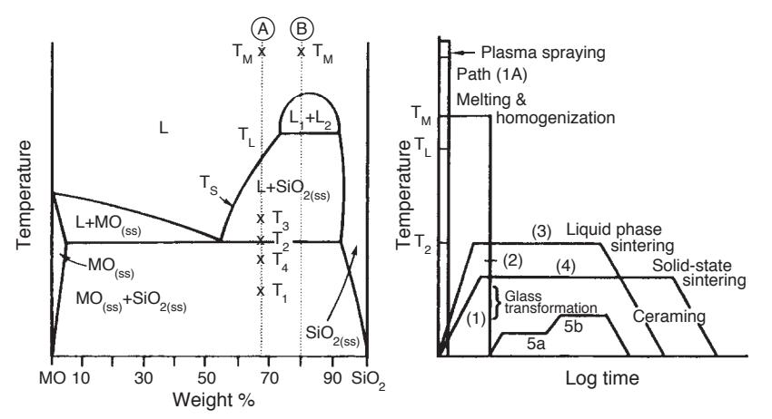

**FIGURE I.2.4.3** Relation of thermal processing schedules of various bioceramics to equilibrium phase diagram.

The interrelation between microstructure and thermal processing of various bioceramics is shown in Figure I.2.4.3, which is a binary phase diagram consisting of a network-forming oxide such as SiO2 (silica), and some arbitrary network modifier oxide (MO) such as CaO. When a powdered mixture of MO and SiO2 is heated to the melting temperature *T*m, the entire mass will become liquid (L). The liquid will become homogeneous when held at this temperature for a sufficient length of time. When the liquid is cast (paths 1B, 2, 5), forming the shape of the object during the casting, either a glass or a polycrystalline microstructure will result. Plasma spray coating follows path 1A. However, a network-forming oxide is not necessary to produce plasma-sprayed coatings such as hydroxyapatites, which are polycrystalline (Lacefield, 1993).

If the starting composition contains a sufficient quantity of network former (SiO2), and the casting rate is sufficiently slow, a glass will result (path 1B). The viscosity of the melt increases greatly as it is cooled, until at approximately *T*1, the glass transition point, the material is transformed into a solid.

If either of these conditions is not met, a polycrystalline microstructure will result. The crystals begin growing at *T*L and complete growth at *T*2. The final material consists of the equilibrium crystalline phases predicted by the phase diagram. This type of cast object is not often used commercially, because the large shrinkage cavity and large grains produced during cooling make the material weak and subject to environmental attack.

If the MO and SiO2 powders are first formed into the shape of the desired object and fired at a temperature *T*3, a liquid-phase sintered structure will result (path 3). Before firing, the composition will contain approximately 10–40% porosity, depending upon the forming process used. A liquid will be formed first at grain boundaries at the eutectic temperature, *T*2. The liquid will penetrate between the grains, filling the pores, and will draw the grains together by capillary attraction. These effects decrease the volume of the powdered compact. Since the mass remains unchanged and is only rearranged, an increased density results. Should the compact be heated for a sufficient length of time, the liquid content can be predicted from the phase equilibrium diagram. However, in most ceramic processes, liquid formation does not usually proceed to equilibrium owing to the slowness of the reaction and the expense of long-term heat treatments.

The microstructure resulting from liquid-phase sintering (or vitrification as it is commonly called) will consist of small grains from the original powder compact surrounded by a liquid phase. As the compact is cooled from *T*3 to *T*2, the liquid phase will crystallize into a fine-grained matrix surrounding the original grains. If the liquid contains a sufficient concentration of network formers, it can be quenched into a glassy matrix surrounding the original grains.

A powder compact can be densified without the presence of a liquid phase by a process called solid-state sintering. This is the process usually used for manufacturing alumina and dense HA bioceramics. Under the driving force of surface energy gradients, atoms diffuse to areas of contact between particles. The material may be transported by grain boundary diffusion, volume diffusion, creep, or any combination of these, depending upon the temperature or material involved. Because long-range migration of atoms is necessary, sintering temperatures are usually in excess of one-half of the melting point of the material: *T* > *T*L/2 (path 4).

The atoms move to fill up the pores and open channels between the grains of the powder. As the pores and open channels are closed during heat treatment, the crystals become tightly bonded together, and the density, strength, and fatigue resistance of the object improve greatly. The microstructure of a material that is prepared by sintering consists of crystals bonded together by ioniccovalent bonds with a very small amount of remaining porosity.

The relative rate of densification during solid-state sintering is slower than that of liquid-phase sintering, because material transport is slower in a solid than in a liquid. However, it is possible to solid-state sinter individual component materials such as pure oxides, since liquid development is not necessary. Consequently, when high purity and uniform fine-grained microstructures are required (e.g., for bioceramics) solid-state sintering is essential.

The fifth class of microstructures is called glass-ceramics, because the object starts as a glass and ends up as a polycrystalline ceramic. This is accomplished by first quenching a melt to form the glass object. The glass is transformed into a glass-ceramic in two steps. First, the glass is heat treated at a temperature range of *5*00–700°C (path 5a) to produce a large concentration of nuclei from which crystals can grow. When sufficient nuclei are present to ensure that a fine-grained structure will be obtained, the temperature of the object is raised to a range of 600–900°C, which promotes crystal growth (path 5b). Crystals grow from the nuclei until they impinge and up to 100% crystallization is achieved. The resulting microstructure is nonporous and contains fine-grained, randomly oriented crystals that may or may not correspond to the equilibrium crystal phases predicted by the phase diagram. There may also be a residual glassy matrix, depending on the duration of the heat treatment, called ceraming. When phase separation occurs (indicated by composition B in Figure I.2.4.3), a nonporous, phaseseparated microstructure can be produced that consists of glass phases suspended in a glass matrix. Crystallization of phase-separated glasses results in very complex microstructures, as reviewed in Höland and Beal (2005). Glass-ceramics can also be made by pressing powders and a grain boundary glassy phase (Kokubo, 1993). For additional details on the processing of ceramics, see Reed (1988) or Onoda and Hench (1978), and for processing of glass-ceramics, see Höland and Beal (2005).

# NEARLY INERT CRYSTALLINE CERAMICS

High-density, high-purity (>99.5%) alumina is used in the articulating surfaces of total joint prostheses because of its excellent corrosion resistance, good biocompatibility, high wear resistance, and high strength (Hulbert et al., 1987; Christel et al., 1988; Hulbert, 1993; Miller et al., 1996). Most Al2O3 devices are very fine-grained polycrystalline α-Al2O3 ceramics produced by pressing and sintering at *T* = 1600–1700°C. A very small amount of MgO (< 0.5%) is used to aid sintering and limit grain growth during sintering.

Strength, fatigue resistance, and fracture toughness of polycrystalline α-Al2O3 ceramics are a function of grain size and percentage of sintering aid (i.e., purity). Al2O3 ceramics with an average grain size of <4 µm and >99.7% purity exhibit good flexural strength and excellent compressive strength. These and other physical properties are summarized in Table I.2.4.4, along with the International Standards Organization (ISO) requirements for alumina implants. Extensive testing has shown that alumina implants that meet or exceed ISO standards have excellent resistance to dynamic and impact fatigue, and also resist subcritical crack growth (Dörre and Dawihl, 1980). An increase in average grain size to >17 µm can decrease mechanical properties by about 20%. High concentrations of sintering aids must be avoided, because they remain in the grain boundaries and degrade fatigue resistance.

Methods exist for lifetime predictions and statistical design of proof tests for loadbearing ceramics. Applications of these techniques show that load limits for specific prostheses can be set for an Al2O3 device based upon the flexural strength of the material and its use environment (Ritter et al., 1979). Loadbearing lifetimes of 30

| TABLE I.2.4.4                                                     | Physical Characteristics of Al2O3 Bioceramics |                          |                      |  |
|-------------------------------------------------------------------|--------------------------------------------------|--------------------------|----------------------|--|
|                                                                   |                                                  | High Alumina Ceramics | ISO Standard 6474 |  |
| Alumina content (% by weight)                                  |                                                  | >99.8                    | ≥99.50               |  |
| Density (g/cm3)                                                   |                                                  | >3.93                    | ≥3.90                |  |
| Average grain size (µm)                                           |                                                  | 3–6                      | <7                   |  |
| Ra (µm)a                                                          |                                                  | 0.02                     |                      |  |
| Hardness(Vickers hardness number, VHN)                         |                                                  | 2300                     | >2000                |  |
| Compressive strength (MPa)                                        |                                                  | 4500                     |                      |  |
| Bending strength (MPa) (after testing in Ringer's solution) |                                                  | 550                      | 400                  |  |
| Young's modulus (GPa)                                             |                                                  | 380                      |                      |  |
| Fracture toughness (K1C) (MPa12)                               |                                                  | 5–6                      |                      |  |
| Slow crack growth                                                 |                                                  | 10–52                    |                      |  |

aSurface roughness value.

years at 12,000 N loads have been predicted (Christel et al., 1988). Results from aging and fatigue studies show that it is essential that Al2O3 implants be produced at the highest possible standards of quality assurance, especially as they are often used as orthopedic prostheses in younger patients. Alumina has been used in orthopedic surgery for >30 years (Miller et al., 1996). Its use has been motivated largely by its exceptionally low coefficient of friction and low wear rates.

The superb tribiologic properties (friction and wear) of alumina occur only when the grains are very small (<4 µm) and have a very narrow size distribution. These conditions lead to very low surface roughness values Ra <0.02 µm (Table I.2.4.4). If large grains are present, they can pull out and lead to very rapid wear of bearing surfaces owing to local dry friction.

Alumina on alumina loadbearing, wearing surfaces, such as in hip prostheses, must have a very high degree of sphericity, which is produced by grinding and polishing the two mating surfaces together. For example, the alumina ball and socket in a hip prosthesis are polished together and used as a pair. The long-term coefficient of friction of an alumina–alumina joint decreases with time and approaches the values of a normal joint. This leads to wear on alumina-articulating surfaces being nearly 10 times lower than metal–polyethylene surfaces (Figure I.2.4.4), and eliminates formation of polyethylene wear particles that are associated with aspetic loosening of total joint prostheses, as discussed elsewhere in this textbook.

Low wear rates have led to widespread use in Europe of alumina noncemented cups press-fitted into the acetabulum of the hip. The cups are stabilized by the growth of bone into grooves or around pegs. The mating femoral ball surface is also made of alumina, which is bonded to a metallic stem. Long-term results in general are good, especially for younger patients. However, Christel et al. (1988) caution that stress shielding, owing to the high elastic modulus of alumina, may be responsible for cancellous bone atrophy and loosening of the acetabular cup in old patients with senile osteoporosis or rheumatoid arthritis. Consequently, it is essential that the age of the patient, nature of the disease of the joint, and biomechanics of the repair be considered carefully before any prosthesis is used, including alumina ceramics.

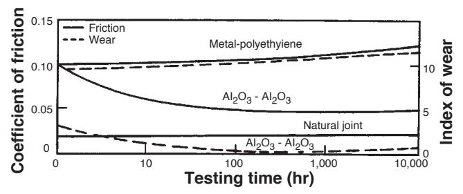

**FIGURE I.2.4.4** Time dependence of coefficient of friction and wear of alumina–alumina versus metal–polyethylene hip joint (*in vitro* testing).

Yttria-stabilised zirconia was also used in a similar way to alumina for articulating applications in hip and knee replacement (Hench and Wilson, 1993). However a series of implant failures around the year 2000, resulted in the withdrawal of zirconia for these applications. Today, there is significant interest in the use of zirconia toughened alumina implants due to the potential to enhance strength and toughness properties over those of alumina. Zirconia is used widely for dental applications due to aesthetic and mechanical benefits the material offers.

Other clinical applications of alumina prostheses reviewed by Hulbert et al. (1987) include knee prostheses; bone screws; alveolar ridge and maxillofacial reconstruction; ossicular bone substitutes; keratoprostheses (corneal replacements); segmental bone replacements; and blade, screw, and post-dental implants.

### POROUS CERAMICS

The potential advantage offered by a porous ceramic implant (type 2, Table I.2.4.2, Figures I.2.4.1 and I.2.4.2) is its inertness combined with the mechanical stability of the highly-convoluted interface that develops when bone grows into the pores of the ceramic. The mechanical requirements of prostheses, however, severely restrict the use of low-strength porous ceramics to nonloadbearing applications. Studies reviewed by Hench and Ethridge (1982), Hulbert et al. (1987), and Schors and Holmes (1993) have shown that when loadbearing is not a primary requirement, porous ceramics can provide a functional implant. When pore sizes exceed 100 µm, bone will grow within the interconnecting pore channels near the surface and maintain its vascularity and long-term viability. In this manner, the implant serves as a structural bridge or scaffold for bone formation.

Commercially available porous products originate from two sources: hydroxyapatite converted from coral or animal bone. The optimal type of porosity is still uncertain. The degree of interconnectivity of pores may be more critical than the pore size. Eggli et al. (1988) demonstrated improved integration in interconnected 50–100 µm pores compared with less connected pores with a size of 200–400 µm. Similarly Kühne et al. (1994) compared two grades of 25–35% porous coralline apatite with average pore sizes of 200 and 500 µm, and reported bone ingrowth to be improved in the 500 µm pore sized ceramic. Holmes (1979) suggests that porous coralline apatite when implanted in cortical bone requires interconnections of osteonic diameter for transport of nutrients to maintain bone ingrowth. The findings clearly indicate the importance of thorough characterization of porous materials before implantation, and Hing (1999) has recommended a range of techniques that should be employed.

Porous materials are weaker than the equivalent bulk form in proportion to the percentage of porosity, so that as the porosity increases, the strength of the material decreases rapidly. Much surface area is also exposed, so that the effects of the environment on decreasing the strength become much more important than for dense, nonporous materials. The aging of porous ceramics, with their subsequent decrease in strength, requires bone ingrowth to stabilize the structure of the implant. Clinical results for nonloadbearing implants are good (Schors and Holmes, 1993).

### BIOACTIVE GLASSES AND GLASS-CERAMICS

Certain compositions of glasses, ceramics, glass-ceramics, and composites have been shown to bond to bone (Hench and Ethridge, 1982; Gross et al., 1988; Yamamuro et al., 1990; Hench, 1991; Hench and Wilson, 1993). These materials have become known as bioactive ceramics. Some specialized compositions of bioactive glasses will bond to soft tissues as well as bone (Wilson et al., 1981). A common characteristic of bioactive glasses and bioactive ceramics is a time-dependent, kinetic modification of the surface that occurs upon implantation. The surface forms a biologically-active carbonated HA layer (HCA) that provides the bonding interface with tissues. Materials that are bioactive develop an adherent interface with tissues that resist substantial mechanical forces. In many cases, the interfacial strength of adhesion is equivalent to or greater than the cohesive strength of the implant material or the tissue bonded to the bioactive implant.

Bonding to bone was first demonstrated for a compositional range of bioactive glasses that contained SiO2, Na2O, CaO, and P2O5 in specific proportions (Hench et al., 1971) (Table I.2.4.5). There are three key compositional features to these bioactive glasses that distinguish them from traditional soda–lime–silica glasses: (1) less than 60 mol% SiO2; (2) high Na2O and CaO content; and (3) a high CaO/P2O5 ratio. These features make the surface highly reactive when it is exposed to an aqueous medium.

Many bioactive silica glasses are based upon the formula called 45S5, signifying 45 wt.% SiO2 (S = the network former) and 5:1 ratio of CaO to P2O5. Glasses with lower ratios of CaO to P2O5 do not bond to bone. However, substitutions in the 45S5 formula of 5–15 wt.% B2O3 for SiO2 or 12.5 wt.% CaF2 for CaO or heat treating the bioactive glass compositions to form glassceramics has no measurable effect on the ability of the material to form a bone bond. However, adding as little as 3 wt.% Al2O3 to the 45S5 formula prevents bonding to bone.

The compositional dependence of bone and soft tissue bonding on the Na2O–CaO–P2O5–SiO2 glasses is illustrated in Figure I.2.4.5. All the glasses in Figure I.2.4.5 contain a constant 6 wt.% of P2O5. Compositions in the middle of the diagram (region A) form a bond with bone. Consequently, region A is termed the bioactive bonebonding boundary. Silicate glasses within region B (e.g., window or bottle glass or microscope slides) behave as nearly inert materials and elicit a fibrous capsule at

|            | TABLE I.2.4.5          |                        |                        |                        | Composition of Bioactive Glasses and Glass-Ceramics (in Weight Percent) |                        |                        |                        |                            |                           |                             |
|------------|------------------------|------------------------|------------------------|------------------------|-------------------------------------------------------------------------|------------------------|------------------------|------------------------|----------------------------|---------------------------|-----------------------------|
|            | 45S5 Bioglass       | 45S5F Bioglass      | 45S5.4F Bioglass    | 40S5B5 Bioglass     | 52S4.6 Bioglass                                                      | 55S4.3 Bioglass     | KGC Ceravital       | KGS Ceravital       | KGy213 Ceravital A-W GC |                           | MB GC                       |
| SiO2       | 45                     | 45                     | 45                     | 40                     | 52                                                                      | 55                     | 46.2                   | 46                     | 38                         | 34.2                      | 19–52                       |
| P2O5       | 6                      | 6                      | 6                      | 6                      | 6                                                                       | 6                      |                        |                        |                            | 16.3                      | 4–24                        |
| CaO        | 24.5                   | 12.25                  | 14.7                   | 24.5                   | 21                                                                      | 19.5                   | 20.2                   | 33                     | 31                         | 44.9                      | 9–3                         |
| Ca(PO3)2   |                        |                        |                        |                        |                                                                         |                        | 25.5                   | 16                     | 13.5                       |                           |                             |
| CaF2       |                        | 12.25                  | 9.8                    |                        |                                                                         |                        |                        |                        |                            | 0.5                       |                             |
| MgO        |                        |                        |                        |                        |                                                                         |                        | 2.9                    |                        |                            | 4.6                       | 5–15                        |
| MgF2       |                        |                        |                        |                        |                                                                         |                        |                        |                        |                            |                           |                             |
| Na2O       | 24.5                   | 24.5                   | 24.5                   | 24.5                   | 21                                                                      | 19.5                   | 4.8                    | 5                      | 4                          |                           | 3–5                         |
| K2O        |                        |                        |                        |                        |                                                                         |                        | 0.4                    |                        |                            |                           | 3–5                         |
| Al2O3      |                        |                        |                        |                        |                                                                         |                        |                        |                        | 7                          |                           | 12–33                       |
| B2O3       |                        |                        |                        | 5                      |                                                                         |                        |                        |                        |                            |                           |                             |
| Ta2O5/TiO2 |                        |                        |                        |                        |                                                                         |                        |                        |                        | 6.5                        |                           |                             |
| Structure  | Glass                  | Glass                  | Glass                  | Glass                  | Glass                                                                   |                        | Glass ceramic       | Glass ceramic       |                            | Glass-ceramic             | Glass-ceramic               |
| Reference  | Hench et al. (1982) | Hench et al. (1982) | Hench et al. (1982) | Hench et al. (1982) | Hench et al. (1982)                                                  | Hench et al. (1982) | Gross et al. (1988) | Gross et al. (1988) |                            | Nakamura et al. (1985) | Höeland and Vogel (1993) |

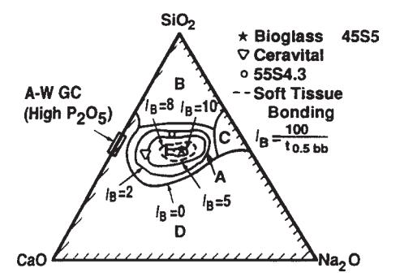

**FIGURE I.2.4.5** Compositional dependence (in wt.%) of bone bonding and soft tissue bonding of bioactive glasses and glassceramics. All compositions in region A have a constant 6 wt.% of P2O5. A-W glass ceramic has higher P2O5 content (see Table I.2.4.5 for details). *I*B, Index of bioactivity.

the implant–tissue interface. Glasses within region C are resorbable and disappear within 10 to 30 days of implantation. Glasses within region D are not technically practical, and therefore have not been tested as implants.

The collagenous constituent of soft tissues can strongly adhere to the bioactive silicate glasses that lie within the dashed line region in Figure I.2.4.5. The interfacial thicknesses of the hard tissue–bioactive glasses are shown in Figure I.2.4.2 for several compositions. The thickness decreases as the bone-bonding boundary is approached.

Gross et al. (1988) and Gross and Strunz (1985) have shown that a range of low-alkali (0 to 5 wt.%) bioactive silica glass-ceramics also bond to bone. They found that small additions of Al2O3, Ta2O5, TiO2, Sb2O3 or ZrO2 inhibit bone bonding (Table I.2.4.5, Figure I.2.4.1). A two-phase silica–phosphate glass-ceramic composed of apatite [Ca10(PO4)6(OH1F2)] and wollastonite [CaO, SiO2] crystals and a residual silica glassy matrix, termed A-W glass-ceramic (A-WGC) (Nakamura et al., 1985; Yamamuro et al., 1990; Kokubo, 1993), also bonds with bone. The addition of Al2O3 or TiO2 to the A-W glassceramic also inhibits bone bonding, whereas incorporation of a second phosphate phase, B-whitlockite (3CaO, P2O5), does not.

Another multiphase bioactive phosphosilicate containing phlogopite (Na, K) Mg3[AlSi3O10]F2 and apatite crystals bonds to bone even though Al is present in the composition (Höhland and Vogel, 1993). However, the Al3+ ions are incorporated within the crystal phase, and do not alter the surface reaction kinetics of the material. The compositions of these various bioactive glasses and glass-ceramics are compared in Table I.2.4.5. The important compositions that are used in the clinic are 45S5 Bioglass and A/W glass-ceramic.

The surface chemistry of bioactive glass and glassceramic implants is best understood in terms of six possible types of surface reactions (Hench and Clark, 1978). A high-silica glass may react with its environment by developing only a surface hydration layer. This is called a type I response. Vitreous silica (SiO2) and some inert glasses at the apex of region B (Figure I.2.4.5) behave in this manner when exposed to a physiological environment.

When sufficient SiO2 is present in the glass network, the surface layer that forms from alkali–proton exchange can repolymerize into a dense SiO2-rich film that protects the glass from further attack. This type II surface is characteristic of most commercial silicate glasses, and their biological response of fibrous capsule formation is typical of many within region B in Figure I.2.4.5.

At the other extreme of the reactivity range, a silicate glass may undergo rapid, selective ion exchange of alkali ions, with protons or hydronium ions leaving a thick but highly porous and nonprotective SiO2-rich film on the surface (a type IV surface). Under static or slow flow conditions, the local pH becomes sufficiently alkaline (pH > 9) that the surface silica layer is dissolved at a high rate, leading to uniform bulk network or stoichiometric

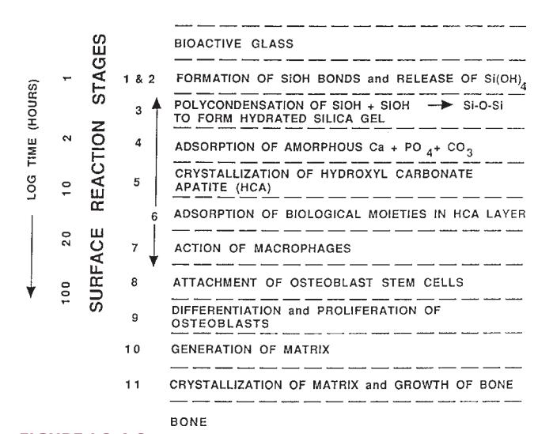

**FIGURE I.2.4.6** Types of silicate glass interfaces with aqueous or physiological solutions.

dissolution (a type V surface). Both type IV and V surfaces fall into region C of Figure I.2.4.5.

Type IIIA surfaces are characteristic of bioactive glasses. The first five reaction stages depicted in Figure I.2.4.6 are characteristic of Type IIIA bioactive glasses such as 45S5 Bioglass. A CaO-P2O5 layer forms on top of the alkali-depleted SiO2-rich film. When multivalent cations such as Al3+, Fe3+, and Ti4+ are present in the glass or solution, multiple layers form on the glass as the saturation of each cationic complex is exceeded, resulting in a type IIIB surface, which does not bond to tissues.

A general equation describes the overall rate of change of glass surfaces and gives rise to the interfacial reaction profiles shown in Figure I.2.4.1. The reaction rate (*R*) depends on at least four terms (for a single-phase glass). For glass-ceramics, which have several phases in their microstructures, each phase will have a characteristic reaction rate, *Ri*

$$
R = -k_1 t^{0.5} - k_2 t^{1.0} - k_3 t^{1.0} + k_4 t^{\gamma} + k_n t^{\gamma}
$$
 (1)

The first term describes the rate of alkali extraction from the glass, and is called a stage 1 reaction. A type II nonbonding glass surface (region B in Figure I.2.4.5) is primarily undergoing stage 1 attack. Stage 1, the initial or primary stage of attack shown in Figure I.2.4.6, is a process that involves an exchange between alkali ions from the glass and hydrogen ions from the solution, during which the remaining constituents of the glass are not altered. During stage 1, the rate of alkali extraction from the glass is parabolic (*t*1/2) in character.

The second term describes the rate of interfacial network dissolution that is associated with a stage 2 reaction. A type IV surface is a resorbable glass (region C in Figure I.2.4.5), and experiences a combination of stage 1 and stage 2 reactions. A type V surface is dominated by a stage 2 reaction. Stage 2, the second stage of attack, is a process by which the silica structure breaks down, and the glass totally dissolves at the interface. Stage 2 kinetics are linear (*t*1.0).

A glass surface with a dual protective film is designated type IIIA. The thickness of the secondary films can vary considerably – from as little as 0.01 µm for Al2O3– SiO2-rich layers on inactive glasses, to as much as 30 µm for CaO–P2O5-rich layers on bioactive glasses (Figure I.2.4.2). A type III surface forms as a result of the repolymerization of SiO2 on the glass surface by the condensation of the silanols (Si-OH) formed from the stage 1 reaction. For example:

$$
Si-OH+OH-Si \rightarrow Si-O-Si+H2O \qquad (2)
$$

Stage 3 protects the glass surface. The SiO2 polymerization reaction contributes to the enrichment of surface SiO2-rich gel layer, Figure I.2.4.6. It is described by the third term in Eq. (1). This reaction is interface controlled with a time dependence of +*k3t*1.0. The interfacial thickness of the most reactive bioactive glasses shown in Figure I.2.4.2 is largely due to this reaction.

The fourth term in Eq. (1), +*k4ty* (stage 4), describes the precipitation reactions that result in the multiple films characteristic of type III glasses. When only one secondary film forms, the surface is type IIIA. When several additional films form, the surface is type IIIB.

In stage 4, an amorphous calcium phosphate film precipitates on the silica-rich layer and is followed by crystallization to form carbonated HA crystals, Figure I.2.4.6. The calcium and phosphate ions in the glass or glass-ceramic provide the nucleation sites for crystallization. The most bioactive glasses reach completion of this stage of surface reaction very rapidly. Thus, the biological response of living cells at the interface with the bioactive glass is to the presence of the growing HCA layer, and not a foreign-body. Carbonate anions (CO3 2−) substitute for OH− in the apatite crystal structure to form a carbonate hydroxyapatite (HCA) similar to that found in living bone (see the following section for details). Incorporation of CaF2 in the glass results in incorporation of fluoride ions in the apatite crystal lattice. Crystallization of HCA occurs around collagen fibrils present at the implant interface, and results in interfacial bonding.

In order for the material to be bioactive and form an interfacial bond, the kinetics of reaction in Eq. (1), and especially the rate of stage 4, must match the rate of biomineralization that normally occurs *in vivo.* If the rates in Eq. (1) are too rapid, the implant is resorbable, and if the rates are too slow, the implant is not bioactive. The interfacial reaction rates for 45S5 Bioglass are summarized in Figures I.2.4.1 and I.2.4.6.

By changing the compositionally-controlled reaction kinetics (Eq. (1)), the rates of formation of hard tissue at an implant interface can be altered, as shown in Figure I.2.4.1. Thus, the level of bioactivity of a material can

be related to the time for more than 50% of the interface to be bonded (*t*0.5bb) (e.g., *I*B index of bioactivity: = (100/*t*0.5bb)) (Hench, 1988). It is necessary to impose a 50% bonding criterion for an *I*B, since the interface between an implant and bone is irregular (Gross et al., 1988). The initial concentration of macrophages, osteoblasts, chondroblasts, and fibroblasts at an implant site varies as a function of the fit of the implant or particle size if the implant is a bone graft particulate, and especially the nature of the bony defect. Consequently, all bioactive implants require an incubation period before bone proliferates and bonds. The length of this incubation period varies widely, depending on the composition of the implant.

The compositional dependence of *I*B indicates that there are iso*I*B contours within the bioactivity boundary, as shown in Figure I.2.4.5 (Hench, 1988). The change of *I*B with the SiO2/(Na2O + CaO) ratio is very large as the bioactivity boundary is approached. The addition of multivalent ions to a bioactive glass or glass-ceramic shrinks the iso*I*B contours, which will contract to zero as the percentage of Al2O3, Ta2O5, ZrO2 or other multivalent (Mn+) increases in the material. Consequently, the iso*I*B boundary shown in Figure I.2.4.5 indicates the contamination limit for bioactive glasses and glass-ceramics. If the composition of a starting implant is near the *I*B boundary, it may take only a few parts per million of multivalent cations to shrink the *I*B boundary to zero and eliminate bioactivity. Also, the sensitivity of fit of a bioactive implant and length of time of immobilization postoperatively depends on the *I*B value and closeness to the *I*B = 0 boundary. Implants near the *I*B boundary require more precise surgical fit and longer fixation times before they can bear loads. In contrast, increasing the surface area of a bioactive implant by using them in particulate form for bone augmentation expands the bioactive boundary. Small (<200 µm) bioactive glass granules behave as a partially resorbable implant and stimulate new bone formation (Hench, 1994). Slow dissolution of the bioactive glass particles provides ionic stimuli to osteoprogenitor cells and leads to enhanced osteogenesis, as described below.

Bioactive implants with intermediate *I*B values do not develop a stable soft tissue bond; instead, the fibrous interface progressively mineralizes to form bone. Bioactive materials with this level of activity are referred to as Class B bioactive. Consequently, there appears to be a critical iso*I*B boundary beyond which bioactivity is restricted to stable bone bonding and growth of bone along the bioactive material interface, termed osteoconduction. Inside the critical iso*I*B boundary, the bioactivity includes both stable bone and soft-tissue bonding, depending on the progenitor stem cells in contact with the implant. Such bioactive materials are considered to exhibit Class A bioactivity and possess properties of both osteoconduction and osteostimulation, discussed below. This soft tissue-critical iso*I*B limit for Class A bioactivity is shown by the dashed contour in Figure I.2.4.5.

The thickness of the bonding zone between a bioactive implant and bone is proportional to its *I*B (compare Figure I.2.4.1 with Figure I.2.4.2). The failure strength of a bioactive bond is inversely dependent on the thickness of the bonding zone. For example, 45S5 Bioglass with a very high *I*B develops a gel bonding layer of 200 µm, which has relatively low shear strength. In contrast, A-W glass-ceramic, with an intermediate *I*B value, has a bonding interface in the range of 10–20 µm and a very high resistance to shear. Thus, the interfacial bonding strength appears to be optimum for *I*B values of ~4. However, it is important to recognize that the interfacial area for bonding is time dependent, as shown in Figure I.2.4.1. Therefore, interfacial strength is time-dependent and is a function of such morphological factors as the change in interfacial area with time, progressive mineralization of the interfacial tissues, and resulting increase of elastic modulus of the interfacial bond, as well as shear strength per unit of bonded area. A comparison of the increase in interfacial bond strength of bioactive fixation of implants bonded to bone with other types of fixation is given in Figure I.2.4.7 (Hench, 1987).

Clinical applications of bioactive glasses and glassceramics are reviewed by Yamamuro et al. (1990), Hench and Wilson (1993), (Hench 1998), and Hench et al. (2004). The high level of clinical success of 20-year use of A-W glass-ceramic in vertebral surgery (Yamamuro et al., 1990), 45S5 Bioglass in endosseous ridge maintenance (Stanley et al., 1996), and middle-ear replacement are important accomplishments of this field. Table I.2.4.6 lists the clinical applications of 45S5 bioactive glass. Use of 45S5 Bioglass in repair of periodontal defects (Wilson and Low, 1992; Wilson, 1994; Hench and Wilson, 1996; Lovelace et al., 1998; Mengle et al., 2003) and in a variety of dental, maxillo-facial, and orthopedic applications is summarized in Hench et al. (2004). This 2004 review includes an extensive bibliography of 800 references listed chronologically since the first paper by Hench et al. (1971) described bone bonding to bioactive glasses. The year 2009 heralded the 40th anniversary of the discovery

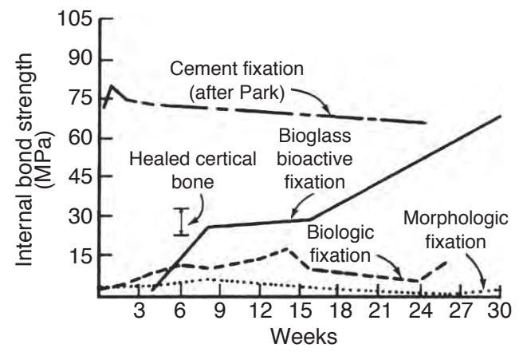

**FIGURE I.2.4.7** Time dependence of interfacial bond strength of various fixation systems in bone. (After Hench, 1987.)

| TABLE I.2.4.6                                                                                                                                                                                                                                               | Typical Clinical Applications of Bioactive Ceramics, Glasses and Glass Ceramics (highlighting 45S5 and Hydroxyapatite as Examples) |  |  |  |  |
|-------------------------------------------------------------------------------------------------------------------------------------------------------------------------------------------------------------------------------------------------------------|---------------------------------------------------------------------------------------------------------------------------------------------|--|--|--|--|
|                                                                                                                                                                                                                                                             | Orthopedics                                                                                                                                 |  |  |  |  |
| Trauma: Long bone fracture (acute and/or comminuted); alone and with internal fixation Femoral non-union repair Tibial plateau fracture                                                                                                         |                                                                                                                                             |  |  |  |  |
| Arthroplasty                                                                                                                                                                                                                                                |                                                                                                                                             |  |  |  |  |
| Filler around implants (acetabular reconstruction)                                                                                                                                                                                                          |                                                                                                                                             |  |  |  |  |
| Impaction grafting General Filling of bone after cyst/tumor removal                                                                                                                                                                                   |                                                                                                                                             |  |  |  |  |
| Spine Fusion Interbody fusion (cervical, thoracolumbar, lumbar) Posterolateral fusion Adolescent idiopathic scoliosis                                                                                                                              |                                                                                                                                             |  |  |  |  |
|                                                                                                                                                                                                                                                             | Cranial-Facial                                                                                                                              |  |  |  |  |
| Cranioplasty                                                                                                                                                                                                                                                |                                                                                                                                             |  |  |  |  |
| Facial reconstruction General oral/dental defects Extraction sites Ridge Augmentation Sinus elevation Cystectomies Osteotomies                                                                                                            |                                                                                                                                             |  |  |  |  |
| Periodontal Repair                                                                                                                                                                                                                                          |                                                                                                                                             |  |  |  |  |
| Dental- Maxillofacial- ENT                                                                                                                                                                                                                                  |                                                                                                                                             |  |  |  |  |
| Toothpaste and treatments for dentinal hypersensitivity and inhibition of gingivitis Pulp capping Sinus obliteration Repair of orbital floor fracture Endosseous ridge maintenance implants Middle ear ossicular replacements (Douek MED) |                                                                                                                                             |  |  |  |  |

of 45S5 Bioglass, and the landmark sales of the one millionth dose of the bone graft product (NovaBone) and the one millionth tube of toothpaste containing 445S5 particulate (NovaMin) designed to occlude dentinal tubules and remineralize the surface of teeth, thereby eliminating the cause of dentinal hypersensitivity. The excellent clinical success of this bioactive material is due to the stimulation of osteogenesis, as summarized above, and a clinical response equivalent to use of autogeneous bone grafts without second site morbidity (Ilharreborde et al., 2008; Ameri et al., 2009).

# BIOACTIVITY REACTION STAGES

There is a sequence of 11 reaction stages that occur at the surface of a Class A bioactive glass, as summarized in Figure I.2.4.6. The log time axis shown in Figure I.2.4.6 is based upon studies of surface reaction rates, as discussed above. The first five stages of surface reactions occur very rapidly and go to completion within 24 hours for the Class A bioactive glasses with highest levels of bioactivity, e.g., 45S5 Bioglass. The effect of the surface reactions is rapid release of soluble ionic species from the glass into the interfacial solution. A high surface area hydrated silica and polycrystalline hydroxyl-carbonate apatite (HCA) bilayer is formed on the glass surface within hours (Figure I.2.4.6, Stages 1–5). The reaction layers enhance adsorption and desorption of growth factors produced by the cells (Figure I.2.4.6, Stage 6), and decrease greatly the length of time macrophages are required to prepare the implant site for tissue repair (Figure I.2.4.6, Stage 7).

Attachment of osteoprogenitor stem cells (Figure I.2.4.6, Stage 8) and synchronized proliferation and differentiation of the cells towards the mature osteoblast phenotype (Figure I.2.4.6, Stage 9) rapidly occurs on the surface of Class A bioactive materials. Several weeks are required for similar cellular events to occur on the surface of Class B bioactive materials. Differentiation of progenitor cells into a mature osteoblast phenotype does not occur on bioinert materials, because of the lack of ionic stimuli. In contrast, osteoprogenitor cells colonize the surface of Class A bioactive materials within 24–48 hours, and begin production of various growth factors which stimulate cell division, mitosis, and production of extracellular matrix proteins (Figure I.2.4.6, Stage 10). Mineralization of the matrix follows soon thereafter and mature osteocytes, encased in a collagen-HCA matrix, are the final product by 6–12 days *in vitro* and *in vivo* (Figure I.2.4.6, Stage 11).

A rapid completion of all 11 reaction stages shown in Figure I.2.4.6 is the key to regenerative repair of bone, which involves: (1) control of the population of cells that are capable of entering into active phases of the cell cycle; (2) complete mitosis of cells with accurate replication of genes (cell proliferation); and (3) cellular differentiation into a phenotype capable of synthesizing a full complement of extracellular proteins that constitute mature osteocytes.

Such osteoblast cell cycle control is achieved *in vivo* by the controlled release of critical concentrations of Ca and Si ionic dissolution products from 45S5 bioactive glass particulate (Buttery et al., 2001; Xynos et. al., 2000, 2001) or 58S bioactive gel-glass (Christodoulou et al., 2005). Osteoprogenitor cells colonize the surface of the bioactive glass (Figure I.2.4.6), and slow release of the critical concentration of soluble Si and Ca ions at the cell–solution interface activates seven families of genes responsible for osteogenesis in the cells. Controlled rates of dissolution of the glass provide the critical concentration of the biologically active ions to the cells via the interfacial solution. The families of genes that are upregulated and/or activated are shown in Table I.2.4.7.

The upregulated genes encode nuclear transcription factors and potent growth factors, especially IGF-II, along with IGF-binding proteins and proteases that cleave IGF-II from their binding proteins. The growth

| TABLE I.2.4.7                                       | Families of Genes in Human Osteoblasts Activated or Up-Regulated by Ionic Dissolution Products of Bioactive Glasses |  |  |  |  |
|-----------------------------------------------------|---------------------------------------------------------------------------------------------------------------------------------|--|--|--|--|
| (1) Transcription Factors and Cell Cycle Regulators |                                                                                                                                 |  |  |  |  |
| (2) DNA Synthesis, Repair and Recombination         |                                                                                                                                 |  |  |  |  |
| (3) Apoptosis Regulators                            |                                                                                                                                 |  |  |  |  |
| (4) Growth Factors and Cytokines                    |                                                                                                                                 |  |  |  |  |
| (5) Cell Surface Antigens and Receptors             |                                                                                                                                 |  |  |  |  |
| (6) Signal Transduction Molecules                   |                                                                                                                                 |  |  |  |  |
| (7) Extracellular Matrix Compounds                  |                                                                                                                                 |  |  |  |  |

factors are present in a biologically active state, as confirmed by analysis of the upregulation of IGF-II mRNA with quantitative real-time PCR (Buttery, 2001; Hench, 2003). Similar bioactive induction of the transcription of extracellular matrix components and their secretion and self-organization into a mineralized matrix is responsible for the rapid formation and growth of bone nodules and differentiation of the mature osteocyte phenotype. Details are given in Xynos et al. (2000, 2001), and reviewed in Hench (2003).

### CALCIUM PHOSPHATE CERAMICS

Bone typically consists by weight of 25% water, 15% organic materials, and 60% mineral phases. The mineral phase consists primarily of calcium and phosphate ions, with traces of magnesium, carbonate, hydroxyl, chloride, fluoride, and citrate ions. Hence, calcium phosphates occur naturally in the body, but they also occur within nature as mineral rocks, and certain compounds can be synthesized in the laboratory. Table I.2.4.8 summarizes the mineral name, chemical name, and composition of various phases of calcium phosphates.

Within the past 20–30 years interest has intensified in the use of calcium phosphates as biomaterials, but only certain compounds are useful for implantation in the body, since both their solubility and speed of hydrolysis increase with a decreasing calcium-to-phosphorus ratio. Driessens (1983) stated that those compounds with a Ca/P ratio of less than 1:1 are not suitable for biological implantation.

The main crystalline component of the mineral phase of bone is a calcium deficient carbonate hydroxyapatite, and a wide variety of methods have been investigated to produce synthetic hydroxyapatite. The most commercially popular routes are based on aqueous precipitation or conversion from other calcium compounds. The first reports appeared in the literature in the 1960s, and since then there have been many approaches based on those original methods. Aqueous precipitation is most often performed in one of two ways: a reaction between a calcium salt and an alkaline phosphate (Collin et al., 1963; Eanes et al., 1965; Jarcho et al., 1976; Kijima and Tsutsumi, 1979; Denissen et al., 1980; Young and Holcomb, 1982; Bonel et al., 1987) or a reaction between calcium hydroxide or calcium carbonate and phosphoric acid (Mooney, 1961; Rao and Boehm, 1974; McDowell et al., 1977; Akao et al., 1981; Irvine, 1981; Nagai et al., 1985). Since these papers were published there have been many reports of alternative wet chemical routes, but most of these are, in fact, based on similar reactants to those first described in the 1960s, 1970s, and 1980s.

Other routes include those based on solid-state processing (originally described by Lehr et al., 1967; Fowler, 1974; Rootare et al., 1978; Monma et al., 1981; Young and Holcomb, 1982), hydrolysis (Schleede et al., 1932; Perloff et al., 1956; Morancho et al., 1981; Young and Holcomb, 1982) or hydrothermal synthesis (Perloff and Posner, 1960; Roy, 1971; Skinner, 1973; Fowler, 1974; Arends et al., 1979; Young and Holcomb, 1982).

The route and conditions under which synthetic HA is produced will greatly influence its physical and chemical characteristics. Factors that affect the rate of resorption of the implant include physical factors, such as the physical features of the material (e.g., surface area, crystallite size), chemical factors, such as atomic and ionic substitutions in the lattice, and biological factors, such as the types of cells surrounding the implant and location, age, species, sex, and hormone levels.

The thermodynamic stability of the various calcium phosphates is summarized in the phase diagram shown in Figure I.2.4.8. The binary equilibrium phase diagram between CaO and P2O5 gives an indication of the compounds formed between the two oxides, and by comparing this with Table I.2.4.8 it is possible to identify

| TABLE I.2.4.8 | Calcium Phosphates |                       |                                      |
|---------------|--------------------|-----------------------|--------------------------------------|
| Ca:P          | Mineral Name       | Formula               | Chemical Name                        |
| 1.0           | Monetite           | CaHPO4                | Dicalcium phosphate (DCP)            |
| 1.0           | Brushite           | CaHPO4·2H2O           | Dihydrate (DCPD) Dicalcium phosphate |
| 1.33          | —                  | Ca8(HPO4)2(PO4)4·5H2O | Octocalcium phosphate (OCP)          |
| 1.43          | Whitlockite        | Ca10(HPO4)(PO4)6      |                                      |
| 1.5           | —                  | Ca3(PO4)2             | Tricalcium phosphate (TCP)           |
| 1.67          | Hydroxyapatite     | Ca10(PO4)6(OH)2       |                                      |
| 2.0           |                    | Ca4P2O9               | Tetracalcium phosphate               |

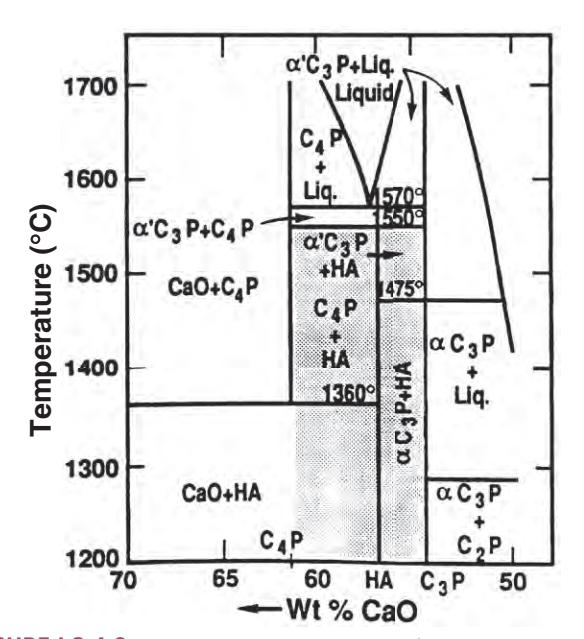

**FIGURE I.2.4.8** Phase equilibrium diagram of calcium phosphates in a water atmosphere. Shaded area is processing range to yield HA-containing implants. (After K. de Groot (1988). Ann. N. Y. Acad. Sci. 523: 227.)

the naturally occurring calcium phosphate minerals. The diagram does not indicate the phase boundaries of apatite due to the absence of hydroxyl groups. However, from the binary diagram an indication may be obtained of the stability of other calcium phosphates with temperature.

The stoichiometry of HA is highly significant where thermal processing of the material is required. Slight imbalances in the stoichiometric ratio of calcium and phosphorus in HA (from the standard molar ratio of 1.67) can lead to the appearance of either α- or β-tricalcium phosphate on heat treatment. Many early papers concerning the production and processing of HA powders reported problems in avoiding the formation of these extraneous phases (Jarcho et al., 1976; Peelen et al., 1978; De With et al., 1981a,b). However, using stoichiometric hydroxyapatite it should be possible to sinter, without phase purity problems, at temperatures in excess of 1300°C.

X-ray diffraction and infrared spectroscopy should be used to reveal the phase purity and level of hydroxylation of hydroxyapatite (Figures I.2.4.9 and I.2.4.10). Kijima and Tsutsumi (1979) used these techniques to study hydroxyapatite sintered at different temperatures, and reported that after sintering at 9000°C the material was fully hydroxylated, but after sintering at temperatures higher than this, dehydroxylation occurred. In fact, the dehydration of hydroxyapatite, produced by processes such as high temperature solid-state reactions, result in the formation of oxyhydroxyapatite: Ca10(PO4)6(OH)2−2xOxVx, (where V is a hydroxyl vacancy). Hydroxyapatite has a P63/m space group: this signifies that the lattice is primitive Bravais,

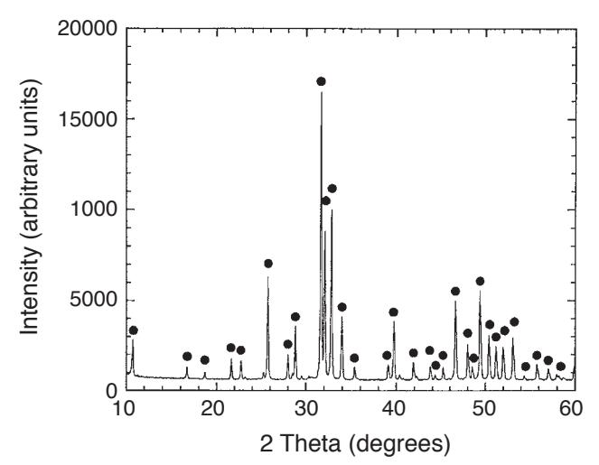

**FIGURE I.2.4.9** X-ray diffraction of hydroxyapatite.

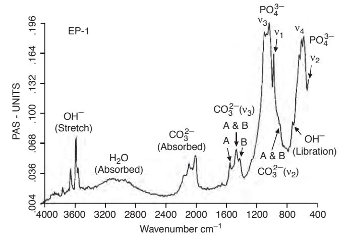

**FIGURE I.2.4.10** Typical FT-IR spectrum for a bone mineral-derived hydroxyapatite.

there is a six-fold axis parallel to the c-axis and a 1/2 (3/6) translation along the length of the c-axis (a screw axis) with a mirror plane situated perpendicular to the screw axis and the c-axis. The lattice parameters for hydroxyapatite have been determined to be 0.9418 nm and 0.6884 nm for the a and c parameters, respectively (JCPDS #09-0432).

The structure assumed by any solid is such that, on an atomic level, the configuration of the constituents is of the lowest possible energy. In phosphates, this energy requirement results in the formation of discrete subunits within the structure, and the PO4 3− group forms a regular tetrahedron with a central P5+ ion and O2− ions at the four corners. In a similar manner, the (OH)− groups are also ionically bonded. In terms of the volume occupied, oxygen ions exceed all other elements in phosphates. Any other elements present may therefore be considered as filling the interstices, with the exact position being determined by atomic radius and charge (see Figure I.2.4.11).

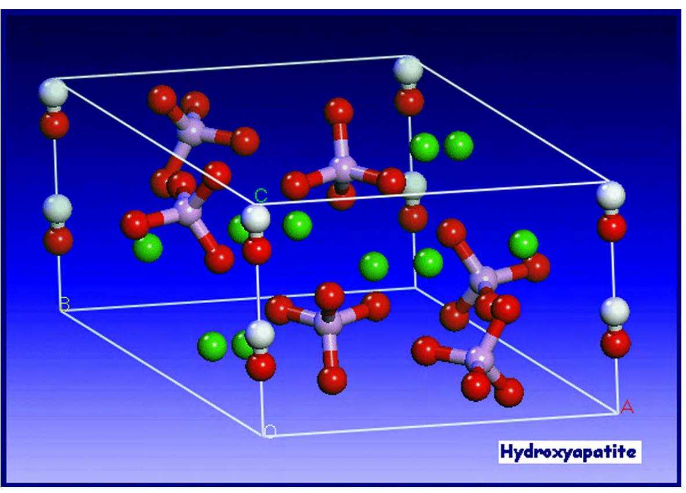

**FIGURE I.2.4.11** Unit cell of hydroxyapatite (from PhD thesis, University of Cambridge, H. Chappell 2008).

The hydroxyapatite lattice contains two kinds of calcium positions: columnar and hexagonal. There is a net total of four "columnar calcium" ions that occupy the [1/3, 2/3, 0] and [1/3, 2/3, 1/2] lattice points. The "hexagonal calcium" ions are located on planes parallel to the basal plane at *c* = 1/4 and *c* = 3/4, and the six \*"Î å { tetrahedra are also located on these planes. The (OH)− groups are located in columns parallel to the *c*-axis, at the corners of the unit cell, which may be viewed as passing through the centers of the triangles formed by the "hexagonal calcium" ions. Successive hexagonal calcium triangles are rotated through 60° (see Figure I.2.4.12).

Defects and impurities in hydroxyapatite may be identified as either substitutional or discrete extraneous crystalline phases (as discussed above). Methods of detection of impurities include X-ray diffraction, infrared spectroscopy, and spectrochemical analysis. It is important to make a full spectrochemical analysis of hydroxyapatite, since contact with any metal ions during production can lead to high levels of impurties in the product. Typical data for one commercial hydroxyapatite powder are shown in Table I.2.4.9.

Other ions which may be incorporated into the HA structure, either intentionally or unintentionally, include carbonate ions (substituting for hydroxyl or phosphate groups), fluoride ions (substituting for hydroxyl groups), silicon or silicate ions (substituting for phosphorus or

phosphate groups), and magnesium ions substituting for calcium (e.g., Newsley, 1963; Le Geros, 1965; Barralet, 1997; Jha et al., 1998; Gibson et al., 1999).

Based on the research work performed by Carlisle in the 1970s, in which the nutritional effects of silicon were studied, Bonfield, Best, and co-workers later reported the development of silicate-substituted hydroxyapatites (Si-HA) (Gibson et al., 1999; Patel et al., 2002; Porter et al., 2003). *In vivo* studies comparing the rates of bone apposition to HA and Si-HA ceramic implants demonstrated a significant increase in the amount of bone apposition and organization around silicon-substituted HA (Si-HA) implants, illustrating their potential as bone graft materials (Patel et al., 2002). Several other groups have also investigated the production and characterization of Si-HA and Si-TCP (Ruys, 1993; Balas et al., 2003; Gasqueres et al., 2008).

Silicate-substituted HA (Si-HA) may be prepared via a variety of synthesis routes. Gibson et al. (1999) produced phase-pure Si-HA via an aqueous precipitation route, and proposed the substitution mechanism given the equation below:

$$
10Ca^{2+} + (6-x)PO43- + xSiO44- + (2-x)OH-\n\rightarrow Ca10(PO4)6-x(SiO4)(OH)2-x
$$

Structural analysis has confirmed that silicate (SiO4 4−) ions can substitute for the PO4 sites in HA.

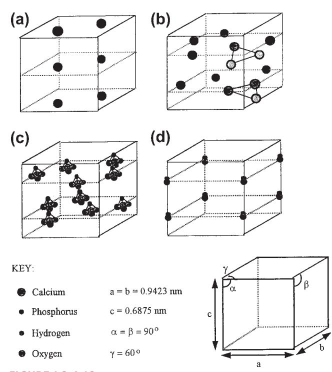

**FIGURE I.2.4.12** Theoretical positions of the ionic species within the unit cell of hydroxyapatite. (Hing, 1995).

| TABLE I.2.4.9 | Trace Elements in a Commercial Hydroxyapatite |
|---------------|--------------------------------------------------|
| Trace Element | PPM                                              |
| Al            | 600                                              |
| Cu            | 1                                                |
| Fe            | 1000                                             |
| Ge            | 100                                              |
| Mg            | 2000                                             |
| Mn            | 300                                              |
| Na            | 3000                                             |
| Pb            | 4                                                |
| Si            | 500                                              |
| Ti            | 30                                               |

This substitution results in changes in the crystal lattice dimension, with a decrease in the a-axis and an increase in the c-axis (Gibson et al., 1999; Patel et al., 2002). This work led to a significant level of interest in silicate-substituted apatite-based bone grafts, and these materials are now used in a range of orthopedic applications (Waked and Grauer, 2008).

The presence of carbonate may be observed directly, using infrared spectroscopy, in the form of weak peaks at between 870 and 880 cm−1, and a stronger doublet between 1460 and 1530 cm−1, and also through alterations in the hydroxyapatite lattice parameters from X-ray diffraction (LeGeros, 1965; Rootare and Craig, 1978; Barralet et al., 1997). The substitution of electronegative anions such as fluorine and chlorine for (OH)− have also been reported to alter the lattice parameters

| TABLE I.2.4.10       | Typical Mechanical Properties of Dense Hydroxyapatite Ceramics |
|----------------------|-------------------------------------------------------------------|
| Theoretical density  | 3.156 g cm3                                                       |
| Hardness             | 500–800 HV, 2000–3500 Knoop                                       |
| Tensile strength     | 40–100 MPa                                                        |
| Bend strength        | 20–80 MPa                                                         |
| Compressive strength | 100–900 MPa                                                       |
| Fracture toughness   | approx. 1 Mpa m0.5                                                |
| Young's modulus      | 70–120 GPa                                                        |

#### of the material (e.g., Kay et al., 1964; Young and Elliot, 1966; see also Elliot, 1994).

Hydroxyapatite may be processed as a ceramic using compaction (die pressing, isostatic pressing, slip casting, etc.) followed by solid-state sintering (discussed earlier in this chapter). When reporting methods for the production and sintering of hydroxyapatite powders, it is very important to adequately characterize the morphology of the product including the surface area, particle size distribution, mean particle size, and physical appearance of the powders, since this will greatly influence the handling and processing characteristics of the material (Best and Bonfield, 1994). There is a great deal of variation in the reported mechanical performance of dense hydroxyapatite ceramics, dependent on phase purity, density and grain size, but the properties cited generally fall in the range shown in Table I.2.4.10.

The bonding mechanism of dense HA implants appear to be very different from that described above for bioactive glasses. The bonding process for HA implants has been described by Jarcho (1981). A cellular bone matrix from differentiated osteoblasts appears at the surface, producing a narrow amorphous electron-dense band only 3 to 5 µm wide. Between this area and the cells, collagen bundles are seen. Bone mineral crystals have been identified in this amorphous area. As the site matures, the bonding zone shrinks to a depth of only 0.05 to 0.2 µm (Figure I.2.4.2). The result is normal bone attached through a thin epitaxial bonding layer to the bulk implant. TEM image analysis of dense HA bone interfaces shows an almost perfect epitaxial alignment of some of the growing bone crystallites with the apatite crystals in the implant. A consequence of this ultra-thin bonding zone is a very high gradient in elastic modulus at the bonding interface between HA and bone. This is one of the major differences between the bioactive apatites and the bioactive glasses and glass-ceramics. The implications of this difference for the implant interfacial response to Wolff's law are discussed in Hench and Ethridge (1982), Chapter 14.

# CALCIUM PHOSPHATE COATINGS

The clinical application of calcium phosphate ceramics is largely limited to bone grafting applications or, if in the form of a monolithic or porous component, to non-major

loadbearing parts of the skeleton. This is because of relatively poor mechanical strength and toughness, and inferior mechanical properties, and it was partly for this reason that interest was directed toward the use of calcium phosphate coatings on metallic implant subtrates. Good reviews of the production of calcium phosphate coatings have been published by de Groot et al. (1998), Sun et al. (2001), and Heimann (2006). Many techniques are available for the deposition of hydroxyapatite coatings, including electrophoresis, sol–gel routes, electrochemical routes, biomimetic routes, and sputter techniques, but the most popular commercial routes are those based on plasma spraying. In plasma spraying, an electric arc is struck between two electrodes and a stream of gases is passed through the arc. The arc converts the gases into plasma with a speed of up to 400 m/sec and a temperature within the arc of 20,000°K. The ceramic powder is suspended in the carrier gas and fed into the plasma, where it can be fired at a substrate. There are many variables in the process including the gases used, the electrical settings, the nozzle/substrate separation, and the morphology, particle size, and particle size distribution of the powder. Because of the very high temperatures but very short times involved, the behavior of the hydroxyapatite powder particle is somewhat different than might be predicted in an equilibrium phase diagram. However, according to the particular conditions used, it is likely that at least a thin outer layer of the powder particle will be in a molten state and will undergo some form of phase transformation, but by careful control of the operating variables the transformed material should represent a relatively small volume fraction of the coating, and the product should maintain the required phase purity and crystallinity (Mayer et al., 1986; Cook et al., 1988; Wolke et al., 1992).

Early work on plasma sprayed coatings established that there are a number of factors that influence the properties of the resulting coating, including coating thickness (this will influence coating adhesion and fixation – the agreed optimum now seems to be 50–100 µm) (de Groot et al., 1987; Soballe et al., 1993), crystallinity (this affects the dissolution and biological behavior) (Le Geros et al., 1992; Klein et al., 1994a,b; Clemens, 1995), biodegradation (affected by phase purity, chemical purity, porosity, crystallinity) (Tang et al., 2010), and adhesion strength (these may range between 5 and 65 MPa (de Groot, 1998).

Plasma sprayed coatings have been found to be highly successful, and are now widely used in hip joint replacement, particularly for younger patients (Sun et al., 2001). However, the mechanical mismatch between the coating and the substrate can lead to high levels of residual interfacial stress. For this reason, a number of other "low temperature" and thin film deposition techniques been investigated, including electrophoresis, sol– gel routes, electrochemical routes, biomimetic routes, electrohyhdrodynamic spray deposition sputter techniques, and bone-like apatite coatings through simulated body fluid treatments.

Sputtering results in thin (<1 micron) coatings on metallic, ceramic or polymeric substrates (Hulshoff et al., 1996, 1997; Lo et al., 2000; Ong, 2002; Boyd et al., 2003; Cairns et al., 2008). Pure calcium phosphate coatings need to be deposited using magnetron sputtering. Using a combination of two or more targets allows the co-deposition of Si with the calcium phosphate, and the resulting films have been found to exhibit enhanced biological performance (Thian et al., 2005, 2006). However, further investigation of sputtered coatings is required to provide better understanding of their potential long-term clinical performance.

The preparation of SiHA films via sol–gel routes (Hijon et al., 2006) and pulsed laser deposition techniques (Garcia-Sanz et al., 1997) has also been investigated. Fluoride-substituted HA coatings on metallic surfaces using a sol–gel method (Wang et al., 2007). Biomimetic approaches have also been investigated. Substrates are immersed in a supersaturated or metastable solution at 37°C with ion concentrations and pH value similar to human blood plasma. After several days, the formation and growth occurs of a thin "bone-like" apatite layer (Ohtsuki et al., 1991). Biomimetic coatings are generally produced using simple, low cost, low temperature processes. However, long induction and growth periods are required to form the coatings, and adhesion strength between the coating and substrate still requires optimization.

Electrostatic spray deposition allows the fabrication of dense, porous or nanostructured CaP coatings (Leeuwenburgh et al., 2003; Huang et al., 2005; Lim et al., 2005; Ahmad et al., 2006; Huang et al., 2008). Research indicates that this route offers the potential for using CaP coatings as carriers for a variety of drugs (Siebers et al., 2004, 2006).

### CALCIUM PHOSPHATE IMPLANTS: MECHANICAL PROPERTIES AND POROSITY

The mechanical behavior of calcium phosphate ceramics strongly influences their application as implants. Tensile and compressive strength and fatigue resistance depend on the total volume of porosity. Porosity can be in the form of micropores (<1 µm diameter, due to incomplete sintering) or macropores (>100 µm diameter, created to permit bone growth). The dependence of compressive strength (σc) and total pore volume (*Vp*) is described in de Groot et al. (1990) by:

$$
\sigma_c = 700 \exp{-5V_p(\text{in MPa})}
$$
 (3)

where (*Vp* is in the range of 0–0.5.

Tensile strength depends greatly on the volume fraction of microporosity ((*Vm*):

$$
\sigma_t = 220 \exp{-20 V_m(\text{in MPa})}
$$
 (4)

The Weibull factor (*n*) of HA implants is low in physiological solutions (*n* = 12), which indicates low reliability under tensile loads. Consequently, in clinical practice, calcium phosphate bioceramics should be used: (1) as powders; (2) in small, unloaded implants such as in the middle ear; (3) with reinforcing metal posts, as in dental implants; (4) as coatings (e.g., composites) or (5) in porous implants where bone growth acts as a reinforcing phase.

There are a number of commercially available porous products on the market, and these originate from three main sources: hydroxyapatite that has been chemically synthesized (e.g., Apapore®); material has been converted from synthetic sources; coral (e.g., Pro Osteon®, Interpore®, Bio Eye®) or animal bone (e.g., Endobon®). There has been some discussion in the literature regarding the optimum "type" of porosity, and a number of authors have suggested that the degree of interconnectivity is more critical than the pore size. Eggli et al. (1988) demonstrated improved integration in interconnected 50–100 µm pores compared with less connected pores with a size of 200–400 µm. Similarly, Kühne et al. (1994) compared two grades of 25–35% porous coralline apatite with average pore sizes of 200 and 500 µm and reported bone ingrowth to be improved in the 500 µm pore sized ceramic. Holmes (1979), who also studied a porous coralline apatite, suggested that when implanted in cortical bone interconnections of osteonic diameter were required for transport of nutrients to the bone ingrowth. The findings clearly indicate the importance of thorough characterization of the porous materials before implantation, and Hing (1999) has recommended a range of techniques which should be employed.

### RESORBABLE CALCIUM PHOSPHATES

Resorption or biodegradation of calcium phosphate ceramics is caused by three factors:

- 1. Physiochemical dissolution, which depends on the solubility product of the material and local pH of its environment. New surface phases may be formed, such as amorphous calcium phosphate, dicalcium phosphate dihydrate, octacalcium phosphate, and anionic-substituted HA.
- 2. Physical disintegration into small particles as a result of preferential chemical attack of grain boundaries.
- 3. Biological factors, such as phagocytosis, which causes a decrease in local pH concentrations (de Groot and Le Geros, 1988).

Ideally, one might wish for a replacement material to be slowly resorbed by the body once its task of acting as a scaffold for new bone has been completed. Degradation or resorption of calcium phosphates *in vivo* occurs by a combination of phagocytosis of particles and the production of acids. However, when selecting a resorbable material for implantation, care must be taken to match the rate of resorption with that of the expected bone tissue regeneration. Where the solubility of calcium phosphates is higher than the rate of tissue regeneration, they will not be of use to fill bone defects. As mentioned previously, the rate of dissolution increases with decreasing calcium-to-phosphorus ratio and, consequently, tricalcium phosphate, with a Ca:P ratio of 1.5, is more rapidly resorbed than hydroxyapatite. Tricalcium phosphate has four polymorphs: α; β; γ; and super α. The γ polymorph is a high pressure phase, and the super α polymorph is observed at temperatures above approximately 1500°C (Nurse et al., 1959). Therefore, the most frequently observed polymorphs in bioceramics are α- and β-TCP. X-ray diffraction studies indicate that the β polymorph transforms to the α polymorph at temperatures between 1120°C and 1290°C (Gibson et al., 1996).

All calcium phosphate ceramics biodegrade to varying degrees; the rate of biodegradation increases as:

- 1. Surface area increases (powders > porous solid > dense solid);
- 2. Crystallinity decreases;
- 3. Crystal perfection decreases;
- 4. Crystal and grain size decrease;
- 5. There are ionic substitutions of CO−3 2, Mg2+, and Sr2+ in HA.

Factors that tend to decrease the rate of biodegradation include: (1) F− substitution in HA; (2) Mg2+ substitution in β-TCP; and (3) lower β-TCP/HA ratios in biphasic calcium phosphates.

### CALCIUM PHOSPHATE BONE CEMENTS

In the 1980s, calcium phosphate bone cements were developed. These materials offer the potential for *in situ* molding and injectability. There are a variety of different combinations of calcium compounds (e.g., α-tricalcium phosphate and dicalcium phosphate) which are used in the formulation of these bone cements, but the end product is normally based either on a calcium deficient hydroxyapatite (Fernandez et al., 1998, 1999a,b) or on brushite (although *in vivo* these tend to convert to hydroxyapatite) (Lemaitre et al., 1987; Constantz et al., 1998). In the development and production of the bone cements a number of factors need to be considered, including the processing parameters (such as solid and liquid component composition, particle size, and liquid-to-powder ratio), setting properties, cohesion time, and the injectability of the paste (Doroszhkin, 2009). These will in turn significantly influence the microstructure and porosity, and hence mechanical behavior of the cement.

The cements have been found to perform well *in vivo*, and are now commercially available (Bohner, 2000). There is considerable interest in the future potential for these materials to be used for drug delivery (Ginebra et al., 2001).

### CLINICAL APPLICATIONS OF HA

Calcium phosphate-based bioceramics have been used in medicine and dentistry for over 20 years (Jarcho, 1981; de Groot, 1983; Hulbert et al., 1987; Le Geros, 1988; de Groot, 1988; de Groot et al., 1990; Le Geros and Le Geros, 1993). Applications include dental implants, periodontal treatment, alveolar ridge augmentation, orthopedics, maxillofacial surgery, and otolaryngology (Table I.2.4.6).

Most authors agree that HA is bioactive, and it is generally agreed that the material is osseoconductive, where osseoconduction is the ability of a material to encourage bone growth along its surface when placed in the vicinity of viable bone or differentiated bone-forming cells. Good reviews of porous hydroxyapatite from different sources for eventual clinical application have been prepared by Hing et al. (1998, 2005), and Damien and Revell (2004). Hing et al. (1998) observed that there are a large number of "experimental parameters," including specimen, host, and test parameters, which need to be carefully controlled in order to allow adequate interpretation of data.

Hydroxyapatite has been investigated and used in a range of different forms for clinical applications. It has been utilized as a dense, sintered ceramic for middle ear implant applications, (van Blitterswijk, 1990) and alveolar ridge reconstruction and augmentation (Quin and Kent, 1984; Cranin et al., 1987), in porous form for orbital implants (Suter et al., 2002), as granules for filling bony defects in dental and orthopaedic surgery, such as for spinal fusion and impaction grafting (Froum et al., 1986; Galgut et al., 1990; Oonishi et al., 1990; Wilson and Low, 1992; Aoki, 1994; Fujishiro, 1997; Bolder et al., 2002; Hing et al., 2007; Wheeler al., 2007; Coathup et al., 2008), and as a coating on metal implants (de Groot, 1987; Cook et al., 1992a,b; Camazzola et al., 2009). There are now numerous reports of the successful use of hydroxyapatite coated femoral prostheses and acetabular cups, and clinical results indicate that these implants are especially successful for younger patients (Stack et al., 2006; Shah, 2009).

Another successful clinical application of hydroxyapatite has been in polymer composites. The original concept of a bioceramic filler in a polymer composite was introduced by Bonfield et al. (1981) with the aim of producing an analog of the mineral-reinforced organic matrix in cortical bone. The material developed by Bonfield and co-workers contains up to 50 vol% hydroxyapatite in a polyethylene matrix, has a stiffness similar to cortical bone, has high toughness, and has been found to exhibit bone-bonding *in vivo*. The material has been used as an orbit implant for orbital floor fractures and volume augmentation (Tanner et al., 1994), and is now in used in middle ear implants, commercialized under the trade name, HAPEX® (Bonfield, 1996).

Other approaches have been made to produce bioactive and either bioresorbable or biodurable composites. The incorporation of glass ceramics A-W and Bioglass® have been investigated within a wide variety of polymer matrices (Thompson et al., 1998; Rea et al., 2004). Another recent advance has been in the development of a compositionally-graded mineralized collagen-GAG scaffold for cartilage and ligament repair (Lynn et al., 2005).

### REFERENCES

- Adachi, N., Ochi, M., Deie, M., & Ito, Y. (2005). Transplant of mesenchymal stem cells and hydroxyapatite ceramics to treat severe osteochondral damage after septic arthritis of the knee. *J. Rheumatol.*, **32**, 1615–1618.
- Ahmad, Z., Huang, J., Edirisinghe, M. J., Jayasinghe, S. N., Best, S. M., Bonfield, W., Brooks, R. A., & Rushton, N. (2006). Electrohydrodynamic print-patterning of nanohydroxyapatite. *J. Biomed. Nanotechnol.*, **2**, 201–207.
- Akao, M., Aoki, H., & Kato, K. (1981). Mechanical properties of sintered hydroxyapatite for prosthetic applications. *J. Mat. Sci.*, **16**, 809.
- Ameri, E., Behtash, H., Mobini, B., Omidi-Kashani, F., & Nojomi, M. (2009). Bioactive glass versus autogenous iliac crest bone graft in adolescent idiopathic scoliosis surgery. *Acta Medica Iranica*, **47**(1), 41–45.
- Andreiotelli, M., Wenz, H. J., & Kohal, R. J. (2009). Are ceramic implants a viable alternative to titanium implants? A systematic literature review. *Clin. Oral Implants Res.*, **20**(Suppl 4), 32–47.
- ASTM F1185-03. (2003). *Standard Specification for Composition of Hydroxylapatite for Surgical Implants, Book of Standards, 13.01*.
- Baikie, T., Mercier, P. H., Elcombe, M. M., Kim, J. Y., Le Page, Y., Mitchell, L. D., White, T. J., & Whitfield, P. S. (2007). Triclinic apatites. *Acta. Crystallogr. B.*, **63**, 251–256.
- Balas, F., Perez-Pariente, J., & Vallet-Regi, F. (2003). *In vitro* bioactivity of silicon substituted hydroxyapatites. *J. Biomed. Mater. Res. A*, **66**, 364–375.
- Barralet, J. E., Best, S. M., & Bonfield, W. (1998). Carbonate substitution in precipitated hydroxyapatite: An investigation into the effects of reaction temperature and bicarbonate Ion concentration. *J. Biomed. Mater. Res.*, **41**, 79–86.
- Barralet, J. E., Gaunt, T., Wright, A. J., Gibson, I. R., & Knowles, J. C. (2002). Effect of porosity reduction by compaction on compressive strength and microstructure of calcium phosphate cement. *J. Biomed. Mater. Res.*, **63**, 1–9.
- Bertoni, E., Bigi, A., Cojazzi, G., Gandolfi, M., Panzavolta, S., & Roveri, N. (1998). Nano–crystals of magnesium and fluoride substituted hydroxyapatite. *J. Inorg. Biochem.*, **72**, 29–35.
- Best, S. M., & Bonfield, W. (1994). Processing behaviour of hydroxyapatite powders of contrasting morphology. *J. Mater. Sci. Mat. Med.*, **5**, 516.
- Blumenthal, N. C., Betts, F., & Posner, A. S. (1975). Effect of carbonate and biological macromolecules on formation and properties of hydroxyapatite. *Calcif. Tissue Res.*, **18**, 81–90.